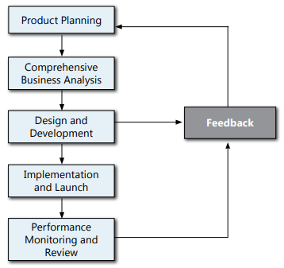

###### Product development process

**product development strategy**

- **product imitation strategy** : to simulate some successful product

- **product improvement strategy** : develop a new version of product to meed curtomer's need.

- **product innovation strategy** : develop a entire new product for the unmet customer's need.

**development process**

- steps of product develop process
  
  

- after first steps, the manager can design to continue development. request for review the product or drop the new product idea.

**product planing**

- contain following steps:
  - **idea generation** : 
    
    - generate the product idea from various source like, sale force, employee, customer and consultants
  
  - **screening**:
    
    - is a quick way to select the product idea for futther investigation.
    
    - commonly exclude the idea with following feature
      
      - against the company's goal or existence system
      
      - not satisfy customer need
      
      - replace exists product sale instead on create a new product sale
  
  - **concept testing**
    
    - involve the idea to financial professional and potential customer to get the feedback to determine which product might have the greatest profitibility

**comprehensive business analysis**

- **market analysis** 
  
  - evaluate all the envirnoment factor that might effect product sale

- **product design objective**
  
  - specify the basic characteristic. such as benefit, premium structure and age limit.

- **feasiblity study**
  
  - rearch on how to produce and offer the product
  
  - reach on how the new product impact on the old product

- **marketing plan**

- **market projection** : 
  
  - which is the preliminary sale and forecast some financial element, such as potential unit sale, revenue and profit.

- different functional area's responsibility in comprehensive business analysis
  
  - **marketing**
    
    - conduct market analysis.
    
    - prepare market plan and market projection
    
    - determine the most appropriate distribution channel
  
  - **agency operation**
    
    - analyze whether need to change current sale force to support new product and estimate the cost.
  
  - **acturial**
    
    - develop the product design objective
    
    - perform preliminary calculation the price that can make the product to be competitive
  
  - **underwriting**
    
    - establish the initial underwriting  gudeline
  
  - **Investment**
    
    - determine which type of investment to support the product
  
  - **cliam adminiatration**
    
    - examinate the cliam assumption
    
    - determine whether current cliam system can support the new product
  
  - **customer service**
    
    - determine whether current customer service can support or not and estimate the cost
  
  - **Information technology**
    
    - determine whether current IT system can support or not and estimate the cost
  
  - **accounting**
    
    - review the financial reporting and determina how the new business reflect in the financial statement.
  
  - **Legal/Compliance**
    
    - review the product is complied to legal and regulatory
    
    - found the if the product is prohibit in any jurisdiction.

**product design and development stages**

- create the financial design using computer model

- using the information from computer model to develop the premium rate
  
  - also include following steps in financial design
    - create application form and sale contract
    
    - set administrative and underwriting gudieline
    
    - development schedule and budget for product implement

**activities in product implement**

- obtaining necessary regulatory approvals

- design promotion and tranining material

- developing information and procedure that nessary to marketing and administer.

**Day 1 functionality and Day 2 functionality**

- **Day 1 functionality** : is the adminstrative or system that is need in the product launch

- **Day 2 functionality** : is the adminstrative or system that is not need immidiated in the product implement, so can be deliver after product launch

**the factor to evaluate the product performance**

- total face amount or number of policy sold

- actual profit compare to the expected profit

- impact on other product or company's share

- customer feedback

- policy lapse rate
