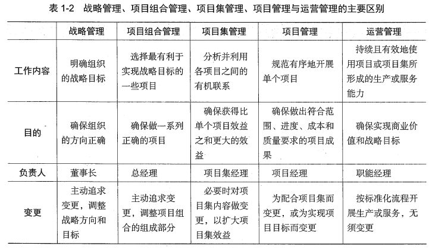

##### 什么是项目

###### 项目的特点

- 临时性。有明确的起点和终点

- 独特性。所以需要进行风险管理

- 驱动组织变更。

- 创造商业价值。能够相关方带来效益

###### 项目的制约因素

**三重制约**

- 进度，成本，范围

**新三重制约**

- 范围，进度，成本，质量，资源，风险，相关方满意

**根据各个制约因素进行管理**

###### 项目，项目集和项目组合

- 项目集管理：通过鬼案例项目之间的内在联系，来取得单独管理所不能取得的效益

- 战略管理与项目组合管理：排列所有备选项目的有限顺序，选择靠前的最有利于实现战略目标的来做。

**项目管理旨在正确地完成单个项目，项目集管理旨在正确完成一系列相互配套的项目获得更大利益。**

**区分大项目和项目集的关键，各个交付的部分是否能够独立运作，是就可以切分成项目集，不能则是大项目。**

#### 五大过程组

- **启动**

- **规划**

- **执行**

- **监控**

- **收尾**

##### 项目运行环境

###### 项目执行组织

- 组织治理：高层领导对组织的工作的指导，支持和监控

- **项目治理**：保证项目的大方向和大目标正确。提供项目的各种保障。

- 项目管理

###### 影响因素分类

- **事业环境因素**（无法控制，无法回避的因素就是环境因素）
  
  - 内部，外部（团队内部还是项目外部）

- **内部组织过程资产**
  
  - 过程，政策和流程。**更新需要PMO审核。**
  
  - 组织知识库。**随着项目的进展动态更新。**
  
  - **PMI 中，非常强调组织过程资产的作用，并且假设项目有很好的的历史资料库。**

###### 常见组织结构及其优缺点

- 职能式
  
  - 分工明确
  
  - 但是无全职员工，项目工作容易忽视
  
  - **项目经理无职权**

- **矩阵式**
  
  - 兼顾项目与职能，提高了资源的利用率
  
  - 但是沟通和管理复杂

- 项目式
  
  - 项目经理权利充分，**对项目的资源有控制权**
  
  - 但是资源重复配置

###### PMO

- 作用：
  
  - 指定方法论
  
  - 协调所管辖项目对资源的共享
  
  - 为项目提供必要支持

- 分类：
  
  - 根据PMO对项目的管理程度区分
    
    - 支持型：仅提供行政支持服务
    
    - 控制型：在提供支持的情况下，有权对项目施加一定的控制
    
    - 指令型：直接管理一些很重要的或者很复杂的项目。

#### 生命周期

##### 项目生命周期

- 每个阶段都有阶段准入标准，应完成工作和应提交的可交付成果

- 一个阶段的结束和一个阶段的开始是两件事。可以是顺序关系或者是交叠关系。

- 在项目开始前会有一个阶段，用于进行前期准备工作。

- 特点：
  
  - 项目初期风险大，不确定性大，风险多，增加价值的机会大，变更代价小。
  
  - 项目末期，不确定性小，风险小，增加价值机会少，变更代价大。

###### 种类

- 预测型生命周期（计划驱动型）。详细定义项目产品和工作内容，再严格按照计划开展工作。

- 迭代型

- 增量型

- 适应型，又叫敏捷型。是迭代和增量型的混合。

- 混合型，预测型和适应型的混合。

##### 产品生命周期

- **从项目开始到项目结束再到项目产品运营终止的全过程。**

##### 项目生命周期与项目管理过程组

**每个阶段都可以看做是一个子项目。每个阶段都要经历五大过程组管理。**

##### 项目经理相关

- 责任：确保项目在规定的范围、进度、成本和质量的要求下。

- 胜任力的五个阶段

- 项目经理的权力：
  
  - 来源于人自身：
    
    - 参照权力
    
    - 专家权力
    
    - 魅力权力
  
  - 来源于职位
    
    - 正式权力
    
    - 奖励权力
    
    - 处罚权力
    
    - 加压权力
  
  - 来源于人际互动
    
    - 关系权力
    
    - 迎合权力
    
    - 愧疚权力
    
    - 说服权力
    
    - 回避权力
  
  - 以上权力的复合
    
    - 信息权力
    
    - 情景权力
