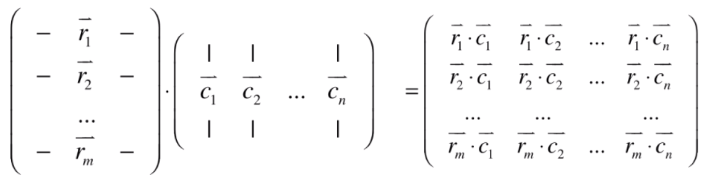
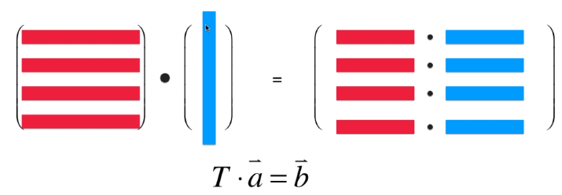
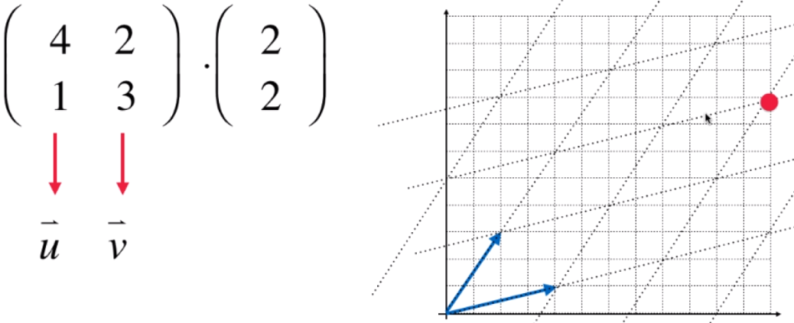

#### 矩阵的理解

- 矩阵可以理解成是一个系统：

- 矩阵可以理解成是一个向量的集合

- 可以从线性方程组理解

#### 特殊矩阵

- 零矩阵：方阵，并且主对角线元素（左上到右下的对角线）都为0.

- 单位矩阵：方阵，且主对角线元素（左上到右下的对角线）都为1.

#### 矩阵乘法

矩阵乘法相当于左侧矩阵的每个行向量和右侧矩阵的每个列向量投影的结果。由于向量r和c要进行点乘运算，所以向量r和c的长度必须相同，所以有矩阵乘法的限制，左侧矩阵的列数和右侧矩阵的行数必须相同。

 

矩阵的乘法实际上可以看做是对一个向量或者一组向量(矩阵)进行变换的过程。

 

##### 性质：

- 结合律：$A \cdot (B \cdot C)=(A \cdot B) \cdot C$

- 分配率：$A \cdot (B + C)=A \cdot B + A \cdot C$

- 不满足交换律，但是满足：$A \cdot B = B^T \cdot A$

##### 矩阵乘法与图形变化

当一个方阵乘以一个向量时，相当于把向量进行了一次坐标变换。$T \cdot \vec a = \vec b$这个过程中，$T$这个矩阵可以看作是一个新的坐标系，这个矩阵的每个行向量相当于一个标准单位向量的坐标，$\vec a$ 可以看作是一个在$T$这个空间中的坐标。相乘后的结果就是在$T$空间的坐标对应在正交空间中的坐标。

- 对称轴翻转

- 错切

- 旋转

##### **矩阵乘法的行视角和列视角**

在矩阵的列视角中，可以把左侧矩阵的每个列向量当做一个新的空间中的一个分量，而右侧的向量可以是看作是在这个空间中的坐标，两者相乘就能得到在正交空间中的坐标。

当左侧的矩阵不是方阵时也同样适用，当行列维数不同时就相当于升维和降维。 

从列视角的角度也很容易理解升维损失精度，因为右侧向量的行数小于新空间中的总维数，所以左侧矩阵所构成的空间实际上只是一个超平面。以一个 3X2 的矩阵为例，该空间实际上是一个平面。

#### 矩阵转置

- 数量运算：
  
  - $(A+B)^T=A^T+B^T$
  
  - $(k \cdot A)^T=k \cdot A^T$

- 结合律：$(A \cdot B)^T=B^T \cdot A^T$

#### 矩阵逆运算

定义： $对于A，存在B，使得 A \cdot B = B \cdot A = I$

概念：

- 可逆矩阵（非奇异矩阵）

- 左逆矩阵：

- 右逆矩阵

- 当存在左逆矩阵和右逆矩阵，则左逆矩阵和右逆矩阵必定相等 

##### 性质：

- $(A^{-1})^{-1}=A$

- 结合律：$(A \cdot B)^{-1} = B^{-1} \cdot A^{-1}$

- $(A^T)^{-1} = (A^{-1})^T$

