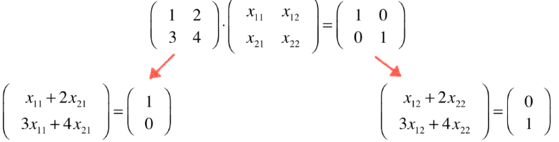
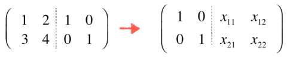
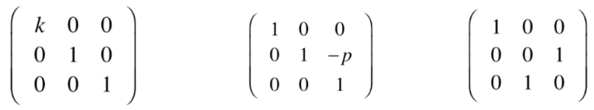
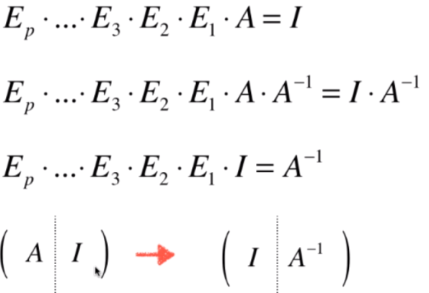

#### 求逆运算方法推导

由逆运算定义：$A \cdot B =I$ 可以得到下图的形式。分解后的两个部分都可以看做是一个独立的求解线性方程组的过程。则两个方程组其实可以合并成一个增广矩阵进行求解。

#### 初等矩阵

- 定义：通过单位矩阵经过有限次初定变换得到的矩阵

- 初等变换：
  
  - 把矩阵的某一行乘以k倍
  
  - 把矩阵的某一行乘以k倍加到另一行中
  
  - 把矩阵的某两行进行交换

##### 初等变换可以使用矩阵乘法进行表示：

当一个矩阵左乘一个初等矩阵，可以看作是进行一次初等变换。**其中初等矩阵的第 i 行第 j 列就表示，被变换矩阵（即右侧矩阵）的第 j 行在结果矩阵中的第 i 行的倍数。**比如$x_{11}=1，x_{12}=2，x_{13}=3$就代表，如果结果矩阵是3x3的方阵，则结果矩阵的第一行就相当于被变换矩阵的第一行的1倍加上第2行的2倍加上第三行的3倍。从下图的基本初等变换矩阵中也可以看到这个规律。

#### 初等矩阵和可逆性

下图的展现了求解矩阵逆的过程相当于把单位矩阵进行一系列初等变换的过程

