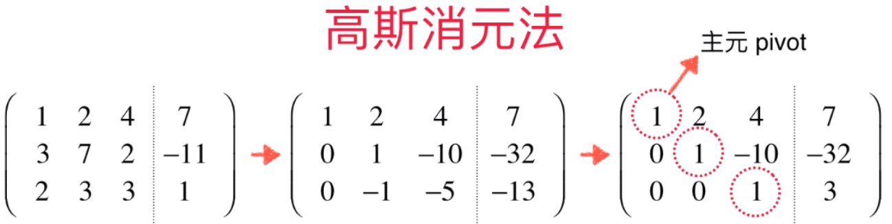
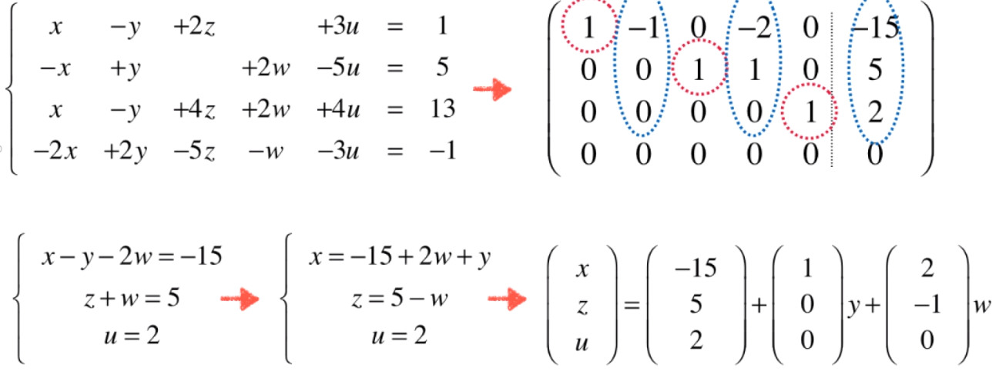

#### 线性方程组

##### 高斯消元法

高斯消元法的主要过程如下：

1. 把线性方程组写成增广矩阵的形式

2. 通过不断对增广矩阵的行进行相加相减或者交换，使得主元上的元素都为1

##### 高斯-约旦消元法

在高斯消元法的基础上把主元上侧的元素也化为0.

#### 线性方程组解的结构

- 当行最简形式的行数小于未知数个数（系数矩阵列数），并且系数矩阵行数和右侧的项行数相同，方程有无数解

- 当行最简形式的行数等于未知数个数（系数矩阵列数），并且系数矩阵行数和右侧的项行数相同，方程有唯一解

- 行最简形式的系数矩阵的行数，少于右侧项行数，则方程无解。

##### 有无数解时解的结构

#### 齐次线性方程组

增广矩阵的右侧项都为0。

##### 性质

- 必定有解

- 如果有唯一解，必定为0解，即所有未知数都为0。 
