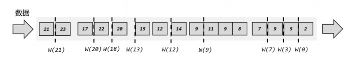

[TOC]

## 基础概念

### 水位和时间

#### 时间语义

- 处理时间（Processing Time）：执行数据处理所在机器的时间（通常指的是算子运行主机的时间）
- 事件时间（Event Time）：通常是数据记录中个某个时间属性，用于标识该记录产生的时间，该时间不会随着记录分发发生改变。
- 水位线（Watermark）：不依赖某个节点上的系统时间的分布式时钟，用于描述整个数据处理的时间进程。

处理时间和事件时间的对比：

- 处理时间具有更好的性能，事件时间更加贴近业务。

#### 水位线和处理逻辑

水位线，是由当前算子定时根据当前处理数据的最大时间戳（可以是处理时间也可以是事件时间）生成的数据处理进度标识消息，通过该消息就可以判断当前算子的处理延迟，同时也是checkpoint数据范围的基础。

- 语义：当前算子不会再发送水位线以前的数据（上游发送的水位线之前的数据会在本节点丢弃）
- 内容：基于数据的时间戳生成的一个时间戳，用来表示当前事件时间的进展
- 水位线可以通过设置延迟，来保证正确处理乱序数据

水位线延迟处理逻辑示例：

该示例设置了允许2秒的消息延迟，最终的实现逻辑是把消息的时间戳减2秒去和当前算子的最大时间戳对比，如果大于最大时间戳则更新最大时间戳。（减2秒相当于允许2秒的消息眼瞅）

水位线传递逻辑：

#### 时间窗口

时间窗口是将无限流中的数据划分成一个个窗口进行分别计算。Flink的窗口合并计算逻辑实现在 `org.apache.flink.streaming.runtime.operators.windowing.WindowOperator`，其作用是计算出记录的所属窗口，然后分发到对应的窗口缓存，如果达到窗口的触发条件则调用计算函数计算出结果并下发到下游。

窗口类型（按照时间划分方式进行分类，时间可以是处理时间或者会话时间）：

- 计数窗口：
- 滑动窗口：
- 会话窗口：
- 全局窗口：通常需要自定义触发窗口计算的时机，如计数窗口。

## 多流转换

## 处理函数

## 相关文档

- [Flink 中的时间和窗口](https://blog.csdn.net/wangshiqi666/article/details/129886673)
- [Flink 中的处理函数](https://blog.csdn.net/wangshiqi666/article/details/129907856)
- [Flink 中的多流转换](https://blog.csdn.net/wangshiqi666/article/details/129909174)
- [动态表和回撤流](https://zhuanlan.zhihu.com/p/66641103?from_voters_page=true)