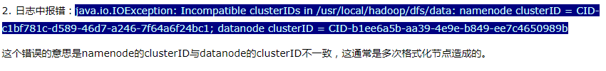

#### 启动阶段

##### 错误信息： could only be replicated to 0 nodes, instead of 1

主要的原因是没有足够数量的可用的 datanode 去存储备份。 
解决方式：

- 检查集群的 slaves 是否都有 datanode 去运行。如果执行 start-all.sh 或者 start-dfs.sh 之后 slave 节点中运行 jps 没有找到 datanode 就说明是没有正常启动 datanode 造成的。进一步检查：
  - master 到 slave 是否能够 无密码 ssh登陆
  - 检查 datanode 的log文件。如果日志中出现类似的错误，则清除 dfs.namenode.name.dir 和 dfs.datanode.data.dir 下的文件，并重新格式化节点。

##### 错误信息：Cannot find configuration directory

原因是环境变量 HADOOP_CONF_DIR 配置错误。该变量的配置在 hadoop-env.sh 中配置。

##### 错误信息： Exception in thread "main" java.lang.IllegalArgumentException: Invalid URI for NameNode address (check fs.defaultFS): file:/// has no authority.

修改core-site.xml 的 fs.defaultFS，改为 fs.default.name。
