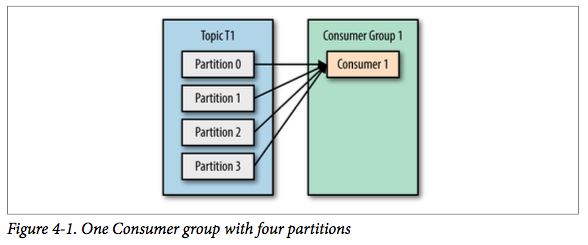
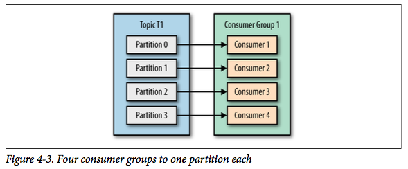
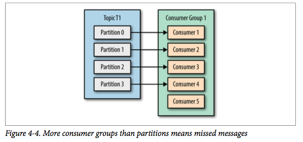

#### Consumer 配置

- 消费者与消费者组概念

- 基本配置

- commit 机制

- Partition Assign机制

##### 消费者与消费者组概念

###### 相关角色

- **消费者**：一个消费者进程或者线程，负责真正消费队列中的信息

- **消费者组**：消费者的逻辑组合，是管理消费状态的基本单元，记录了对每个topic的每个partition 的消费状态。这些状态都是存储在 zookeeper 中，大致的目录结构为`/consumers/<group.id>/offsets/<topic>/<partitionId>`

- **消费者leader**：负责决定消费者组内的分组方案

- **消费者组的coordinator**：实际维护消费者组状态信息的进程

###### 消费者与消费者组的关系

消费者leader在rebalance 发生时，会按照`partition.assignment.strategy` 定义的分区分配策略把每个topic 的不同分区分配给消费者组里面的不同消费者

1. 当一个消费者组内只有一个消费者订阅某一个topic时，所有消息都会被该消费者消费
   
   

2. 当一个消费者组内只有多个消费者订阅某一个topic时，则需要leader按照分配策略进行分配)
   
   

3. 当消费者数量大于某一个topic的分区数量时，则会存在空闲的消费者
   
   

###### Rebalance

**发生条件**：

- 增加partition

- 增加消费者

- 消费者主动关闭

- 消费者宕机

- coordinator自己也宕机

**步骤**：

1. coordinator从组中选择一个leader

2. 由leader计算所有topic 的分区分配，并把结果返回给coordinator

3. 由coordinator发送 Sync请求到各个consumer，同步分区分配结果

##### 基本配置

###### 代码样例

创建consumer实例：

```java
// 配置基本信息
Properties props = new Properties();
props.put("bootstrap.servers", "broker1:9092,broker2:9092");
props.put("group.id", "CountryCounter");
props.put("key.deserializer", "org.apache.kafka.common.serialization.StringDeserializer");
props.put("value.deserializer", "org.apache.kafka.common.serialization.StringDeserializer");
// 创建consumer实例
KafkaConsumer<String, String> consumer = new KafkaConsumer<String,String>(props);
// consumer订阅topic
consumer.subscribe(Collections.singletonList("customerCountries"));
```

拉取消息：

```java
try {
   // 不断循环消费消息
   while (true) { 
        // 从consumer实例中拉取信息，其中参数是 timeout 时长单位是ms
       ConsumerRecords<String, String> records = consumer.poll(100);
        // 循环消费每条消息，需要注意的是，当使用通配符订阅消息时，此处的消息可能包含多个topic的
       for (ConsumerRecord<String, String> record : records)  
       {
            // 消费消息
           log.debug("topic = %s, partition = %s, offset = %d,
              customer = %s, country = %s\n",
              record.topic(), record.partition(), record.offset(),
              record.key(), record.value());

       }
   }
} finally {
      // 退出时关闭consumer实例
      consumer.close();
}
```

###### 常用配置项

- `fetch.min.bytes`：从broker抓取的最小数据量，当broker的数据量不够时，consumer不会抓取

- `fetch.max.wait.ms`：定义consumer最长的fetch等待时间，
  
  - 默认值：500

- `max.partition.fetch.bytes`：指定了每个分区最大的返回数据大小。这个数值需要比`max.message.size`。否则，存在consumer无法消费的消息

- `session.timeout.ms`：consumer的会话超时时间，当consumer超过该时间没有发送心跳时，就会认为该consumer死亡，会触发rebalance。这个值的设置需要考虑 consumer消费消息的时长，防止因为消费时长大于timeout时间导致kafka认为consumer死亡
  
  - 默认值：3000

- `heartbeat.interval.ms`：consumer在 poll 方法中等待消息时，发送心跳的间隔时间。通常推荐是 `session.timeout.ms` 的 1/3
