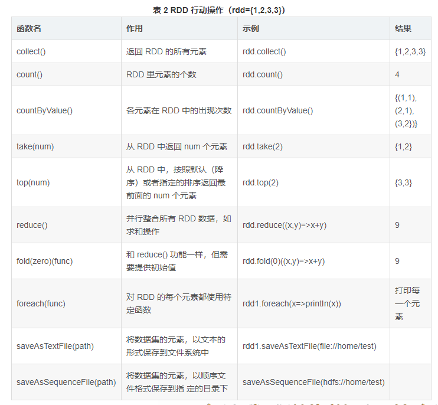

#### RDD API

- 生成source RDD
  
  - parallelize
  
  - textFile
  
  - HadoopRDD

- transformation 算子
  
  - RDD[T] 形式的RDD的转换
  - RDD[(K,V)] 形式的RDD的转换

- action 算子

##### 生成source RDD

##### transformation算子

###### RDD[T] 形式的RDD的转换

**下面图表中，rdd1={1,2,3,3}，rdd2={3,4,5}**

| 函数名            | 作用                                                                   | 示例                      | 结果               |
| -------------- | -------------------------------------------------------------------- | ----------------------- | ---------------- |
| map()          | 将函数应用于每个元素，返回值是新的RDD                                                 | rdd1.map(x => x+1)      | {2,3,4,4}        |
| flatMap()      | 将函数应用于每个元素，将元素数据进行拆分，flatmap 要求输入的函数的返回值是TraversableOnce类型的子类（即迭代器）。 | rdd1.flatMap(x=>x to 3) | {1,2,3,2,3,3,3}  |
| filter()       | 过滤掉不符合条件的元素。                                                         | rdd1.filter(x => x!=1)  | {2,3,3}          |
| distinct()     | 将rdd中的元素去重                                                           | rdd1.distinct()         | {1,2,3}          |
| union()        | 生成包含两个RDD 的新的RDD                                                     | rdd1.union(rdd2)        | {1,2,3,3,3,4,5}  |
| intersection() | 求两个RDD 的共同元素                                                         | rdd1.intersection(rdd2) | {3}              |
| substract()    | 将原RDD和参数里面的RDD相同的元素去掉                                                | rdd1.substract(rdd2)    | {1,2}            |
| cartesian()    | 两个rdd 的笛卡尔积                                                          | rdd1.cartesian(rdd2)    | {(1,3),(1,4)...} |
| sortBy()       | 对每个元素求出key值，然后进行排序                                                   | rdd1.sortBy(\_)         | {1,2,3,3}        |
| zip()          | 和输入的RDD进行横向拼接，要求输入rdd 和 原rdd 分区数量相同，分区内的元素数量相同。                      |                         |                  |
| zipWithIndex() | 把每个元素变成，(元素，index)                                                   |                         |                  |

###### RDD[(K,V)] 形式的RDD的转换

**所有对 RDD[(K,V)]的处理函数都在PairRDDFunctions 这个类中。**

| 函数名           | 作用                                            | 实例  | 结果  |
| ------------- | --------------------------------------------- | --- | --- |
| join系列函数      | 对左右两侧的RDD，按照key 进行关联，然后得到 key,(左value，右value) |     |     |
| mapValues     | 对value 进行转换                                   |     |     |
| flatMapValues | 对value进行展开                                    |     |     |

##### action算子

action 算子是真正触发 spark 进行计算的算子。

