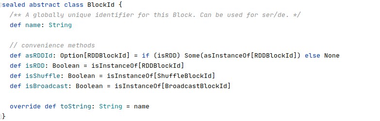
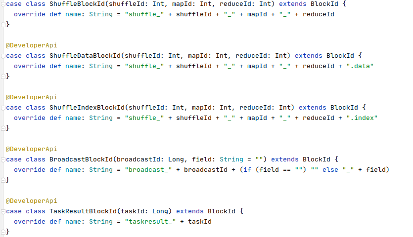
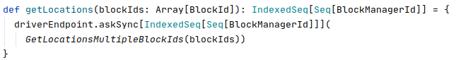

#### BlockManager

- 基本概念
  
  - BlockId
  
  - BlockManager

- 方法源码
  
  - getRemoteBytes

##### 基本概念

###### BlockId

每个block 在同一个application 下面都有唯一的BlockId，BlockId 的定义如下。其中 name 在整个application范围内唯一。

不同类型的Block有不同的Id，主要表现在 name 的pettern不同。以下是部分BlockId

###### BlockManager

- 该类提供了所有通过BlockId存取Block 的方法，所有的spark组件都是通过该类进行Block 的存取。

- 这个类型包含了存取block 的所有所需服务，如 MemoryStore，DiskStore 和 shuffleClient等。

- 同时，每个BlockManager还会包含 BlockManagetMaster 的成员变量。
  
  - BlockManagerMaster 类主要用于 BlockManger 和 Driver进行通信，比如查看某个Block的可以访问的位置，或者更新本地存有的block 信息。
  
  - BlockManagerMaster类封装了对BlockManagerMasterEndpoint 的Rpc调用的逻辑。比如
    
    
  
  - 
