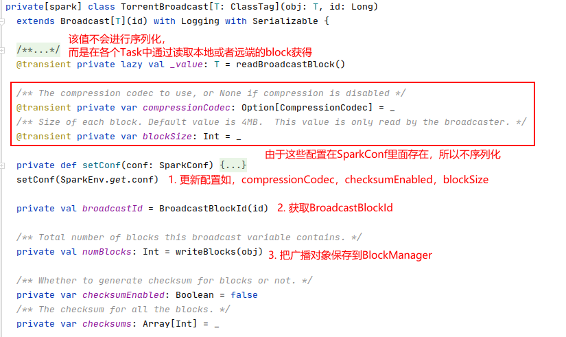
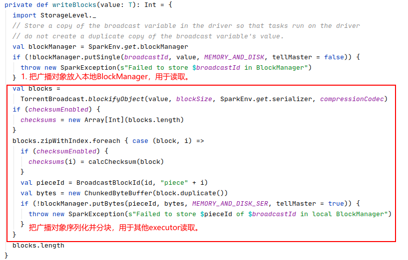
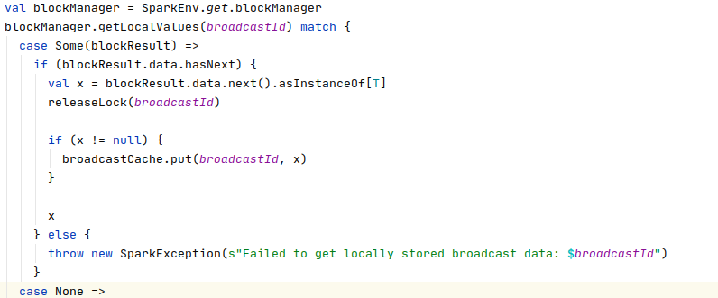
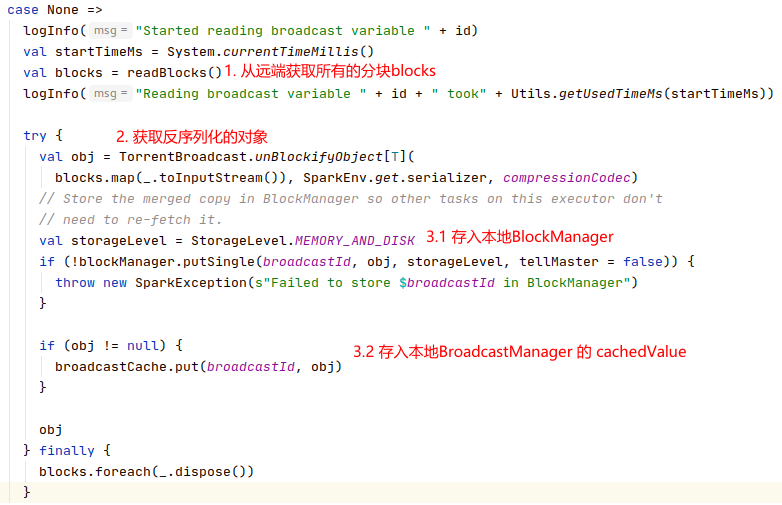
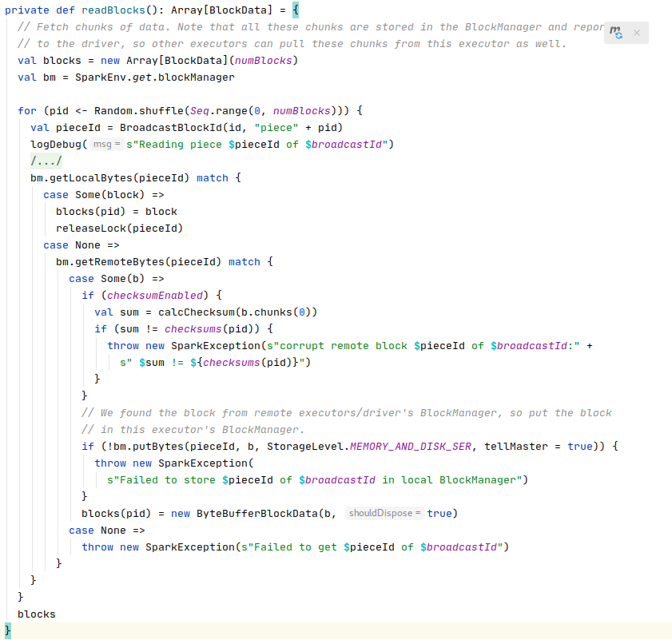

#### Broadcast

- broadcast使用
  
  - api
  
  - 限制

- 源码


##### broadcast使用

###### api

通过sparkContext实例的 broadcast 方法把某个对象进行广播，并获取该对象的广播变量，通过广播变量的value 方法获取被广播的对象。

```scala
// driver side
scala> val broadcastVar = sc.broadcast(Array(1, 2, 3))

broadcastVar: org.apache.spark.broadcast.Broadcast[Array[Int} = Broadcast(0)


// executor side

scala> broadcastVar.value

res0: Array[Int] = Array(1, 2, 3)
```

###### 限制

当一个对象呗广播出去后，所有对该对象的修改，都不能在广播变量最终返回的对象上生效。相当于最终获取的对象实例时被广播的一瞬间的快照。


##### 源码

- Broadcast是广播变量的接口，定义了如何读取广播变量包含的对象，其唯一实现类是 TorrentBroadcast。

- BroadcastFactory 是创建Broadcast对象的工厂类，其唯一实现是 TorrentBroadcastFactory

###### broadcast变量获取

创建broadcast对象的调用栈如下，最终会调用 TorrentBroadcast对象的构造函数进行创建。

```textile
SparkContext.broadcast
	env.broadcastManager.newBroadcast[T](value, isLocal)
		broadcastFactory.newBroadcast[T](value_, isLocal, nextBroadcastId.getAndIncrement())
			new TorrentBroadcast[T](value_, id)
```

TorrentBroadcast对象的构造函数逻辑如下：



1. 读取和 broadcast 相关的配置

2. 获取BroadcastBlockId。

3. 调用writeBlocks函数把要广播的对象存储到BlockManager‘
   
   
   
   1. 把要broadcast的对象以 MEMORY_AND_DISK 的 storageLevel 保存在本地的 BlockManager 中。**保存的block用于本地缓存。**
   
   2. 把broadcast的对象进行序列化，并拆分成 spark.broadcast.blockSize 中规定大小的 block块。并以MEMORY_AND_DISK_SER保存在本地的BlockManager 中。**这些block分块是用于被其他节点读取。**
   
   3. 如果配置了checkSum则计算并更新checksums，


###### broadcast变量取值

TorrentBroadcast 读取value时调用的方法是 readBroadcastBlock，其读取顺序是：


1. 先从本地的 BroadcatManager 中的cachedValue 查找是否已经缓存
   
   1. 如果有就返回

2. 如果没有则从本地的 BlockManager 中调用 getLocalValues 查找在本地有对应的block
   
   
   
   1. 如果有就尝试把对象存入 broadcastManager 的 cachedValue中
   
   2. 然后返回对应的值

3. 如果BlockManager本地没有对应的block则。
   
   
   
   1. 调用 readBlocks 方法从远端获取blocks。
   
   2. 调用 TorrentBroadcast.unBlockifyObject 方法把分块的blocks反序列化成对象
   
   3. 最后把对象分别放入本地的 BlockManager中 和放入 Broadcastmanager 的 cachedValue 中

其中 readBlocks 方法的逻辑如下：



1. 按照随机的顺序去获取broadcast对象的所有分块，对于每个分块block
   
   1. 首先尝试在本地获取
   
   2. 然后在调用BlockManager的getRemoteBytes获取分块
   
   3. 然后把分块存到本地的BlockManager 中。


