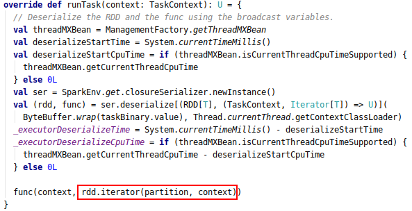
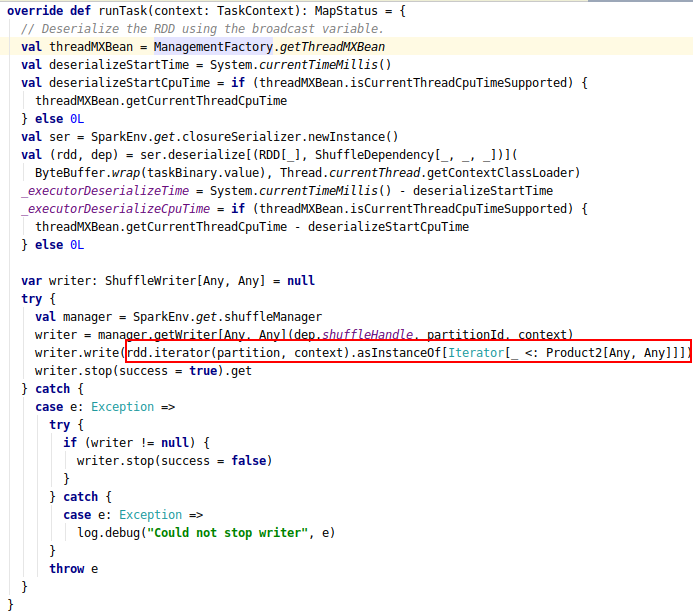
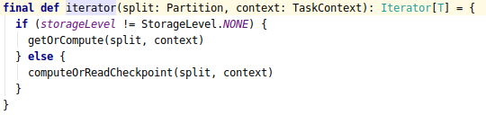
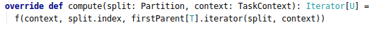
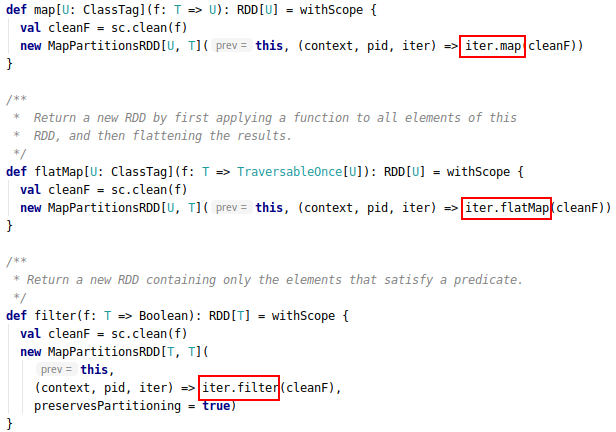
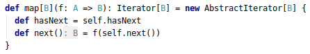
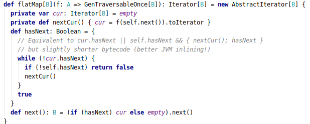
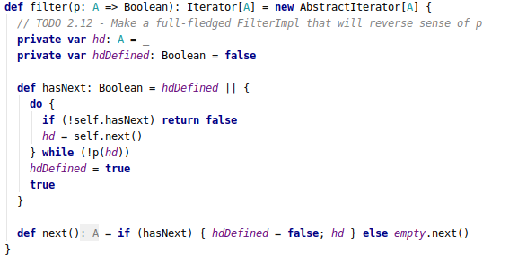

#### RDD源码

- task中如何调用rdd进行运算
  
  - 计算入口
  
  - RDD 的 Iterator 的方法
  
  - MapPartitionsRDD 的 compute的方法
  
  - HadoopRDD 的 compute的方法
  
  - Shuffle

##### task中如何调用rdd进行运算

###### 计算入口

Spark在运行任务时，会把 task 提交到 Executor 中的线程池中，并在线程池中最终调用 Task 类的 run 方法。而 run 方法优惠调用 runTask 方法。这是一个抽象方法，由子类 ResultTask 和 ShuffleMapTask实现。以下是两个实现类的 runTask 方法。 

**ResultTask#runTask**

 

**ShuffleMapTask#runTask** 

 

从上面的代码中看出最终的计算是调用 rdd 的 Iterator 方法或者结果的迭代器，然后不断迭代得到全部结果。

###### RDD 的 Iterator 的方法

RDD 的 iterator 方法是 final 方法，代码如下。RDD会首先判断结果是否存在与cache（通过 getOrCompute ）或存在 checkPoint （通过 computeOrReadCheckpoint），如果没有就会去调用 rdd 的compute 方法。compute 是抽象方法由各个 RDD 子类负责实现。

###### MapPartitionsRDD 的 compute 方法

MapPartitionsRDD 的 compute 主要通过包装器模式对 parent 的 Iterator 添加当前 RDD 的处理逻辑。其代码如下。其中 f 函数是从构造器中传入的，这个函数的作用是对 parent 的 Iterator 进行包装，添加当前RDD 的处理逻辑。**通过不断的递归调用直到source类型RDD 或者 shuffle read 类型的RDD，这些rdd 返回了真正返回 element 的 Iterator，然后不断递归封装，最后得到的是包含整个管道处理逻辑的 Iterator。**

 

RDD的大部分宅依赖的 transformation 函数都是构造 MapPartitionsRDD 。下面是 map， filter 和 flatMap 的函数源码，可以看到三个函数分别调用了 Iterator 类的 map，flatMap 和 filter 方法。

 

Iterator 的 map，flatMap 和 filter 的源码如下，都是使用了包装器模式，对Iterator 的 next 和 hasNext 进行了包装。

