#### Join 执行计划选择

- join 算法选择
  
  - Join Operator 结构
  
  - ExtractEquiJoinKeys

- broadcast side 选择
  
  - broadcast side 源码
  
  - 数据大小判断源码

##### 

##### Join算法的选择

###### Join Operator 结构

经过优化后的 LogicalPlan 只会包含由 basicOperator 组成的计划树，这些basicOperator都定义在 basicLogicalOperators.scala 中。其中Join的数据结构如下。

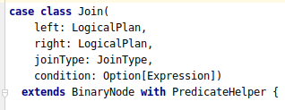

然后Join算法选择的源码是在JoinSelection 的 apply 方法。其中需要调用 ExtractEquiJoinKeys 和 ExtractFiltersAndInnerJoins 的 unapply 方法对join 类型进行细分。最终根据给定的 rule 选择join 的算法。

###### ExtractEquiJoinKeys

该模式是判断join的条件是否都是等于，并且各个条件之间是否都是 and。然后提取出key和其他filter条件。<br>

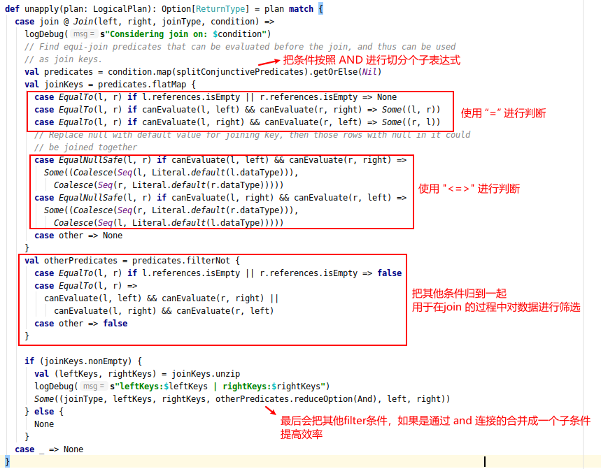


**源码中的splitConjunctivePredicates方法用于把表达式以最顶层的and为边界拆分成一个个子表达式。**

```textile
用于把一下的 AST 拆分成 Seq[Condition]
  AND
 /   \
A     AND        ===> A :: B :: C :: ... :: Nil
     /   \
    B    AND
        /   \
       C    ...

```

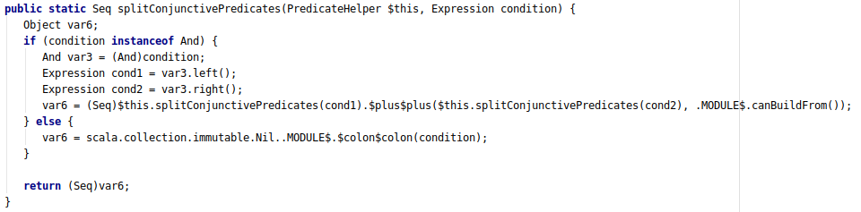


**源码中，canEvaluate 方法是判断，某一侧的plan是否能够处理**

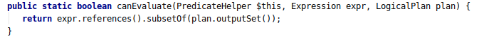


###### ExtractFiltersAndInnerJoins


##### broadcast side 选择

###### broadcast side 源码

入口：org.apache.spark.sql.execution.SparkStrategies.JoinSelection#broadcastSide

```textile
JoinSelection#apply
    |    判断是否进行broadcast join的方法
    +--- canBroadcastByHints()
    +--- canBroadcastBySizes()
    |    判断是左侧 broadcast 还是右侧 broadcast 的方法
    +--- broadcastByHints()
    +--- broadcastBySizes()
```

1. BroadcastByHints 和 BroadcastBySizes 最终会调用 broadcastSide。<br>
   
   该方法入参：左表右表是否能被广播，以及左表和右表的LogicalPlan。<br>判断逻辑：当只有一侧能能够broadcast时，选择那一侧，否侧选择体积更小的一侧。**当两侧都可broadcast，并且sizeInBytes相同，则广播右表。**

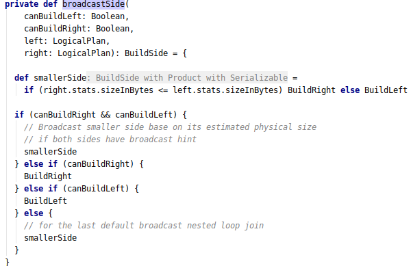

2. BroadcastByHints， BroadcastBySizes，broadcastByHints 和 broadcastBySizes 都会调用 canBuildLeft 和 canBuildRight 分别判断左表和右表是否具备 broadcast 的条件。<br>
   
   其中 canBuildLeft 的逻辑如下：
   
   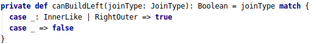
   
   其中 canBuildRight 的逻辑如下：
   
   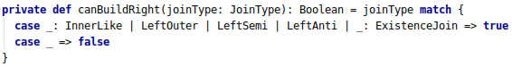

3. 对于 canBroadcastByHints 来说，能够 build某一侧的表的条件是 sql 中使用了 hint
   
   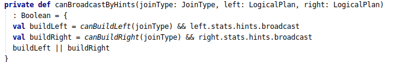

4. 对于 canBroadcastBySizes 来说，需要文件大小小于 autoBroadcastThreshold
   
   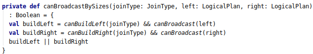

###### 数据大小判断源码

有上面的源码可知，broadcast 的size是通过左右侧的logicalPlan的 stats中的 sizeInBytes 进行判断的。logicalPlan 的 stats 的源码如下：<br>

从源码可以看出，LogicalPlan 的 statistics 最终是 BasicStatsPlanVisitor 或者 SizeInBytesOnlyStatsPlanVisitor 遍历 执行计划的子树获得的，采用的是访问者模式进行遍历。

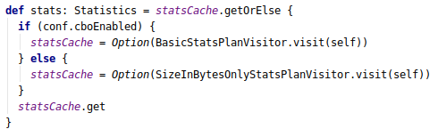

**SizeInBytesOnlyStatsPlanVisitor会对不同节点的数据进行估算，但是最终所有的数据大小来源都会从LogicalPlan的叶子结点开始汇总，叶子结点的大小通过 computeStats 进行计算。以下是源码**<br>

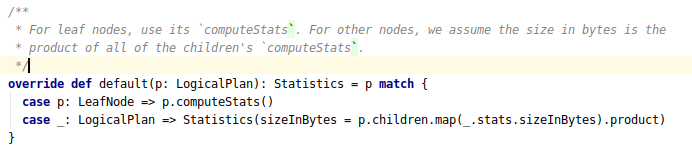

**此外，Project 和 Filter 等都是通过 visitUnaryNode方法进行估算的，大致的算法只和输入输出字段的数据大小比例有关**

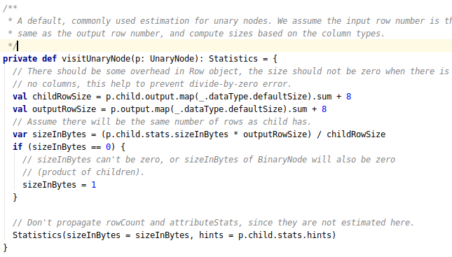

LeafNode 通常是读取source 的执行计划，下面是常见的 Hive 数据源**HiveTableRelation**。获取 HiveTable 的统计信息是在 DetermineTableStats 这个类中，源码如下：<br>

其中，有两个 spark 的配置项和获取HiveTable统计信息有关

- **spark.sql.statistics.fallBackToHdfs**：
  
  - 默认值是 false
  
  - 用于控制是否从 HDFS 中获取HiveTable 的所在路径的大小当做 HiveTable 的大小

- **spark.sql.defaultSizeInBytes**
  
  - 默认值是 Long.MaxValue。
  
  - 当不启用fallBackToHdfs是，所有 HiveTable 的大小都会取该值。

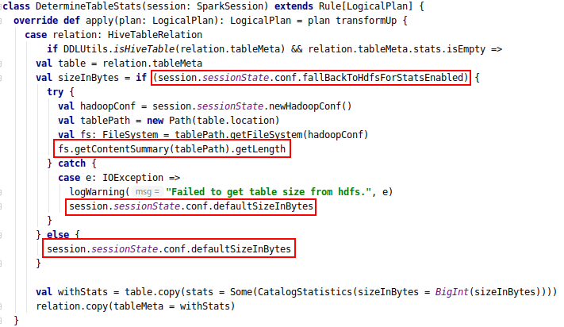
