#### 执行计划生成

- Dataset API
  
  - 构造函数

- QueryExection

- LogicalPlan 结构
  
  - 类继承
  
  - 常用方法

- 生成 LogicalPlan 
  
  - 以sql为入口
  - 以 DF 变换为入口

- RuleExecutor 基于规则的执行计划处理器

- 执行计划绑定

- 执行计划优化

- 物理计划生成
  
  - 入口
  
  - 算法选择
  
  - prepareExecution
  
  - EnsureRequirement， Distribution 和 Partitioning
  
  - ReuseSubquery
  
  - toRDD

##### Dataset API

##### QueryExection

SparkSQL最终需要生成 RDD 用于提交到 DAG Scheduler进行运算。由 LogicalPlan 生成 RDD 的方法是在 **QueryExecution.toRDD** 这个方法中。构造 QueryExecution 需要 SparkSession 和 LogicalPlan，这个类中把生成执行计划的每个步骤都用成员变量进行了存储。相关的成员变量有：

2. analyzed：存储已经经过绑定的 LogicalPlan

3. withCachedData：找到 LogicalPlan 中可以使用 cachedData 的子计划，并替换成扫描 cachedData

4. optimizedPlan：调用 Optimizer 对 LogicalPlan 进行优化

5. sparkPlan：生成的物理执行计划，比如各种Aggregate和Join算法的选择，如何扫描datasource

6. executedPlan：完善物理执行计划，比如检查不同步骤之间的数据分布和分块（Partitioning）是否满足执行条件

7. ToRDD：生成可以提交的 RDD。

##### LogicalPlan结构

###### 类继承

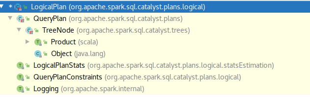

###### 常用方法

- transformDown(rule: PartialFunction[BaseType, BaseType]): BaseType：
  
  - 作用：前序遍历，并返回对所有节点遍历顺序应用 rule 之后的实例
  
  - 源码：
    
    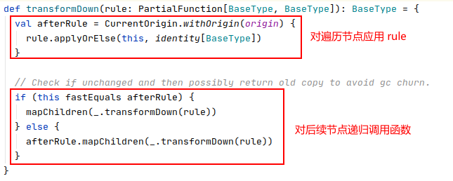
  
  - 

- transformUp(rule: PartialFunction[BaseType, BaseType]): BaseType
  
  - 作用：后序遍历，并返回对所有节点遍历顺序应用 rule 之后的实例

- collect\[B\](pf: PartialFunction[BaseType, B]): Seq[B]:
  
  - 作用：遍历整棵树，对每个节点进行计算，并返回所有计算结果的集合

##### 生成LogicalPlan

###### 以sql 为入口

入口如下，通过调用SparkSession 实例的 sql 方法生成 sql。


然后调用 sqlParser 的parsePlan 方法，这个方法定义在 AbstractSqlParser中。此处调用的 parse 方法是个偏函数，有两个入参，一个是 sql ，另一个是传入 parser 输出 logicalPlan 的函数。其中，圈出的部分就是传入parse 的函数参数。这个函数的逻辑主要是使用 astBuilder 去遍历 parse 生成的数据结构，最终生成logicalPlan。


最终调用的是 SparkSqlParser 的 parse 方法。其中包括了词法，语义和语句分析，并最终调用有 parsePlan 中构造的函数生成 logicalPlan。


**解析sql 使用的是 SqlBaseParse，里面包含了对语法的定义。而语法树到 AST 则是通过 SqlBaseBaseVisitor 完成对语法树的遍历。**<br>

最后在 Dataset 的 ofRows 方法中，会对生成的 logicalPlan 进行解析并绑定，得到 ResolvedLogicalPlan。


##### RuleExecutor 基于规则的执行计划处理器

执行计划的绑定和优化都需要使用 RuleExecutor。RuleExecutor 有如下成员：


- Strategy 类是指 Batch 迭代的次数。可以有 Once 和 FixedPoint 次

- Batch 是一个case class，包含名称，迭代次数上限和规则集合。

- isPlanIntegral：用于判断参数对应的计划是否完整。

- execute：用于把规则应用到执行计划中。

**以下是execute 方法的源码：**<br>

总体的逻辑是把 RuleExecutor 创建时给定所有 batch 依次应用到 LogicalPlan中。


在每个batch中使用foldLeft 把 Rule 依次应用到 plan 中，并且检查应用之后 Plan 是否完整。


##### 执行计划绑定

这个阶段主要进行的是 LogicalPlan 中的名字绑定，比如解析源表、别名、函数 和 子查询等等，把对应的名词替换成执行计划。对应的是 QueryExecution 的 analyzed 属性<br>

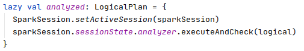

实现执行计划绑定的是 Analyzer，以下是其包含的batch。

```scala
lazy val batches: Seq[Batch] = Seq(
    Batch("Hints", fixedPoint,
      new ResolveHints.ResolveBroadcastHints(conf),
      ResolveHints.RemoveAllHints),
    Batch("Simple Sanity Check", Once,
      LookupFunctions),
    Batch("Substitution", fixedPoint,
      CTESubstitution,
      WindowsSubstitution,
      EliminateUnions,
      new SubstituteUnresolvedOrdinals(conf)),
    Batch("Resolution", fixedPoint,
      ResolveTableValuedFunctions ::
      ResolveRelations ::
      ResolveReferences ::
      ResolveCreateNamedStruct ::
      ResolveDeserializer ::
      ResolveNewInstance ::
      ResolveUpCast ::
      ResolveGroupingAnalytics ::
      ResolvePivot ::
      ResolveOrdinalInOrderByAndGroupBy ::
      ResolveAggAliasInGroupBy ::
      ResolveMissingReferences ::
      ExtractGenerator ::
      ResolveGenerate ::
      ResolveFunctions ::
      ResolveAliases ::
      ResolveSubquery ::
      ResolveSubqueryColumnAliases ::
      ResolveWindowOrder ::
      ResolveWindowFrame ::
      ResolveNaturalAndUsingJoin ::
      ExtractWindowExpressions ::
      GlobalAggregates ::
      ResolveAggregateFunctions ::
      TimeWindowing ::
      ResolveInlineTables(conf) ::
      ResolveTimeZone(conf) ::
      ResolvedUuidExpressions ::
      TypeCoercion.typeCoercionRules(conf) ++
      extendedResolutionRules : _*),
    Batch("Post-Hoc Resolution", Once, postHocResolutionRules: _*),
    Batch("View", Once,
      AliasViewChild(conf)),
    Batch("Nondeterministic", Once,
      PullOutNondeterministic),
    Batch("UDF", Once,
      HandleNullInputsForUDF),
    Batch("FixNullability", Once,
      FixNullability),
    Batch("Subquery", Once,
      UpdateOuterReferences),
    Batch("Cleanup", fixedPoint,
      CleanupAliases)
  )
```

##### 执行计划优化

经过绑定后的 LogicalPlan 会调用Optimizer 进行优化。对应QueryExecution 的是 optimizedPlan 属性

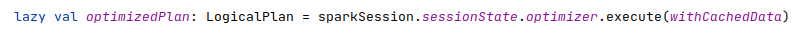

##### 物理计划生成。

###### 入口

QueryExecution的sparkPlan是经过算法选择之后的物理执行计划。

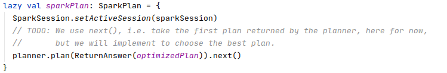

QueryExecution 的 executePlan 是真正可执行的物理计划，主要是在sparkPlan的基础上对不同步骤执行进行数据分布的匹配及其他准备活动。


###### 算子算法选择

从入口方法可以看出，算子算法的选择调用的是 planner 的plan 方法，这个方法定义在 QueryPlanner 的 plan 方法中，用于生成可选的多个物理执行计划。

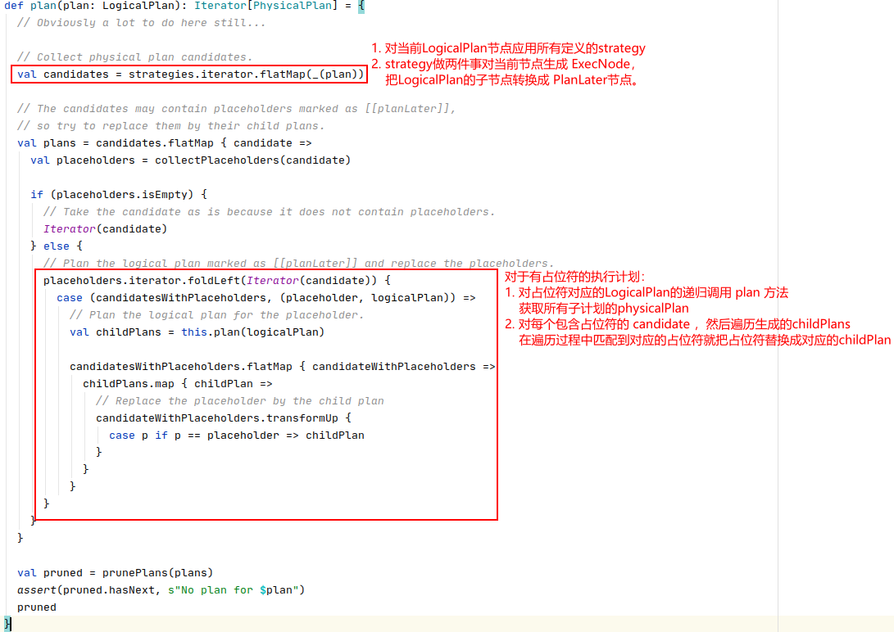

其中 collectPlaceHolder 是在SparkPlanner中实现的，其逻辑是以 Planlater作为占位符

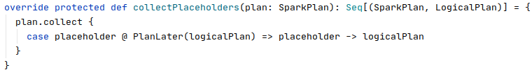

**SparkPlanner 的strategy集合如下**

```scala
override def strategies: Seq[Strategy] =
    experimentalMethods.extraStrategies ++
      extraPlanningStrategies ++ (
      DataSourceV2Strategy ::
      FileSourceStrategy ::
      DataSourceStrategy(conf) ::
      SpecialLimits ::
      Aggregation ::
      JoinSelection ::
      InMemoryScans ::
      BasicOperators :: Nil)
```

strategy 都是采用模式匹配的方式针对特定类型的LogicalPlan 节点生成执行计划。

###### prepareExecution

在完成了算子的算法选择后，就是对生成的PhysicalPlan进行准备工作。

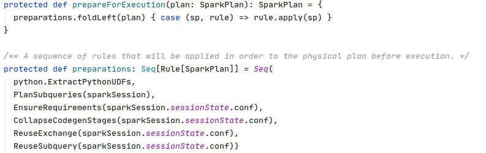

主要包含以下方法：

1. PlanSubqueries：
   
   1. 作用：处理特殊子查询的物理计划，如相关子查询

2. EnsureRequirements：
   
   1. 作用：确保执行计划的分区和排序正确性

3. CollapesCodegenStages：
   
   1. 作用：进行代码生成

4. ReuseExchange：
   
   1. 作用：Exchange节点的重用

5. ReuseSubquery：
   
   1. 作用：子查询的重用

###### EnsureRequirement， Distribution 和 Partitioning

Distribution 接口给主要描述的是对数据分布的需求，而 Partitioning 则是如何去实现 Distribution 的具体做法。

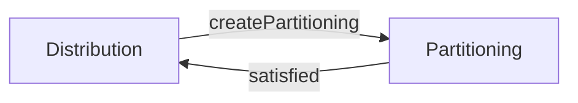

Distribution 可以调用 createPartitioning 方法创建符合条件的默认的Partitioning。Partitioning 可以调用 satisfied 方法检查本身是否满足给定的 Distribution。

**Distribution** 的接口定义如下:

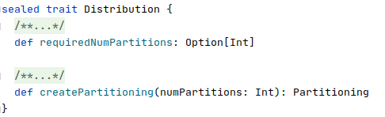

- requiredNumPartiton：表示该 Distribution 需要的分区数量。当返回 None 时表示不限制分区数量
- createPartitioning：创建满足要求的默认 Partitioning。

Distribution的子类如下图所示
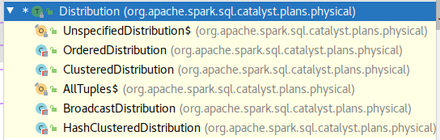

**Partitioning** 的接口定义如下

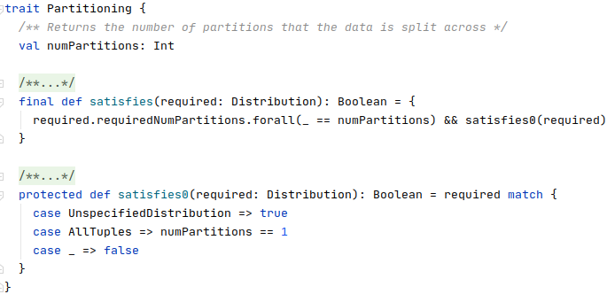

- numPartitions：分区数量

- satisfied：
  
  - 作用：检查是否满足Distribution。
  
  - 逻辑：如果Distribution限制分区数量则检查分区数量是否满足，然后调用 satisfied0 有子类进行重载各自的检查逻辑。

Partitioning 的类继承如下

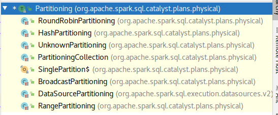


**EnsureRequirement.apply**方法的逻辑如下：

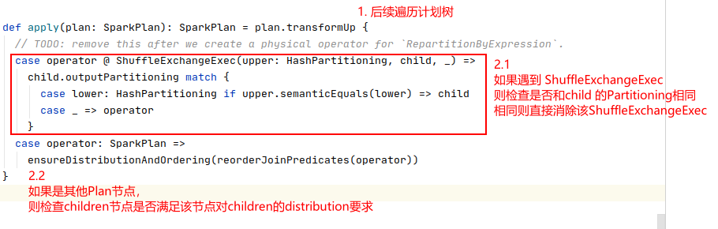


**EnsureRequirement.ensureDistributionAndOrdering**<br>

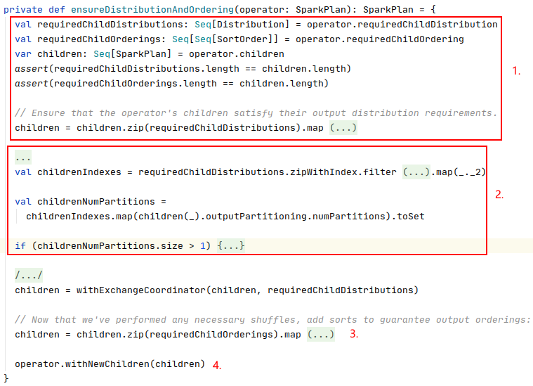

该方法的逻辑如下：

1. 获取经过处理的children 的list，处理逻辑是检查当前节点的所有子节点是否满足Distribution：
   
   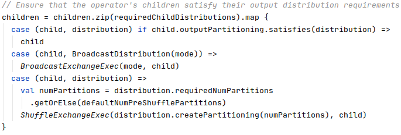
   
   1. 如果满足则直接引用child
   
   2. 如果是 BroadcastDistribution 则特殊处理
   
   3. 其他则根据 distribution的 requiredNumPartitions 或者 defaultNumPreShufflePartitions（在spark.sql.shuffle.partitions定义），通过createPartitioning创建Partitioning，并创建 ShuffleExchangeExec节点。

2. 统一child的output分区数量
   
   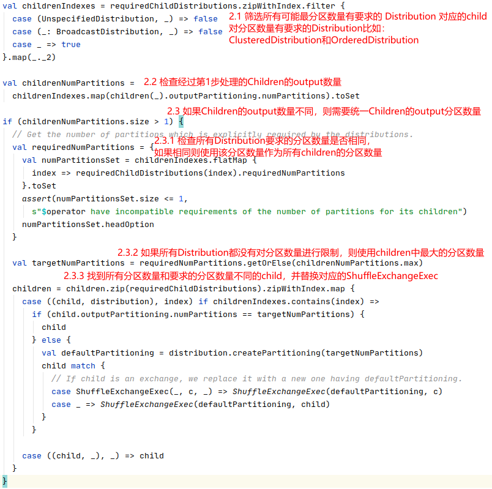
   
   1. 获取所有对child的Distribution要求中，对分区数量有要求的child节点Index。
   
   2. 获取这些节点的当前的Partitioning输出数量
   
   3. 如果分区数量统一则不做处理，如果不统一则做如下处理
      
      1. 检查这些child对应的所需的 Distribution 的 requiredNumPartitions
      
      2. 如果存在不同的 requiredNumPartitions 则报错，因为不能强制要求子节点有不同的分区数量
      
      3. 如果存在统一的requiredNumPartitions，则使用requiredNumPartitions，否则使用最大的 child的当前分区数量。

3. 检查child的 ordering，如果满足则 不做处理，如果不满足则加入SortExec
   
   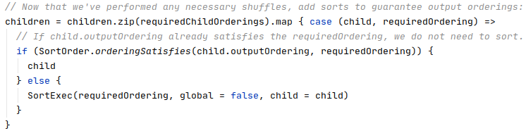

4. 把当前节点的children替换成经过处理之后的children，并返回该节点。


###### toRDD

toRDD 最终调用的是 SparkPlan 的 execute 方法来生成RDD。其源码如下，最终会调用 SparkPlan 的子类的doExecute方法进行 rdd 的生成

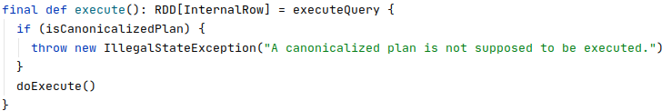

以SortExec 为例，其doExecute的方法就是获取child 的 execute 生成的 RDD， 然后创建新的RDD加入 sort的逻辑

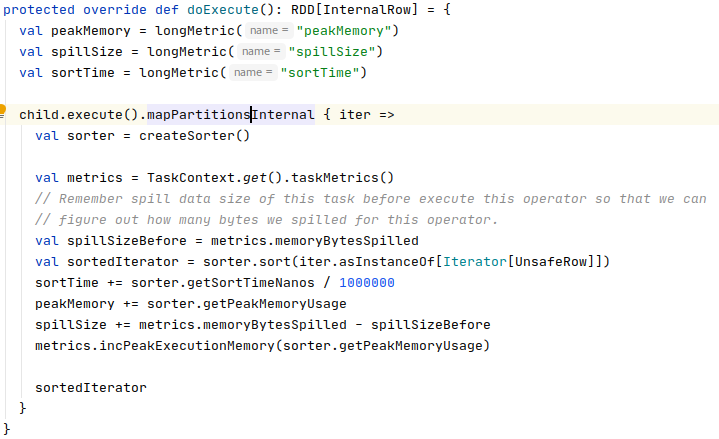


