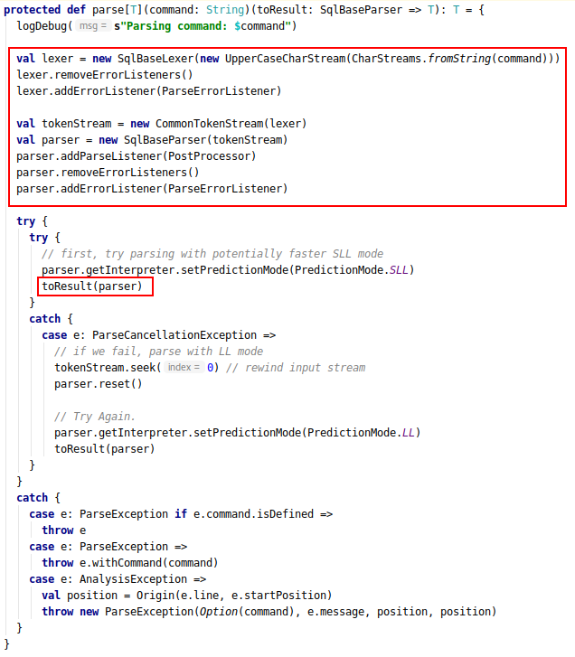

#### 执行计划生成

- Dataset API
  
  - 构造函数

- 生成 LogicalPlan 
  
  - 以sql为入口
  - 以 DF 变换为入口

- RuleExecutor 基于规则的执行计划处理器

- 执行计划绑定

- 执行计划优化

- 物理计划生成


##### Dataset API


##### 生成LogicalPlan

###### 以sql 为入口

入口如下，通过调用SparkSession 实例的 sql 方法生成 sql。


然后调用 sqlParser 的parsePlan 方法，这个方法定义在 AbstractSqlParser中。此处调用的 parse 方法是个偏函数，有两个入参，一个是 sql ，另一个是传入 parser 输出 logicalPlan 的函数。其中，圈出的部分就是传入parse 的函数参数。这个函数的逻辑主要是使用 astBuilder 去遍历 parse 生成的数据结构，最终生成logicalPlan。


最终调用的是 SparkSqlParser 的 parse 方法。其中包括了词法，语义和语句分析，并最终调用有 parsePlan 中构造的函数生成 logicalPlan。



**解析sql 使用的是 SqlBaseParse，里面包含了对语法的定义。而语法树到 AST 则是通过 SqlBaseBaseVisitor 完成对语法树的遍历。**<br>

最后在 Dataset 的 ofRows 方法中，会对生成的 logicalPlan 进行解析并绑定，得到 ResolvedLogicalPlan。


##### RuleExecutor 基于规则的执行计划处理器

执行计划的绑定和优化都需要使用 RuleExecutor。RuleExecutor 有如下成员：


- Strategy 类是指 Batch 迭代的次数。可以有 Once 和 FixedPoint 次

- Batch 是一个case class，包含名称，迭代次数上限和规则集合。

- isPlanIntegral：用于判断参数对应的计划是否完整。

- execute：用于把规则应用到执行计划中。

**以下是execute 方法的源码：**<br>

总体的逻辑是把 RuleExecutor 创建时给定所有 batch 依次应用到 LogicalPlan中。


在每个batch中使用foldLeft 把 Rule 依次应用到 plan 中，并且检查应用之后 Plan 是否完整。


##### 执行计划绑定

这个阶段主要进行的是 LogicalPlan 中的名字绑定，比如解析源表、别名、函数 和 子查询等等，把对应的名词替换成执行计划。<br>

实现执行计划绑定的是 Analyzer，以下是其包含的batch。

```scala
lazy val batches: Seq[Batch] = Seq(
    Batch("Hints", fixedPoint,
      new ResolveHints.ResolveBroadcastHints(conf),
      ResolveHints.RemoveAllHints),
    Batch("Simple Sanity Check", Once,
      LookupFunctions),
    Batch("Substitution", fixedPoint,
      CTESubstitution,
      WindowsSubstitution,
      EliminateUnions,
      new SubstituteUnresolvedOrdinals(conf)),
    Batch("Resolution", fixedPoint,
      ResolveTableValuedFunctions ::
      ResolveRelations ::
      ResolveReferences ::
      ResolveCreateNamedStruct ::
      ResolveDeserializer ::
      ResolveNewInstance ::
      ResolveUpCast ::
      ResolveGroupingAnalytics ::
      ResolvePivot ::
      ResolveOrdinalInOrderByAndGroupBy ::
      ResolveAggAliasInGroupBy ::
      ResolveMissingReferences ::
      ExtractGenerator ::
      ResolveGenerate ::
      ResolveFunctions ::
      ResolveAliases ::
      ResolveSubquery ::
      ResolveSubqueryColumnAliases ::
      ResolveWindowOrder ::
      ResolveWindowFrame ::
      ResolveNaturalAndUsingJoin ::
      ExtractWindowExpressions ::
      GlobalAggregates ::
      ResolveAggregateFunctions ::
      TimeWindowing ::
      ResolveInlineTables(conf) ::
      ResolveTimeZone(conf) ::
      ResolvedUuidExpressions ::
      TypeCoercion.typeCoercionRules(conf) ++
      extendedResolutionRules : _*),
    Batch("Post-Hoc Resolution", Once, postHocResolutionRules: _*),
    Batch("View", Once,
      AliasViewChild(conf)),
    Batch("Nondeterministic", Once,
      PullOutNondeterministic),
    Batch("UDF", Once,
      HandleNullInputsForUDF),
    Batch("FixNullability", Once,
      FixNullability),
    Batch("Subquery", Once,
      UpdateOuterReferences),
    Batch("Cleanup", fixedPoint,
      CleanupAliases)
  )
```


##### 执行计划优化


