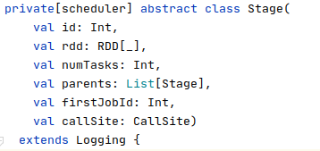
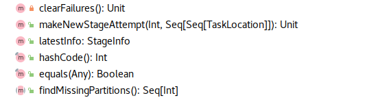

### Stage源码

- stage 数据结构
  
  - 成员变量
  
  - 子类

- stage 划分

#### stage 数据结构

##### 成员变量

**构造函数变量**

- id：stage Id

- rdd：

- numTasks：运行task 的数量

- parents：依赖的 Stage

- firstJobId：

- callSite：用户代码和该stage相关的位置

**成员方法**

- findMissingPartitions：
  
  - 抽象方法
  
  - 需要子类实现返回哪些partition还未进行计算。

##### 子类

**ShuffleMapStage**

- 

- ResultStage
