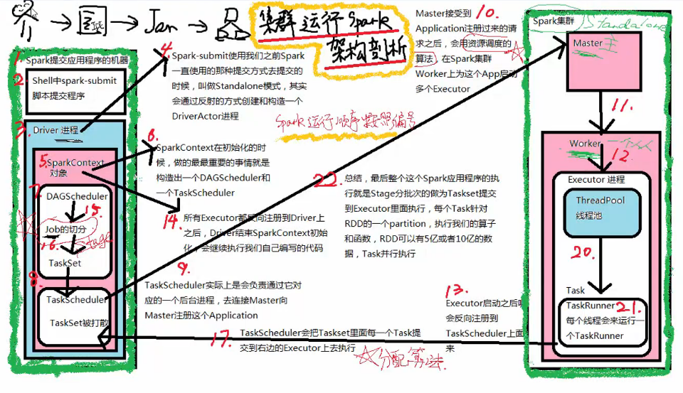
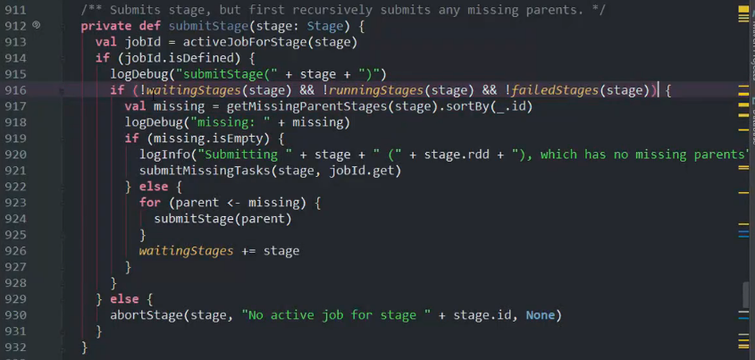
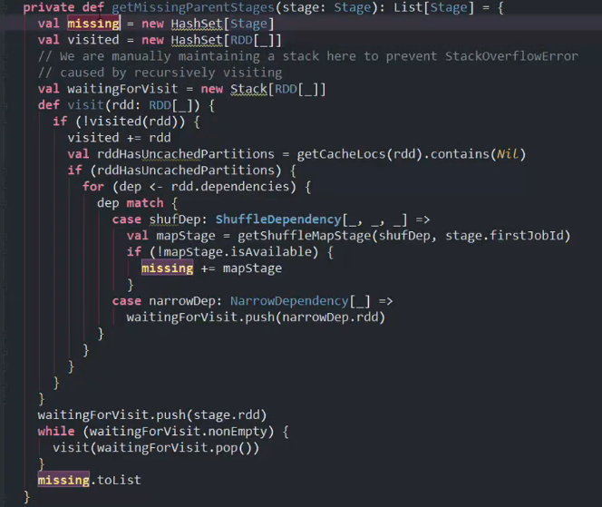

##### 任务调度及DAG生成源码

- spark 任务提交后job启动的过程

- spark DAG 生成过程

###### spark 任务提交后job启动的过程

1. 用户通过spark-submit提交application到集群上

2. 然后集群就会根据选择的deploy-mode选择在client 端还是cluster端启动 driver。

3. 启动的 Driver 进程实际上就是我们编写的main函数。然后driver中如果遇到了RDD的action操作就会生成 DAG并且最终生成task set提交到 task scheduler 中进行运行。

4. Driver运行的时候还进行了 task scheduler的创建，这一个操作主要是在 new SparkContext()中进行的，这个方法会根据我们选择的master 创建对应的task scheduler实现。这个创建过程包含几个主要步骤
   
   1. 创建task scheduler实例。
   
   2. 根据配置向集群申请资源并且启动excutor
   
   3. 每个executor 启动成功之后就会把自己注册回driver。
   
   4. task scheduler 就完成创建

5. task scheduler 就会把提交过来的task set 分配到指定的机器去执行。分配的方式主要根据 getPreferredLocs获取比较好的执行task 的机器。

###### spark DAG 生成过程

**典型的 spark stage实例**

该图对应的是一个job，其中每个虚线框代表一个stage，每个stage内的一条线就代表的是一个task。一个实线方框代表一个RDD，一个RDD内的块代表一个partition。

1. 通过RDD的action 触发

2. 从最后的stage开始，把最后的stage构造成 final stage，然后传递到submit stage 中进行stage的切分。

3. 在submit stage中递归地根据RDD的依赖切分stage。每当遇到一个RDD的宽依赖就对应的宽依赖切分出一个新的stage，由于这个stage是新切分的，所以是没有被提交的，所以称为 missing stage。

4. 当一个stage 没有 missing stage 的时候就会通过 submitMissingTask 方法把 stage 根据partition 切分成task 去运行。

5. 其中getMissingParentStages 方法做得事情就是根据 stage 对应的RDD，遍历该RDD对应的所有dependent RDD。遍历的时候做以下事情
   1. 对于shuffleDependency就添加到missing中，即这些 RDD是属于依赖到的并且还没提交的stage。这些stage 返回后就会在submitStage中继续递归解析。
   
   2. 对于 NarrowDependency，继续对窄依赖的dependency进行搜索，知道找到没有依赖的RDD，即source。

