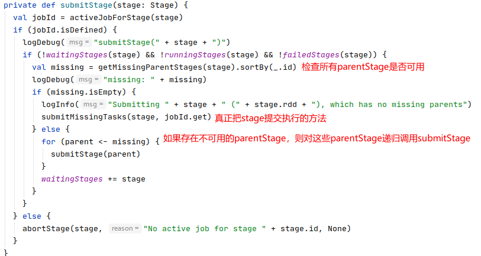

##### 任务调度及DAG生成源码

- spark 任务提交后job启动的过程
  
  - 从RDD到Executor的执行task 的总体流程图

- spark DAG 生成过程
  
  - DAG生成的三个阶段
  
  - 把 RDD 的action 转换成 DAGScheduler的runJob方法所需的参数
  
  - 创建 JobID 并提交
  
  - 创建 JobID 相关的 Stage实例并提交。

###### spark 任务提交后job启动的过程

1. 用户通过spark-submit提交application到集群上

2. 然后集群就会根据选择的deploy-mode选择在client 端还是cluster端启动 driver。

3. 启动的 Driver 进程实际上就是我们编写的main函数。然后driver中如果遇到了RDD的action操作就会生成 DAG并且最终生成task set提交到 task scheduler 中进行运行。

4. Driver运行的时候还进行了 task scheduler的创建，这一个操作主要是在 new SparkContext()中进行的，这个方法会根据我们选择的master 创建对应的task scheduler实现。这个创建过程包含几个主要步骤
   
   1. 创建task scheduler实例。
   
   2. 根据配置向集群申请资源并且启动excutor
   
   3. 每个executor 启动成功之后就会把自己注册回driver。
   
   4. task scheduler 就完成创建

5. task scheduler 就会把提交过来的task set 分配到指定的机器去执行。分配的方式主要根据 getPreferredLocs获取比较好的执行task 的机器。


###### 从RDD到Executor的执行task 的总体流程图


###### spark DAG 生成过程

**典型的 spark stage实例**

该图对应的是一个job，其中每个虚线框代表一个stage，每个stage内的一条线就代表的是一个task。一个实线方框代表一个RDD，一个RDD内的块代表一个partition。


1. 通过RDD的action 触发

2. 从最后的stage开始，把最后的stage构造成 final stage，然后传递到submit stage 中进行stage的切分。

3. 在submit stage中递归地根据RDD的依赖切分stage。每当遇到一个RDD的宽依赖就对应的宽依赖切分出一个新的stage，由于这个stage是新切分的，所以是没有被提交的，所以称为 missing stage。

4. 当一个stage 没有 missing stage 的时候就会通过 submitMissingTask 方法把 stage 根据partition 切分成task 去运行。


5. 其中getMissingParentStages 方法做得事情就是根据 stage 对应的RDD，遍历该RDD对应的所有dependent RDD。遍历的时候做以下事情
   
   1. 对于shuffleDependency就添加到missing中，即这些 RDD是属于依赖到的并且还没提交的stage。这些stage 返回后就会在submitStage中继续递归解析。
   
   2. 对于 NarrowDependency，继续对窄依赖的dependency进行搜索，知道找到没有依赖的RDD，即source。


###### DAG生成的三个阶段

1. 从 RDD 的action 函数开始到调用DAGScheduler 的 runJob的方法
   
   1. 不断调用 SparkContext 的 runJob 方法的重载。这些方法最终会调用 DAGScheduler 的 runJob方法。
      
      ```scala
      def runJob[T, U](
            rdd: RDD[T],
            func: (TaskContext, Iterator[T]) => U,
            partitions: Seq[Int],
            callSite: CallSite,
            resultHandler: (Int, U) => Unit,
            properties: Properties): Unit
      ```
      
      这个方法参数有
      
      1. rdd：最终触发action 的rdd
      
      2. func：用于处理每个分区的函数，每个分区会提供一个迭代器 Iterator[T] 最终返回 U
      
      3. partitions：所有相关的分区ID
      
      4. callSite：用户代码中调用action函数的位置。
      
      5. resultHandler：最终把消费所有分区的结果并生成最终结果的函数
      
      6. properties：运行时属性
   
   2. 这些重载的方法主要作用是
      
      1. 把中间处理过程用到的处理函数进行依赖清理，最后得到可以正常序列化和反序列化的 func。
      
      2. 把action函数的逻辑包装成 resultHandler。
      
      3. 获取一些其他信息，如callSite，properties

2. 从 DAGScheduler的 runJob 方法到调用DAGScheduler的 submitJob 方法，到提交 SubmitJob 时间到 EventLoopBus，最终在DAGScheduler 的 handleJobSubmit 方法创建finalStage和ActiveJob实例 。**（提交JobId并创建Job实例）**
   
   1. 在DAGScheduler的 runJob 方法中，会调用submitJob方法创建 JobWaiter，并调用返回的jobWaiter的awaitResult方法等待job完成。
   
   2. 在DAGScheduler的submitJob方法中，包含以下逻辑
      
      1. 检查RDD分区数量
      
      2. 生成JobId
      
      3. 创建JobWaiter。用JobWaiter用于等待Job成功或者失败，并执行对应的回调函数
      
      4. 创建JobSubmit事件，发送到EventLoopBus中。
      
      5. 返回创建的JobWaiter实例
   
   3. 在DAGScheduler 的 handleJobSubmit 方法中
      
      1. 创建finalStage
      
      2. 创建ActiveJob实例
      
      3. 向listenerBus 提交 JobStart事件
      
      4. 调用submitStage，并传入finalStage。

3. DAGScheduler  的 submitStage 方法开始从 finalRDD开始创建 finalStage，并创建各个依赖的parentStag，并创建对应的TaskSet 提交到 TaskScheduler。**（创建Job相关所有的Stage实例，并提交）**

###### 把 RDD 的action 转换成 DAGScheduler的runJob方法所需的参数

###### 创建 Job 实例并提交

###### Submit finalStage

**submitStage逻辑**

DAGScheduler的submitStage主要的逻辑如下



1. 检查该stage 是否有 isAvailable 是false 的parent，如果有则首对这些 parentStage 调用 submitStage方法

2. 如果没有则调用 submitMissingTasks 方法

**DAGScheduler 的 getMissingParentStages 的逻辑** <br>

遍历stage对应RDD的所有依赖，如果是ShuffleDependency则检查对应的ShuffleMapStage是否可用。如果是narrowDep则继续检查其依赖。**因为对于每一个stage来说，其数据来源只有两个可能一个是直接的数据源。另一个是 shuffle过后的结果。其中直接数据源没有dependency。**


其中在 getOrCreateShuffleMapStage 这个方法中会创建 ShuffleMapStage，这个方法会做以下事情：


1. 在 DAGScheduler 中shuffleIdToMapStage会记录 shuffleId 和 ShuffleMapStage 的关系。如果存在shuffleId 对应的 ShuffleMapStage 则直接返回

2. 如果不存在则
   
   1. 调用getMissingAncestorShuffleDependencies方法获取所有父依赖的中没有注册到 shuffleIdToMapStage 中的 ShuffleDependency。
   
   2. 对这些ShuffleDependency调用 createShuffleMapStage 方法创建 ShuffleMapStage 并注册到 shuffleIdToMapStage中
   
   3. 最后对本调用createShuffleMapStage身进行创建和注册。

在 createShuffleMapStage 会创建 ShuffleMapStage 实例并在mapOutputTracker 中注册对应的shuffleId，并跟踪对应的shuffle是否完成。


**submitMissingTasks**主要的作用是序列化RDD，创建task实例，并把task包装成TaskSet提交到TaskScheduler进行运行。其逻辑如下

1. 获取所有需要计算的partitionId
   
   

2. 初始化Stage 的状态
   
   

3. 过去每个task的最佳location
   
   

4. 对stage对应的RDD进行序列化，并把序列化对象进行广播。其中此处序列化的对象都会在 ResultTask或者ShuffleMapTask 中的runTask 方法中进行反序列化
   
   

5. 创建task实例，对task
   
   

6. 把创建的task实例包装成 TaskSet 提交到 taskScheduler中
   
   
