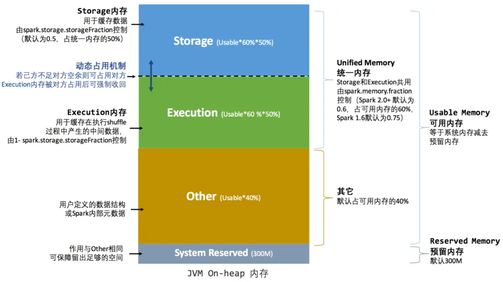
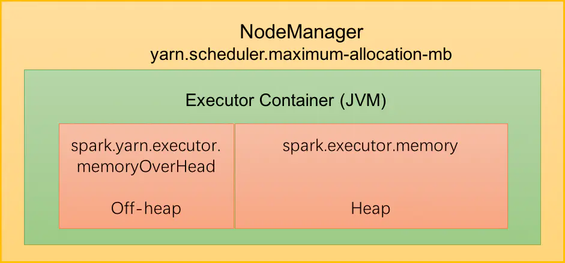

##### Spark 内存相关配置

- Spark unified memory 管理机制

- Spark on Yarn 内存管理配置

###### Spark unified memory 管理机制

unified memory管理机制主要用于管理spark executor 的JVM堆内存。下列参数用于配置上述各个区间的大小。**需要注意的是上述分区方式和JVM底层的内存模型不相关，上述的分区方式主要是用于内存空间大小的管理。**

- spark.executor.memory：用于配置整个堆内存大小。 = Usable Memory + Reserved Memory

- spark.memory.fraction：用于配置 unified memory 的大小。

- spark.storage.storageFraction：用于配置初始时期storage内存的占比

###### Spark on Yarn内存管理配置

上图是 spark on Yarn和executor相关的内存参数的关系。

- spark.executor.memory：配置JVM堆内内存

- spark.yarn.executor.memoryOverHead：配置JVM的堆外内存大小

- yarn.scheduler.maximum-allocation-mb：是yarn 集群上配置每个container能够拿到的最大内存。**这个内存大小，包含从JVM产生的子进程的内存。**
