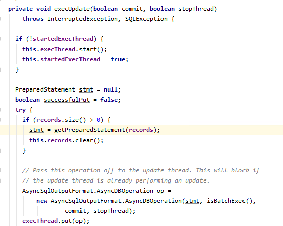
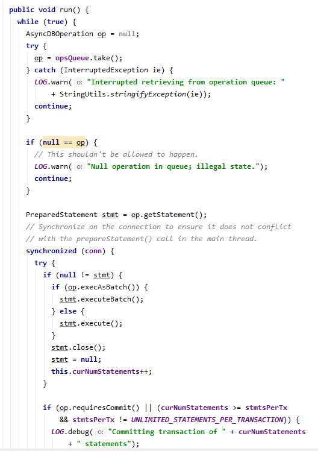
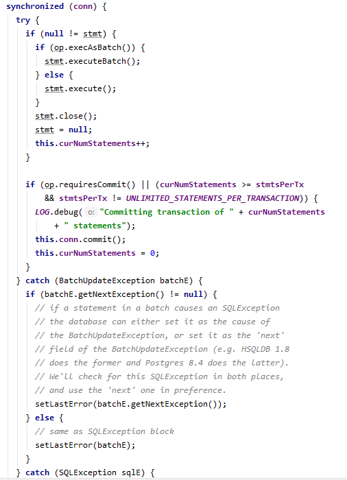
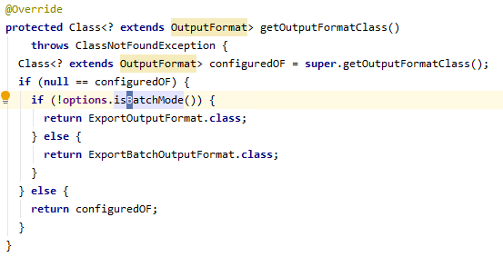
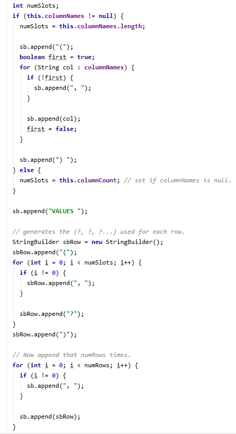
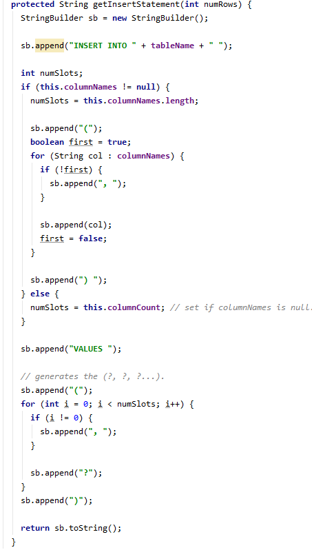

##### Export 源码

- 文件读取

- 生成sql 并执行

###### 文件读取

###### 生成sql 并执行

在sqoop中控制sql 的class是 AsyncSqlRecordWriter. 生成sql 的方法栈是 Write -> execUpdate -> getPreparedStatement。

其中相关的语句如下图：

其中 getPreparedStatement 是抽象方法由子类去实现。得到的sql statement被封装成AsyncDBOperation由另一个异步线程线程负责执行发送sql到DB。

sql执行的语句如下：

每个AsyncSqlRecordWriter会包含一个异步线程AsyncSqlExecThread提交sql，每个sql会封装成operation放到AsyncSqlExecThread的队列中，然后AsyncSqlExecThread会不断从队列中取出operation执行。

和sql 事务提价的语句如下：

其中operation的requireCommit 这个语句直接就是创建operation的时候就指定的了。还有一个就是根据当前writer 已经提交的语句数量是否超过每个transaction的语句数量。

sql statement的生成方式由各个AsyncSqlRecordWriter。这个主要由命令行参数--batch来控制。这个参数实际上是配置SqoopOptions 这个class的 isBatchMode 的返回值。这个返回值主要是控制 **ExportJobBase** 里面选择 ExportFormat的 class。

其中 ExportOutputFormat 和 ExportBatchOutputFormat 的内部分别由两个writer 的实现类ExportRecordWriter和ExportBatchRecordWriter，。这两个实现类 都是 AsyncSqlRecordWriter 的子类。

这两个writer的区别就在 getPreparedStatement，而getPreparedStatement里面又会引用 getInsertStatement。getInsertStatement这个方法就是控制生成insert语句的方法。

ExportRecordWriter生成的是 类似 insert value (?,?,..),(?,?,..).. 的语句：

ExportBatchRecordWriter生成的是 类似 insert value (?,?,..); 的语句：

