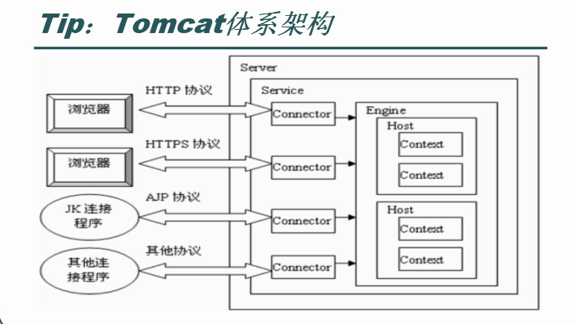
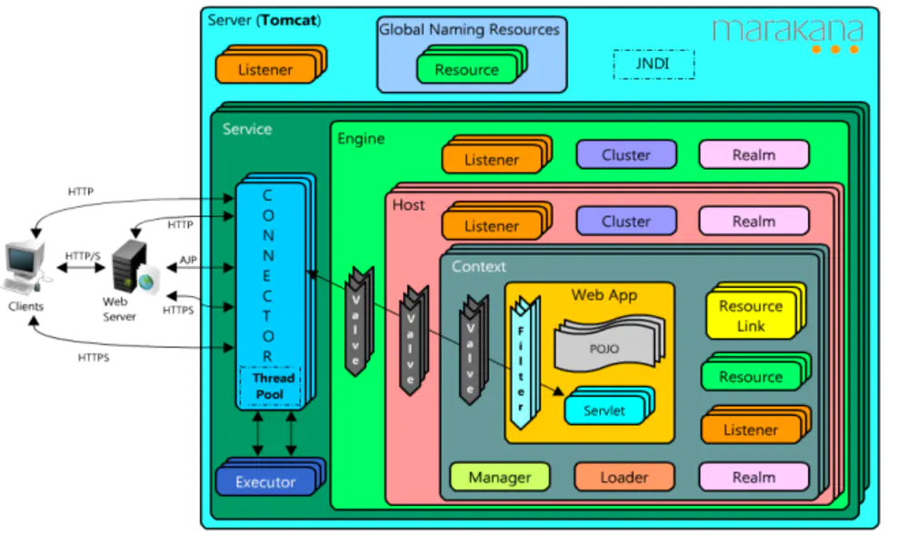
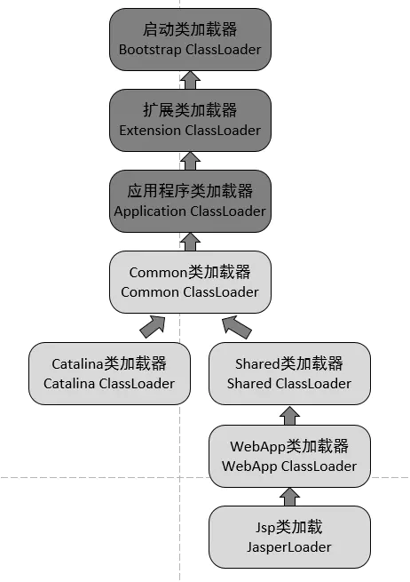

### Tomcat

- 安装和启停

- 目录结构和配置项

- `server.xml`配置
  
  - Connector 和 Executor 配置
  
  - Host 配置
  
  - 安全相关配置
  
  - 其他配置

- Tomcat 类加载机制

#### 安装和启停

1. 下载解压即可完成安装

2. 需要配置环境变量`JAVA_HOME`

启动和停止分别依靠bin下的`startup.sh`和`shutdown.sh`完成。

**注意！如果本机安装了多个Tomcat，不论点击谁的startup.bat，启动的都是CATALINA_HOME变量所指向的Tomcat。**

#### 目录结构和配置项

tomcat 目录结构如下

```textile
tomcat
　　|---bin：存放启动和关闭tomcat脚本

　　|---conf：存放不同的配置文件（server.xml和web.xml）；
　　|---doc：存放Tomcat文档；
　　|---lib/japser/common：存放Tomcat运行需要的库文件（JARS）；
　　|---logs：存放Tomcat执行时的LOG文件；
　　|---src：存放Tomcat的源代码；
　　|---webapps：Tomcat的主要Web发布目录（包括应用程序示例）；
　　|---work：存放jsp编译后产生的class文件；
```

conf 目录下包含的配置文件：

- **server.xml**: Tomcat的主配置文件，包含Service, Connector, Engine, Realm, Valve, Hosts主组件的相关配置信息；

- **web.xml**：遵循Servlet规范标准的配置文件，用于配置servlet，并为所有的Web应用程序提供包括MIME映射等默认配置信息；

- **tomcat-user.xml**：Realm认证时用到的相关角色、用户和密码等信息；Tomcat自带的manager默认情况下会用到此文件；在Tomcat中添加/删除用户，为用户　　指定角色等将通过编辑此文件实现；

- **catalina.policy**：Java相关的安全策略配置文件，在系统资源级别上提供访问控制的能力；

- **catalina.properties**：Tomcat内部package的定义及访问相关控制，也包括对通过类装载器装载的内容的控制；Tomcat在启动时会事先读取此文件的相关设置；

- **logging.properties:** Tomcat6通过自己内部实现的JAVA日志记录器来记录操作相关的日志，此文件即为日志记录器相关的配置信息，可以用来定义日志记录的组　　件级别以及日志文件的存在位置等；

- **context.xml：** 所有host的默认配置信息

#### `server.xml`配置

`server.xml`主要配置和请求处理以及webapp相关的选项。和Tomcat的请求处理架构息息相关。





一个tomcat进行由 Server->Service->Engine->Host->Context 组成的四层结构

- `server`：每个`server.xml`只能有一个server标签。代表一个tomcat进程的全局配置。

- `service`：一个tomcat进程可以有多个service。

- `Executor`：用于配置线程池

- `Connector`：配置某个service监听的端口。

- `Engine`：一个service只能有一个engine，代表处理请求的组件。Engine组件从一个或多个Connector中接收请求并处理。该标签主要用于配置service 的默认主机`defaultHost`

- `Host`：用于配置不同的虚拟主机。当客户端通过不同的域名访问到此主机时，可以把不同的请求导向不同的 web app。

- `Context`：一个web app实例。

##### Connector 和 Executor 配置

Connector 配置项有：

- enableLookups：(default=true) 是否允许反向解析访客的IP地址，当你的应用程序使用 request.getRemoteHost() 时如果只需要IP地址，建议禁用此项，这样能节省反向域名解析的时间。
- maxPostSize：(default=2097152 即2MB) 最大允许 POST 上传的数据大小（单位为：字节），对于一般网站来说，比如有写评论写文章的网站，默认的2MB已经足够，不过如果网站带有图片甚至文件上传功能，则需要根据具体情况来定。
- protocol：连接器的类型，tomcat 6 有如下几种选择
  - org.apache.coyote.http11.Http11Protocol：简写为 “HTTP/1.1″，这是默认的连接器，一个访客网络连接需要一个线程，并发性能比较低。
  - org.apache.coyote.http11.Http11NioProtocol：NIO连接器，一个由非阻塞的socket工作模式构成的连接器，并发性能良好，纯Java实现。
  - org.apache.coyote.http11.Http11AprProtocol：APR连接器，所谓 APR 就是网络上最多服务器使用的 Web 服务程序 [Apache Http Server](http://httpd.apache.org/) 所使用的库，Tomcat 建议在生产环境使用，具体方法下面会介绍。
- redirectPort：当用户访问非https的资源而该资源又需要https方式访问时，tomcat会自动重定向到https端口，一般https使用 TCP 443端口，所以一般取值”443″。
- SSLEnabled：(default=false)，设置当前连接器是否使用安全SSL传输，如果设置为”true”，则应该同时设置下面两个属性： scheme=”https” (default=http) 可以设置为 http 或者 https。 secure=”true” (default=false)。
- adress：连接器所绑定的IP地址，当一台服务器存在多个ip地址时可以指定其中的需要绑定的一个，默认不设置该属性的值表示绑定当前服务器的所有ip地址。
- compressableMimeType：(default=”text/html,text/xml,text/plain”) 指定需要GZIP压缩的资源的类型。
- compression：(default=off) 是否启用GZIP压缩，可以取值 on/off/force，设置为on之后会对 compressableMimeType 属性指定的资源类型启用GZIP压缩。
- connectionTimeout：(default=”60000″) 当访客网络连接后，服务器等待第一行Request头出现的时间。单位是毫秒。
- executor：指定当前连接器使用的线程池的名称，如果指定，则忽略其他针对线程数量的设置，比如 maxThreads。
- maxThreads：(default=200) 最多可创建线程的数量。
- port=”80″：绑定端口。
- keepAliveTimeout：(default=connectionTimeout)，访客完成一次请求后维持网络连接的时间。

Executor配置有：

- name：线程池名称。

- namePrefix：线程前缀

- maxThreads：最大线程数量

- minSpareThreads：最小线程数量

**默认每个connector创建自己的线程池。**


##### Host 配置

Host配置属性有：

- name：设置虚拟主机的域名，比如 localhost 表示本机名称，实际应用时应该填写具体域名，比如 www.dog.com 或者 dog.com，当然如果该虚拟主机是给内部人员访问的，也可以直接填写服务器的 ip 地址，比如 192.168.1.10。
- autoDeploy：是否允许自动部署，默认值是 true，即表示 Tomcat 会自动检测 appBase 目录下面的文件变化从而自动应用到正在运行的 Web 应用程序。
- unpackWARs：设置是否自动展开 war 压缩包再运行 Web 应用程序，默认值是 true。
- appBase：设置 Web 应用程序组的路径。前面说过一个虚拟主机可以由多个 Web 应用程序构成，所以这里的 appBase 所指向的目录应该是准备用于存放这一组 Web 应用程序的目录，而不是具体某个 Web 应用程序的目录本身（即使该虚拟主机只由一个 Web 应用程序组成）。appBase 属性的值可以是相对于 Tomcat 安装目录的相对路径，也可以是绝对路径，需要注意的是该路径必须是 Tomcat 有权限访问的，通过 Arch Linux 源安装的 Tomcat 是通过 tomcat 用户运行的，因此创建一个新的 appBase 目录之后可以使用 chown 命令更改目录的所有者。

虚拟主机，通过不同的请求域名指向不同的webapp目录。例子：

```xml
<Host name="www.dog.com" appBase="/var/lib/tomcat6/dog" autoDeploy="true" unpackWARs="true">  
</Host>  
<Host name="www.cat.com" appBase="/var/lib/tomcat6/cat" autoDeploy="true" unpackWARs="true">  
</Host>  
```


##### 安全相关配置

tomcat通过`域(Realm)`定义可以进行访问控制的范围，通过Resource提供用户密码等信息，最后通过在`web.xml`中配置`security-constraint`定义需要进行访问控制的资源

###### Resource配置

所有的resource都定义在`GlobalNamingResources`中，在。


resource相关文章参考：[Apache Tomcat 8 (8.5.66) - JNDI Resources How-To](https://tomcat.apache.org/tomcat-8.5-doc/jndi-resources-howto.html)


##### 其他配置

- c


#### Tomcat 类加载机制

tomcat 的类加载器父子关系如下:



其中各个类加载器的作用如下：

- Common类加载器，负责加载Tomcat和Web应用都复用的类。
  - 加载位置如下：
    - `$CATALINA_BASE/lib`
    - `$CATALINA_BASE/lib/*.jar`
    - `$CATALINA_HOME/lib`
    - `$CATALINA_HOME/lib/*.jar`
      
      其中CATALINA_HOME是tomcat的安装路径。通常CATALINA_HOME和CATALINA_BASE相同。但是单机多实例的话可以通过下面的方式配置不同的CATALINA_BASE。
      
      ```shell
      CATALINA_BASE=/tmp/tomcat_base1 bin/catalina.sh start
      ```
- Catalina类加载器，负责加载Tomcat专用的类，而**这些被加载的类在Web应用中将不可见**
- Shared类加载器，负责加载Tomcat下所有的Web应用程序都复用的类，而这些被加载的类在Tomcat中将不可见
- WebApp类加载器，**每个webapp独立一个**。负责加载具体的某个Web应用程序所使用到的类，而这些被加载的类在Tomcat和其他的Web应用程序都将不可见
  - 用于加载 `/WEB-INF/classes`和 `/WEB-INF/lib`下的类。
- Jsp类加载器，每个jsp页面一个类加载器，不同的jsp页面有不同的类加载器，方便实现jsp页面的热插拔

参考：

- [深入理解Tomcat（五）类加载机制 - 简书](https://www.jianshu.com/p/51b2c50c58eb)

- [Apache Tomcat 8 (8.5.66) - Class Loader How-To](https://tomcat.apache.org/tomcat-8.5-doc/class-loader-howto.html)
