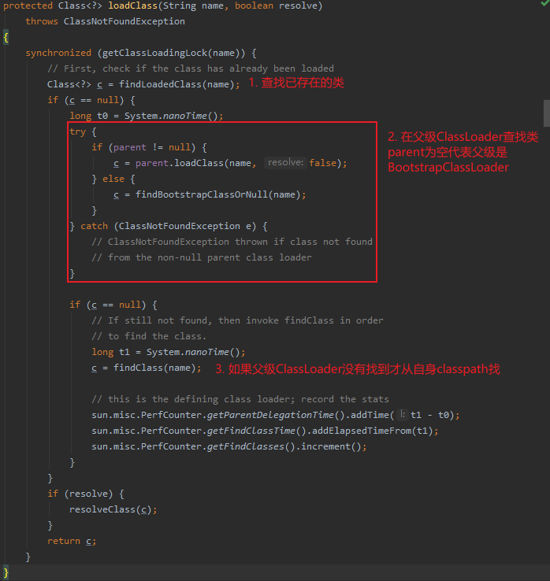
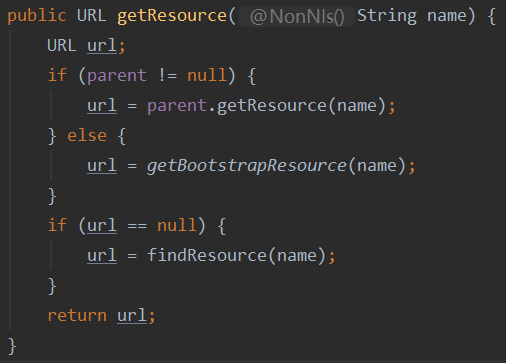
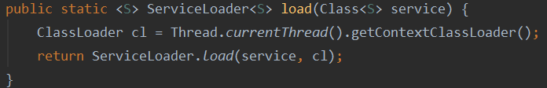

### Class和ClassLoader

- ClassLoader
  
  - 常用方法
  
  - 双亲委托机制
  
  - ContextClassLoader

- Class
  
  - forName方法
  
  - loadClass方法
  
  - getResource方法
  
  - 

#### ClassLoader

##### 常用方法

- loadClass：通过类名加载类
  
  - resolve 参数：代表类实例是否被初始化，初始化包括连接以及设置静态变量值和调用static方法块

- findClass：定义ClassLoader本身如何通过类名找到类实例

- defineClass：直接通过字节码定义四新的类实例

- getResource：在classpath查找文件，
  
  - name参数：资源文件相对于classpath的路径，**注意路径不能以”/“开头，路径分隔符固定为”/“**
  
  - getResource同样满足双亲委托机制，对应实际查找资源的方法为 findResource

##### 双亲委托机制

###### 为什么采用双亲委托并且双亲委托可以被重载

采用原因：

- 保证JDK的核心代码只能由BootStrap类加载器加载，避免核心API被篡改。

- 保证JDK的核心代码加载一次。

为什么可以被重载：

- 双亲委托机制是用于保证核心代码的稳定性，所以非核心代码的类加载器可以采用其他加载机制。

###### 实现机制

双亲委托机制实现主要是方法`ClassLoader.loadClass(name,resolve)`，如果需要违背双亲委托，只需要重载loadClass方法。

getResource的双亲委托机制实现也是通过ClassLoader的getResource，重载可以修改这一机制

##### ContextClassLoader

ContextClassLoader是JDK提供加载违背双亲委托类的机制，通常是接口类的类加载器不包含实现类，这时就需要ContextClassLoader来加载这些实现类。**ClassLoader没有提供代码直接使用ContextClassLoader，需要由开发者控制何时使用ContentClassLoader** 

例子:

- Java的内置SPI代码，ServiceLoader的load方法，默认情况下就是通过ContextClassLoader
  
  

- 

#### Class

##### forName方法

默认会初始化类实例，默认的类加载器是Class初次调用时，调用方的类加载器。

##### getResource方法

Class的getResource本质上调用Class本身的ClassLoader对应的getResource方法加载资源。
