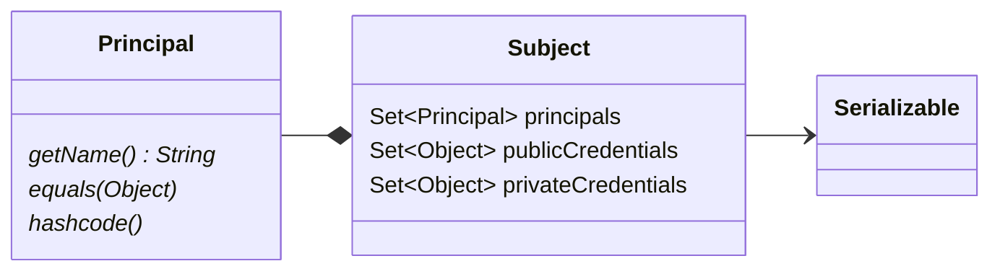
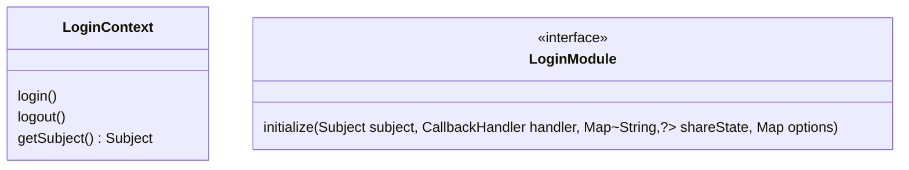
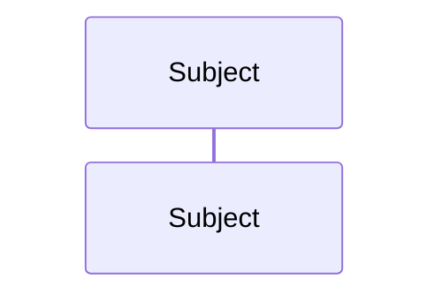

# JAAS框架

[TOC]

## 框架简介

通过可插拔方式将认证与授权服务和应用程序分离开。应用程序只需要确定哪些代码在执行时需要进行身份验证和权限校验，具体的实现由运行时配置的认证和授权服务提供。

## 核心类和接口

数据实体类：

- Subject：代表当前主体的身份上下文、可以是用户、进程、线程等。
- Principal：代表一个具体的权限身份。一个主体会有多个权限身份
- Credential：主体持有的凭证，比如公钥、私钥、密码等。

身份验证接口类：

- LoginContext: 一次身份认证认证的上下文实体，提供认证过程的操作方法以及获取当前上下文对应的身份主体
- LoginModule: 认证逻辑实现的接口，

## 相关文档

- [Java 认证与授权(JAAS)介绍](https://blog.51cto.com/wuyongyin/6024152)