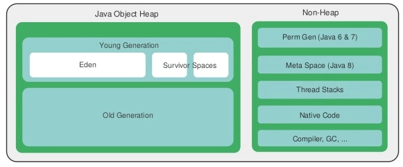
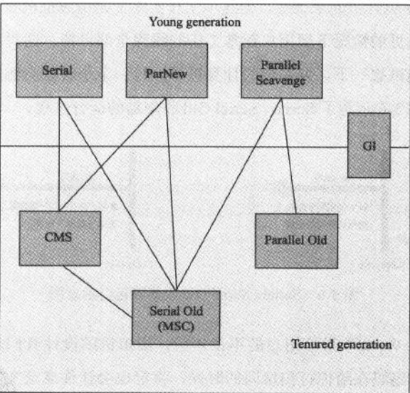
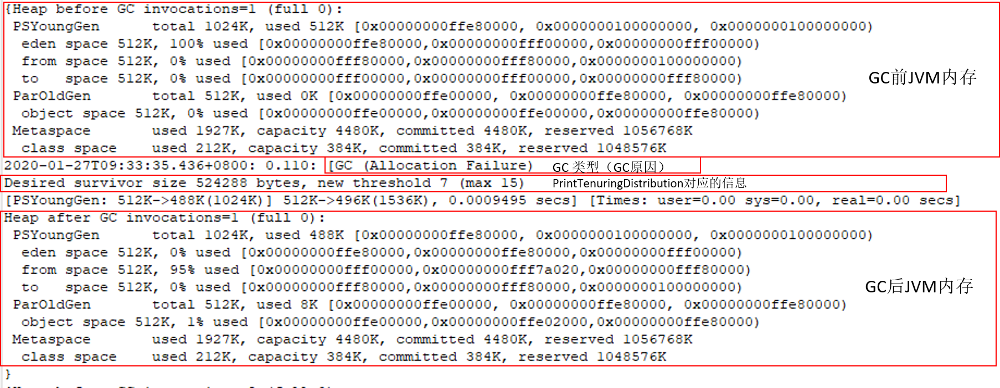

##### JVM内存及GC

- JVM内存结构

- JVM内存相关参数

- JVM GC 类型

- JVM GC 日志

###### JVM 内存结构

JVM 运行的最大内存通过下面的公式计算

Max memory = [-Xmx] + [-XX:MaxPermSize] + number_of_threads * [-Xss]

其中 

- -Xmx 是最大堆内存

- [-XX:MaxPermSize] 对应是永久代或者元数据最大内存。
  
  在JDK7之前字符串常量和类信息存放在永久代，由于字符串常量池的空间不可控，所以JDK7之后移入堆空间中。并且类信息存放到 Metaspace，通过类似 -XX:MaxMetaspaceSize=500M 控制。
  
  **如果没有使用-XX:MaxMetaspaceSize来设置类的元数据的大小，其最大可利用空间是整个系统内存的可用空间。**

- [-Xss] 线程栈大小

其中堆内存分为新生代和老年代，通过参数 -Xmn 或者-XX:NewRatio控制。

- -Xmn 参数设置的是新生代的大小。

- -XX:NewRatio 是配置新生代和老年代的比值。比如 4 代表 新生代：老年代=1:4.

新生代又分为 Eden 区和survivor 区，通过参数 **-XX:SurvivorRation**配置。比如8表示，survivor ：eden = 2:8 。因为survivor区有两个。

###### JVM内存相关参数

- -Xmn: 最大堆内存

- -Xms：初始堆内存。同时也是JVM最小堆内存数量

- -XX:NewSize 或者 -Xmn 设置新生代内存数量

- -XX: NewRatio 设置新生代和老年代比例。

- -XX:SurvivorRatio 配置survivor区和eden区的比例。

- -XX:MaxPermSize：配置最大永久代空间

- -XX:MetaspaceSize，初始空间大小，达到该值就会触发垃圾收集进行类型卸载，同时GC会对该值进行调整：如果释放了大量的空间，就适当降低该值；如果释放了很少的空间，那么在不超过MaxMetaspaceSize时，适当提高该值。

- -XX:MaxMetaspaceSize，最大空间，默认是没有限制的。

- -XX:MinMetaspaceFreeRatio，在GC之后，最小的Metaspace剩余空间容量的百分比，减少为分配空间所导致的垃圾收集

- -XX:MaxMetaspaceFreeRatio，在GC之后，最大的Metaspace剩余空间容量的百分比，减少为释放空间所导致的垃圾收集

###### GC类型

目前GC种类如下图（其中连线代表可以同时使用）：

| GC 类型                                                                                                | 日志关键字                                                                                                                                                                                  | 特点                                             | 相关JVM参数                                                 |
| ---------------------------------------------------------------------------------------------------- | -------------------------------------------------------------------------------------------------------------------------------------------------------------------------------------- | ---------------------------------------------- | ------------------------------------------------------- |
| Serial(年轻代)                                                                                          | DefNew                                                                                                                                                                                 | 1. 复制算法 2.单线程 3.client模式年轻代默认算法        |                                                         |
| ParNew(年轻代）                                                                                          | ParNew                                                                                                                                                                                 | 1. 复制算法    2.多线程 3.server模式年轻代默认算法 | -XX:ParallelGCthreads  限制垃圾回收的线程数                   |
| Paralle Scavenge(年轻代）                                                                                | PSYoungGen                                                                                                                                                                             | 1. 复制算法 2.多线程 3.有自适应调节JVM参数的选项         | 1.-XX:MaxGCPauseMillis： 设置大于0的毫秒数，收集器尽可能在该时间内完成垃圾回收 |
|  2.-XX:GCTimeRatio： 大于0小于100的整数，即垃圾回收时间占总时间的比率。 设置越小则希望垃圾回收所占时间越小，CPU能花更多的时间进行系统操作，提高吞吐量 |                                                                                                                                                                                        |                                                |                                                         |
|  3.-XX:UseAdaptiveSizePolicy： 参数开关，启动后系统动态自适应调节各参数，如-Xmn、-XX：SurvivorRatio等参数。               |                                                                                                                                                                                        |                                                |                                                         |
| Serial Old(年老代）                                                                                      | ParOldGen                                                                                                                                                                              | 1. 标记-整理算法 2.多线程                           |                                                         |
| CMS                                                                                                  | CMS-initial-mark CMS-concurrent-mark-start CMS-concurrent-mark CMS-concurrent-preclean-start CMS-concurrent-preclean CMS-concurrent-sweep CMS-concurrent-reset | 1. 部分标记阶段并发进行                                  |                                                         |

[表格内容参考该博客](https://www.cnblogs.com/baizhanshi/p/6140925.html?utm_source=itdadao&utm_medium=referral)

###### JVM GC 日志

下面的JVM参数与GC日志有关

- 配置gc日志文件
  
  - **Xloggc**：配置 GC日志路径。可以通过 %t 在文件名上添加时间戳，其中时间戳格式是 “yyyy-MM-dd_HH-MI-SS”。%p在文件名上添加pid。
  
  - **UseGCLogFileRotation**：配置日志文件为滚动文件
  
  - **NumberOfGCLogFiles**：配置最多滚动文件数
  
  - **GCLogFileSize**：配置滚动文件大小

- 配置打印GC日志选项
  
  - **PrintGCDetails**：GC时打印更多详细信息
  
  - **PrintGCDateStamps**：打印GC时间戳
  
  - **PrintTenuringDistribution**：打印存活实例年龄信息
  
  - **PrintGCApplicationStoppedTime**：打印应用暂停时间
  
  - **PrintHeapAtGC**：GC前后打印堆区使用信息

最详细的GC大致如下图所示

