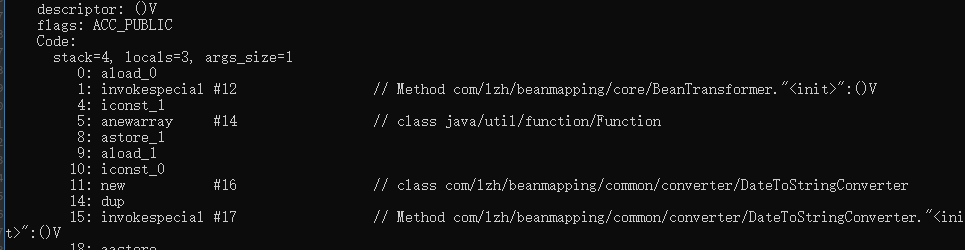
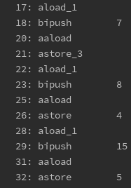
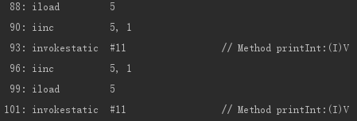

#### 阅读字节码指令：

通过 javap 打开指定的.class 文件可以查看到相应类的字节码内容，下图是方法体的部分

从上图可以看出方法体内的字节码指令主要包含几部分内容。首先是每行指令的首位数字，这个数字表示的这个指令在这个方法体内的偏移量。第二个英文表示字节码的名称，后面带 “#”数字 的代表对常量池的引用。 

所以阅读字节码指令的时候需要关注三个地方，字节码指令类型，字节码指令需要的参数，字节码指令需要对常量池的引用。 

比如说，想aload_0, astore_1，这些指令是不需要使用到常量池信息的，这些指令就只需要关注目前需要从操作栈中需要提取多少个参数即可。像 invokespecial ，newarray 这类的指令是需要使用到常量池引用或者常量的，这些指令有几个特点，这个指令的下一个指令的偏移量并不是紧跟这个指令的偏移量的，而是多偏移了两个字节。因为需要两个字节存储相应的常量池引用或者是数字常量。比如下图这些没有 “#” 就代表这个数字表示常量。这些常量最大只能存储 short 类型的最大值。更大的数字只能通过常量池引用来实现。

 

 

java 指令中会有些指令有相应的简化版本，比如说 astore 指令有简化的 astore_3 表示存储到第四个本地变量中。如上图所示，当本地变量索引超过3就会使用会 astroe 加上一个常量表示本地变量引用 比如说 atore 4。

#### 常用字节码指令介绍及使用：

###### 数组操作指令主要有：

anewarray, aaload ,aastore （引用三种引用类型数组操作），基本类型的数组的 aload 和 astore  需要把a替换成相应的类型。此外boolean 和 byte 数组类型前缀相同。

- anewarray 表示新建指定类型的数组，需要操作栈顶一个参数表示数组长度，以及一个常量池引用表示数组的类型

- aaload 需要一个数组引用和数值表示索引在操作数栈顶中，**引用先于索引值入栈**。

- astore 需要一个数组引用和数值表示索引在操作数栈顶中

###### 基本类型操作：

在jvm中基本上对每个基本类型都会添加特定前缀来区分不同的字节码，比如加载本地变量对不同类型就有 bload, sload, iload, lload, cload, fload 和 dload，再加上引用类型的 aload。 

某些数据操作的特殊点：

- jvm中boolean 变量的读写归入 int 变量的读写，boolean 数组的读写归入 byte 数据的读写。

- 由于 long 和 double 占用两个字长，所以对 long 和 double 的栈操作需要使用 pop2 和 dup2.

###### ++的陷阱：

java 中 =i++ 代表先把 i 的值取出备份，然后再对i 自增，然后把备份的值幅值到对象。=++i 则相反，是先对 i 进行自增然后才取出 i 的值进行幅值。下面是字节码截图，上面是 =i++， 下面是 =++i

[java 字节码指令集](https://blog.csdn.net/web_code/article/details/12164733)
