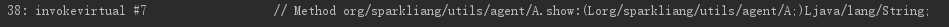
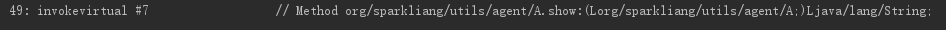
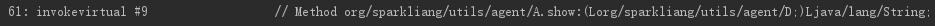
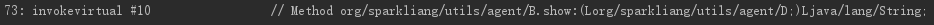

```java
class A {
    public String show(D obj) {
        return ("A and D");
    }
    public String show(A obj) {
        return ("A and A");
    }
}

class B extends A {
    public String show(A obj) {
        return ("B and A");
    }
    public String show(B obj) {
        return ("B and B");
    }
}

class C extends B {}

class D extends B {}

public class TestPolymorphic {
    public static void main(String[] args) {
            A ab = new B();
            A ad = new D();
            B b = new B();
            D d = new D();
            System.out.println(ab.show(ad));
            System.out.println(ab.show(b));
            System.out.println(ab.show(d));
            System.out.println(b.show(d));
        }
}

// B and A
// B and A
// A and D
// A and D
```

java 的多态的底层是因为父类和子类间的相同的方法签名指向了不同的方法体，所以多态是发生在运行时，而不是编译时。**java 在编译的时候已经确定好了需要调用的方法签名了。**而编译时选择方法签名的顺序是：

1. 首先找到参数调用对象对应**声明的类型（而不是实际new 的类型，因为 JVM 中方法参数和本地声明变量都会被作为本地变量，所以对于变量类型，JVM无法得知运行时类型，只能通过声明类型查找方法。）**。

2. 在被调用对象中的所有方法中查找是否支持对应参数类型的方法。**（所有方法即包含继承来的方法，因为本质上是从对象的方法表中进行查找。）**

3. 如果无法找到，则把参数转成父类或者实现的结构重新进行查找，知道找到合适的方法为止。

**这里有两点需要注意的：**

- 参数的类型以声明的类型为准，如 A ad = new D(); ab.show(ad) 编译器会把ad 作为类型 A 查找show 方法。

- 当编译器无法直接找到符合类型要求的方法，但是通过类型转换时查找时，却找到到存在多个复合条件的 方法时会报错。需要通过强制类型转换确定需要调用的方法。

下图是上面例程中对应的方法调用字节码：

<br>
<br>
<br>
<br>
