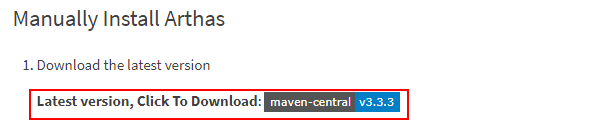
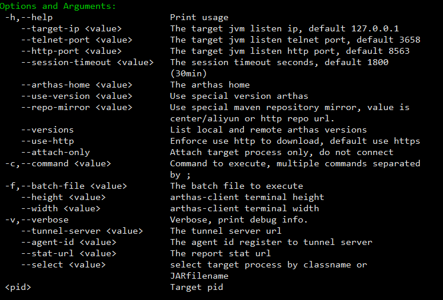
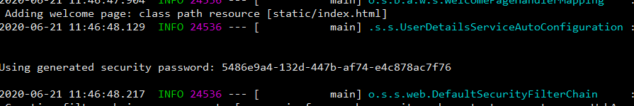
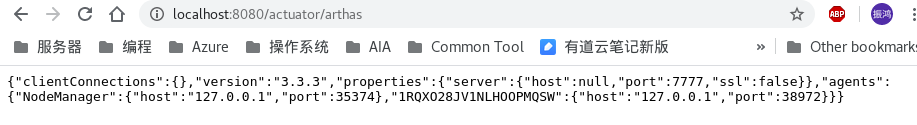
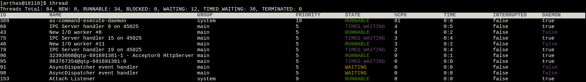
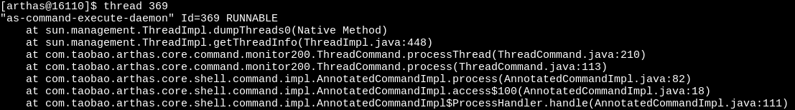

#### Arthas

- 参考文档
  
  - [GitHub](https://github.com/alibaba/arthas)
  
  - [命令列表](https://alibaba.github.io/arthas/en/commands.html)
  
  - [QuickStart](https://alibaba.github.io/arthas/arthas-tutorials?language=cn)
  
  - [UserCases](https://github.com/alibaba/arthas/issues?q=label%3Auser-case)

- [安装教程](#安装教程)
  
  - [一键安装](#一键安装)
  
  - [离线安装](#离线安装)
  
  - [卸载](#卸载)

- 运行
  
  - 命令行
  
  - web console

- 常用命令
  
  -  


##### 安装教程

###### 一键安装

下载 arthas-boot.jar 并直接运行，运行如果是第一次运行会安装依赖包

```bash
curl -O https://alibaba.github.io/arthas/arthas-boot.jar
java -jar arthas-boot.jar
```

###### 离线安装

[离线安装的官方文档](https://alibaba.github.io/arthas/en/manual-install.html)

安装步骤如下

1. 下载对应版本的压缩包，地址在离线安装的官方文档中有
   
   

2. 运行之前检查到对应user的home目录下的**\.arthas** 的文件夹，是否存在，存在则移除
   
   ```bash
   sudo su admin
   rm -rf /home/admin/.arthas/lib/* # remove all the leftover of the old outdated Arthas
   ```

3. 解压，并运行解压出来的安装脚本
   
   ```bash
   mkdir arthas
   unzip -d arthas arthas-packaging-3.3.3-bin.zip
   cd arthas
   ./install-local.sh # switch the user based on the owner of the target Java process.
   ```

4. 使用 as.sh 启动 arthas
   
   ```bash
   ./as.sh
   ```

###### 卸载

移除对应user的home目录下的**.arthas** 的文件夹


##### 运行

###### 命令行

- 使用 arthas-boot 进行启动。java -jar arthas-boot.jar，其参数如下
  
  

- 如果使用 install-local.sh 的方式，可以直接使用 as.sh 进行启动

**注意：需要使用和JVM进程相同的用户才能正常attach，否则会报无法attach的错误**


###### web console

web console 的作用是通过浏览器访问 arthas 的命令行工具。<br>

**默认情况下，当使用arthas attach 一个 JVM 进程的时候，默认会监听 3658 。此时就可以用 IP:3658 进行访问。但是使用 arthas-boot 起web console 的方法，只能每个JVM进程绑定一个port。**<br>

<br>

**使用tunnel server作为web console的server，然后通过 agent 去 attach各个JVM进程**，方法如下：

1. 从 [github](https://github.com/alibaba/arthas/releases)中下载，对应的 tunnel-server 的 jar 包。放到某一个目录下，重命名成 arthas-tunnel-server.jar。

2. 使用 java -jar arthas-tunnel-server.jar 启动. 
   
   1. **在启动过程中会返回一个password**，这个是用于登录查看agent list
      
      
   
   2. tunnel-server 默认http请求监听的是 8080端口
   
   3. tunnel-server 默认使用 7777 端口监听 agent 的连接请求。

3. agent连接 tunnel server。
   
   命令如下：
   
   ```bash
   sudo su - -s /bin/bash apache-hadoop-exec -c 'java -jar /usr/local/arthas/arthas-boot.jar \
   --telnet-port 3695 --http-port 8653 --attach-only \
   --tunnel-server "ws://localhost:7777/ws" --agent-id NodeManager \
   16110'
   ```
   
   1.  --telnet-port代表监听命令请求的端口，--http-port 表示http访问的端口，server 和 agent 沟通需要用到这两个端口。
   
   2.  --attach-only，表示仅仅attach 到 JVM 进程上，但是不打开arthas命令行
   
   3. --tunnel-server：tunnel-server 的 url，格式是 ws://\<host name\>:\<server port\>/ws
   
   4. --agent-id：每个agent 的唯一id
   
   5. 最后一个参数是 JVM 的进程号

4. 在 tunnel server 查看所有已连接到server 的agent。http://localhost:8080/actuator/arthas
   
   

5. 


##### 常用命令

###### dashboard

监控指定JVM进行的实时数据面板


###### thread

**thread** 命令直接查看当前JVM 的线程列表



**thread \<thread id\>** 查看该线程的栈




###### sc

用于查看当前已加载的类


###### jad

用于查看某个类或者某个方法的反编译代码


