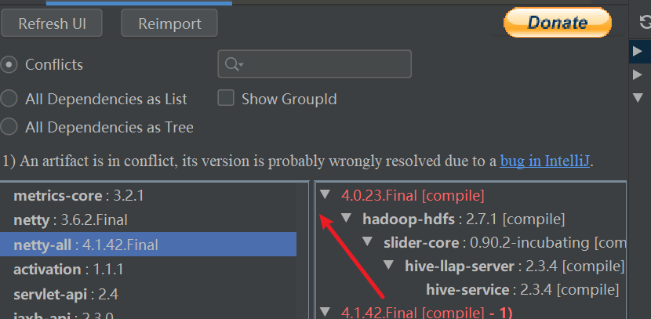

### Maven依赖管理

- 基础知识
  
  - scope
    
    - 分类
    
    - 依赖的scope传递
  
  - 依赖排除

- 获取依赖信息

- maven依赖解析逻辑

#### 基础知识

##### scope

###### 分类

- compile：参与项目的编译，测试、运行以及打包。**默认的scope**

- runtime：**跳过编译**，只参与项目的运行

- test：只参与测试代码的编译和运行

- provided：配置了provided的依赖意味着打包的时候会被排除

- system：对应的依赖由本机的某个目录提供，**需要配置systemPath**。

###### 依赖的传递

<table>
<tr>
    <th>直接依赖</th><th colspan="4">间接依赖</th>
</tr>
<tr>
    <td></td><td>compile</td><td>provided</td><td>runtime</td><td>test</td>
</tr>
<tr>
    <td>compile</td><td>compile</td><td>-</td><td>runtime</td><td>-</td>
</tr>
<tr>
    <td>provided</td><td>provided</td><td>-</td><td>provided</td><td>-</td>
</tr>
<tr>
    <td>runtime</td><td>runtime</td><td>-</td><td>runtime</td><td>-</td>
</tr>
<tr>
    <td>test</td><td>test</td><td>-</td><td>test</td><td>-</td>
</tr>
</table>

##### 依赖排除

例子：当需要排除项目E依赖时，可以通过exclude进行排除

```text
Project-A
   -> Project-B
        -> Project-D 
              -> Project-E <! -- This dependency should be excluded -->
              -> Project-F
   -> Project C
```

pom文件配置：

```xml
<dependencies>
    <dependency>
      <groupId>sample.ProjectB</groupId>
      <artifactId>Project-B</artifactId>
      <version>1.0-SNAPSHOT</version>
      <exclusions>
        <exclusion>
          <groupId>sample.ProjectE</groupId> <!-- Exclude Project-E from Project-B -->
          <artifactId>Project-E</artifactId>
        </exclusion>
      </exclusions>
    </dependency>
  </dependencies>
```

#### 获取依赖信息

- 通过maven命令获取依赖树。命令是`mvn dependency:tree`

- idea
  
  - 旗舰版通过pom 的show diagram显示maven依赖图，**当依赖很多的时候会很慢**
  
  - Maven Helper：安装了插件后，会在pom文件的界面中显示有`Dependency Analyzer`用于分析maven依赖。
    
    其中`Conflicts`会显示所有的冲突，以及导致冲突的配置项。右侧栏每一项展开之后就是导致依赖的链条，最下方是本pom文件的配置项。
    
    
  
  - 

依赖冲突信息：

- omitted for conflict with xxx：代表对应的依赖因为冲突而忽略，其中xxx是保留的版本号。

#### maven 依赖解析逻辑

规则：

- 最短路径原则
  
  - 例子，依赖`A->B->C->D1`和`E->F->D2`，这样最后会采用D2这个包。

- 位置靠前优先采用

**maven解析依赖是采用广度优先算法，采用最先成功解析到的包，整个项目中只会有唯一的groupId+artifactId组合。**
