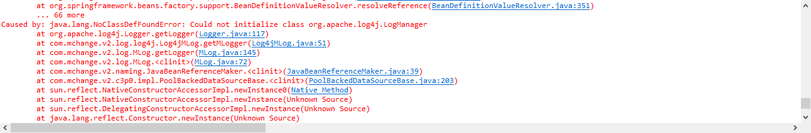
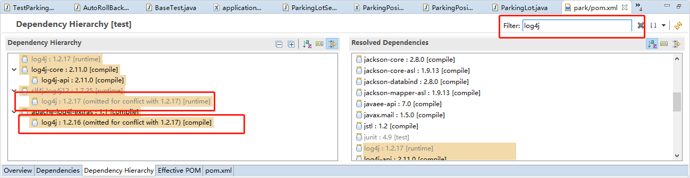
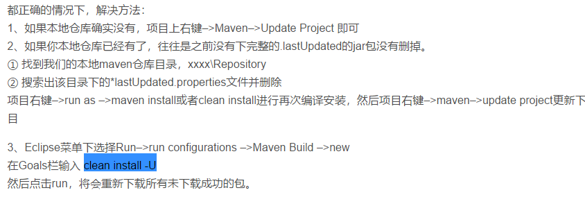
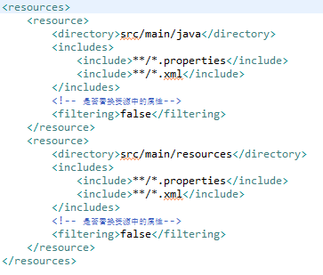

##### 常见问题解决方案

###### Class not found通常解决方法

在maven项目中出现Class not found的主要原因是由于maven依赖的jar包之间出现冲突

通常的解决方法是检查jar包之间的依赖关系不加载相应的jar包

比如：

在出现log4j 相关类的class not found<br>



首先通过eclipse查找到jar包的依赖关系，筛选与log4j相关的jar包



omiited for conflict 表示存在冲突，则在maven中不加载相应的jar包

###### 加载maven骨架慢的解决方案：

把archetype-catalog.xml放到maven的repository下

并且使用mvn archetype:generate把对应的骨架模板加载到本地后可以加快构建maven骨架

在eclipse中需要按照下面的教程配置，加载本地archetype

[https://www.cnblogs.com/hujinshui/p/6732673.html](https://www.cnblogs.com/hujinshui/p/6732673.html)

###### 没有自动根据pom自动更新依赖

如果eclipse中没有配置自动更新pom.xml则需要手动运行maven build

[https://blog.csdn.net/Blue_Red_1314/article/details/74003091](https://blog.csdn.net/Blue_Red_1314/article/details/74003091)<br>



###### 没有自动打包resource文件

存在xml或者properties类型的文件出现找不到文件的报错，主要是由于maven 在build项目的时候只是把.class文件复制到classpath下，xml等文件没有进行复制



###### 缺少依赖

缺少依赖有可能是maven setting配置不正确导致无法使用对应的repository。为了更详细的查看获取某个依赖时的日志信息，我们可以直接使用`mvn dependency:get`命令手动下载某个jar，以查看获取依赖时的详细错误。

```shell
mvn dependency:get -Dartifact <group id>:<artifac tId>:<version> -X
```

**其中`-X`用于打开debug日志以查看更多信息。**
