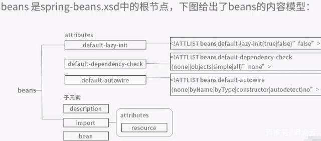
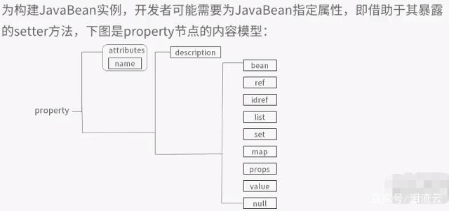

### Spring依赖注入

- 基础配置
  - maven依赖
  - 配置文件引用
- bean配置    
  - `beans`节点配置  
  - `bean`节点配置
    - 属性注入
    - 构造器注入
    - 工厂方法注入
    - 循环依赖问题
  - 依赖注入配置 
- 依赖注入源码
- 

#### 基础配置

spring bean管理配置，是通过xml管理Bean创建相关的配置，而程序中只需要通过ApplicationContext引用依赖的组件，从而使得依赖组件的创建代码和使用代码可以分离开。

##### maven依赖

spring 和依赖注入相关的依赖包为：

- spring-beans

- spring-context

- spring-core

- spring-expression

##### 配置文件引用

通过`ClassPathXmlApplicationContext`读取 applicationContext.xml 配置文件获取 ApplicationContext。

示例代码：

```java
BeanFactory factory = new ClassPathXmlApplicationContext("applicationContext.xml");
IPersonService personService = (IPersonService) factory.getBean("personService");
```

#### Bean配置

spring的依赖相关的配置文件是以`beans`作为根节点，由一些列`bean`节点组成，每个`bean`节点对应某个或某系列`bean`。

##### `beans`节点配置

beans 可选的配置项如下：



其中：

- `default-lazy-init`属性：

- `default-dependency-check`属性：

- `default-autoware`属性：配置autoware默认查找bean的方式。

- `import`子节点用于从其他xml文件中引入配置

##### `bean`节点配置

bean节点主要用于配置某个或某系列的bean，主要通过`bean`节点中的如`contractor-arg`，`property`等子节点，定义出该bean组件依赖的字面值或者对象。<br>

`bean`节点的属性或子节点可以分成几类：

- 和标识相关的：
  
  - `id`属性
  
  - `name`属性
  
  - `class`属性

- 和依赖相关的
  
  - `contractor-arg`：通过构造器参数传入依赖
  
  - `property`：通过某个属性setter传入依赖

- 和bean创建方式相关：
  
  - `init-method`
  
  - `destory-method`
  
  - `factory-method`
  
  - `factory-bean`

###### 属性注入

通过`bean`下的`property`节点配置。通过属性的setter注入依赖对象。`property`节点的可配置项如下：



- name：指定注入的属性名称。**支持级联属性，如`mother.name`指的是配置mother属性中的name属性。**

- value：配置字面量
  
  - 其中value中可以通过`type`属性配置值的类型。

- ref：引用其他bean。有三种可选属性
  
  - local：只能引用当前容器的bean。
  
  - parent：可以引用
  
  - bean：

- props：配置属性中的多个子属性。

##### bean 配置文件参考文档

- [Spring配置文件详解](https://baijiahao.baidu.com/s?id=1627706479612877818&wfr=spider&for=pc)
