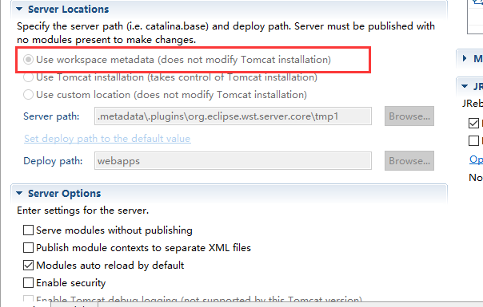
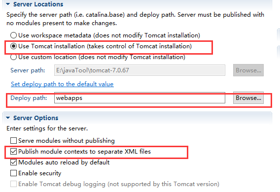
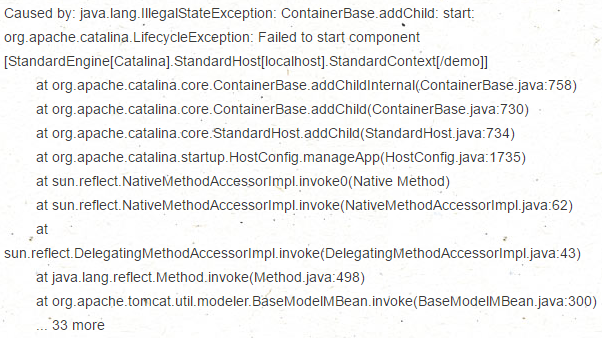

#### eclipse maven项目 tomcat出现404解决方法.md

出现404的主要原因是因为文件或者项目路径没找到，eclipse默认的输出方式是把所有的class文件输出到workplace下的out，这个需要修改tomcat server的配置来使eclipse输出到tomcat 的webapps目录下

主要是修改红框中的选项到第二个

修改之前需要先remove server下的所有项目，接着clean server

接着双击对应的server 弹出设置页面，设置相应选项

#### 出现component could not startte

 

**出现此种情况导致无法通过tomcat运行web，是由于tomcat版本太高需要替换成低版本**
