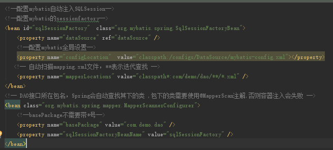

整合关键点：

1. 通过spring来管理Mybatis的SQLSession

2. 通过管理数据源的方式来使用spring管理数据库访问事务

使用spring自动生成SQLSession的方式主要是使用下图配置



需要满足的条件是sql映射的xml文件需要与dao接口类在同一个目录下面

并且映射文件的namespace就是dao接口的全限定名，且方法也要同名

如果不在同一个目录下需要在全局设置中配置配置mappers映射相应的dao，并且命名规则依然要一一对应

```xml
<!--<mappers>
    <mapper resource="com/demo/dao/MessageDao.xml"/>
</mappers>-->
```


##### Maven与Tomcat整合部署：

[https://blog.csdn.net/mween/article/details/77234197](https://blog.csdn.net/mween/article/details/77234197)

主要包含两个步骤，添加Maven的Tomcat插件

配置Maven的运行环境为 clean tomcat7:run(注意不能写成Tomcat:run，否则对应的端口配置等信息就无法进行配置)

配置mybatis 显示sql语句

```xml
<setting name="logImpl" value="STDOUT_LOGGING"/></settings>
```


