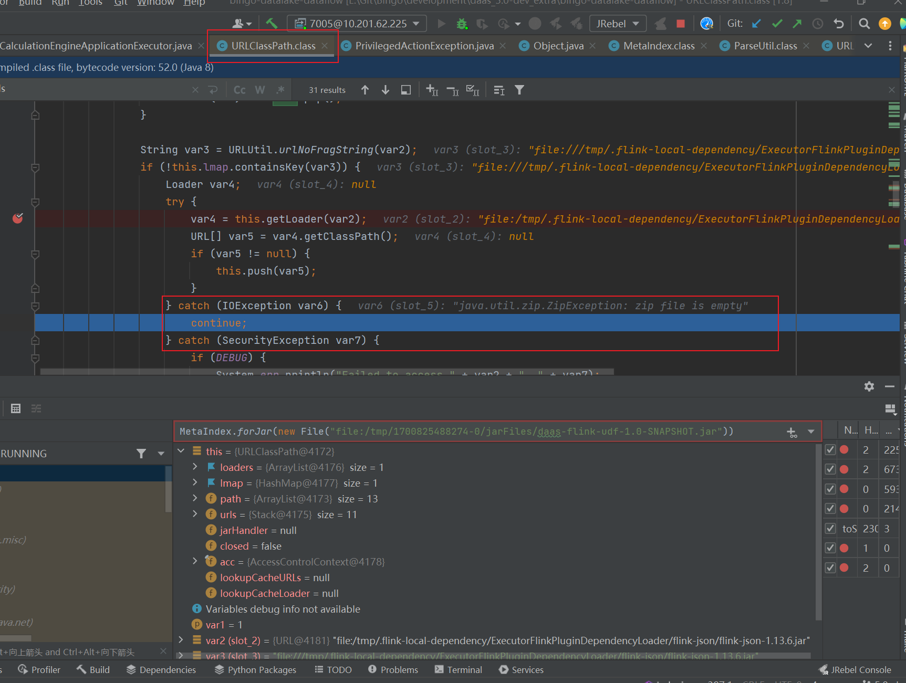

[TOC]

#### 类加载相关问题排查

##### 原因：类冲突

###### 现象：

- 出现包不兼容。比如“Incompatible Jackson version: 2.9.7”

###### 错误排查方法：

- 在jvm option 中添加 -verbose:class
  
  - 添加之后会在 stdout 中打印出类加载信息。

##### 原因：jar包加载失败

###### 排查方法

1. 在URLClassPath类中的getLoader方法在断点，因为此处会把所有IOException屏蔽掉

   

2. 

