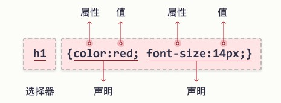

### CSS 语法

- 基本结构
  
  - 选择器语法
    
    - 简单选择器
    
    - 组合选择器
    
    - 伪元素选择器
    
    - 属性选择器
  
  - 选择器优先级

- CSS 使用
  
  - 外部css
  
  - 内部css
  
  - html行内css

#### 基本结构



其中可以通过`/* ... */`进行注释。注释可以横跨多行


##### 选择器语法

###### 简单选择器

根据名称、id、类来选取元素

| 选择器                    | 例子         | 例子描述                        |
| ---------------------- | ---------- | --------------------------- |
| .*class*               | .intro     | 选取所有 class="intro" 的元素。     |
| #*id*                  | #firstname | 选取 id="firstname" 的那个元素。    |
| *                      | *          | 选取所有元素。                     |
| *element*              | p          | 选取所有 \<p\> 元素。              |
| *element*,*element*,.. | div, p     | 选取所有 \<div\> 元素和所有 \<p\> 元素 |

###### 组合选择器

根据它们之间的特定关系（如相对位置关系）来选取元素。组合类型有：

- 后代选择器 `空格`

- 子选择器 `>`

- 相邻兄弟选择器 `+`

- 通用兄弟选择器 `~`

例子

| 选择器                   | 示例         | 示例描述                            |
| --------------------- | ---------- | ------------------------------- |
| *element* *element*   | div p      | 选择 <div> 元素内的所有 <p> 元素。         |
| *element*>*element*   | div > #abc | 选择其父元素是 <div> 元素的所有 id 为abc的元素。 |
| *element*+*element*   | div + p    | 选择所有紧随 <div> 元素之后的 <p> 元素。      |
| *element1*~*element2* | p ~ ul     | 选择前面有 <p> 元素的每个 <ul> 元素。        |

**注意，element可以是任意选择器**。

###### 伪类选择器

用于选择满足某种特殊状态的元素，如鼠标悬停，已访问未访问等等。其语法为：

```css
selector:pseudo-class {
  property: value;
}

/* 例子 */
div:hover #to-red {
  background-color: red;
}
```

[所有的伪类对应的元素状态](https://www.w3school.com.cn/css/css_pseudo_classes.asp)

###### 属性选择器

[attribute] 选择器用于选取带有指定属性或元素的属性满足某个条件的元素

| 选择器                    | 例子                  | 例子描述                                    |
| ---------------------- | ------------------- | --------------------------------------- |
| [*attribute*]          | [target]            | 选择带有 target 属性的所有元素。                    |
| [*attribute*=*value*]  | [target=_blank]     | 选择带有 target="_blank" 属性的所有元素。           |
| [*attribute*~=*value*] | [title~=flower]     | 选择带有包含 "flower" 一词的 title 属性的所有元素。      |
| [*attribute*\|=*value* | [lang\|=en]         | 选择带有以 "en" 开头的 lang 属性的所有元素。            |
| [*attribute*^=*value*] | a[href^="https"]    | 选择其 href 属性值以 "https" 开头的每个 <a> 元素。     |
| [*attribute*$=*value*] | a[href$=".pdf"]     | 选择其 href 属性值以 ".pdf" 结尾的每个 <a> 元素。      |
| [*attribute**=*value*] | a[href*="w3school"] | 选择其 href 属性值包含子串 "w3school" 的每个 <a> 元素。 |

#### CSS 使用

##### 外部css文件

每张 HTML 页面引用的css文件必须在 head 部分的 <link> 元素内声明。

```html
<!DOCTYPE html>
<html>
<head>
<link rel="stylesheet" type="text/css" href="mystyle.css">
<link rel="stylesheet" type="text/css" href="mystyle2.css">
</head>
<body>

<h1>This is a heading</h1>
<p>This is a paragraph.</p>

</body>
</html>
```

##### 内部css

内部样式是在 head 部分的 <style> 元素中进行定义。

```html
<!DOCTYPE html>
<html>
<head>
<style>
body {
  background-color: linen;
}

</style>
</head>
<body>
<h1>This is a heading</h1>
</body>
</html>
```


##### html行内css

html元素的样式通过style属性定义。

```html
<!DOCTYPE html>
<html>
<body>

<h1 style="color:blue;text-align:center;">This is a heading</h1>
<p style="color:red;">This is a paragraph.</p>

</body>
</html>
```


