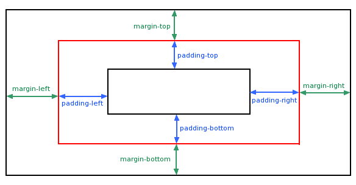

[TOC]

### 间距设置: margin, padding

#### margin 简写属性：（padding 与此相同）

- **margin:25px 50px 75px 100px; （上右下左）**

- **margin:25px 50px 75px;（上，左右，下）**

- **margin:25px 50px;（上下，左右）**

- **margin：25px（相同边距）**

### 文本格式：

#### 段落格式

- 文本对齐：text-align：left，right，center，justify（分散对齐）

- 文本修饰：text-decoration：none，overline，line-through，underline

- 文本转换：text-transform：uppercase，lowercase，capitalize（首字母大写）

- 文本缩进：（第一行缩进）text-indent：\<integer\> px

#### 字体格式

- 字体类型：font-family

- 字体样式：font-style：normal，italic（使用字体自身斜体样式），oblique（系统直接倾斜文字）

- 字体大小：font-size：em（以 16px 的相对大小），px

- 字体加粗：font-weight: blob

### 组件样式

#### 边框样式：

边框样式设置中可以单独对上下左右的边框进行设置，比如单独设置上边框样式:
border-top-style

- border-width

- border-style：solid,dashed (虚线),dotted（点虚线）,double(双实线)

- border-color:

- border-radius:设置圆角半径，设置左上角圆角 border-top-left-radius。
