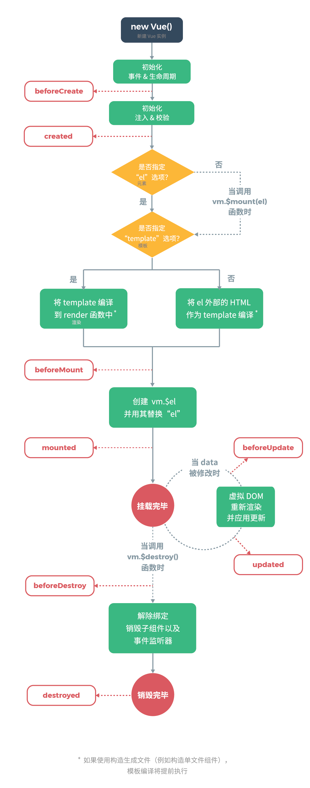

### Vue组件

[TOC]

#### 组件注册使用

通过Vue.component函数注册全局组件。例子：

```javascript
Vue.component('runoob', {
  template: '<h1>自定义组件!</h1>'
})
```

局部组件只能在某个Vue实例中使用。通过components属性注册

```javascript
// 创建根实例
new Vue({
  el: '#app',
  components: {
    // <runoob> 将只在父模板可用
    'runoob': Child
  }
})
```

注册了的组件可以通过同名标签进行引用，如`runoob`的组件可以在模板中通过`<runoob>`引用。

#### 组件配置项

##### template

###### 插槽slot

slot机制主要是使得组件能成为一个布局框架，通过使用时在组件节点内部配置template，去动态替换组件内的占位符。

详细文档：[插槽 — Vue.js](https://cn.vuejs.org/v2/guide/components-slots.html)

##### props

配置组件接收的属性，并且prop发生变动，变动也会通过props定义的属性传递到组件中。

##### prop配置

每个属性都有如下配置项：

- type：类型检查，可以通过数组允许多个类型**基础的类型检查 (`null` 和 `undefined` 会通过任何类型验证)**。

- required：是否必须

- default：默认值，可以是固定值或者工厂方法。

- validator：自定义校验器。函数签名是`bool function (value)`

##### data

data必须是工厂函数而不能是固定的json对象。因为组件会创建多个实例，需要工厂方法多次初始化实例。

**注意点：**

- data中属性改变触发事件是通过setter的钩子函数触发的。所以如何属性是集合，对集合的操作是不会触发数据改变事件的。

- 以 `_` 或 `$` 开头的 property **不会**被 Vue 实例代理，因为它们可能和 Vue 内置的 property、API 方法冲突。你可以使用例如 `vm.$data._property` 的方式访问这些 property。

##### methods

methods 将被混入到 Vue 实例中。可以直接通过 VM 实例访问这些方法，或者在指令表达式中使用。方法中的 `this` 自动绑定为 Vue 实例。

##### computed

计算属性的结果会被缓存，除非依赖的响应式 property 变化才会重新计算。注意，如果某个依赖 (比如非响应式 property) 在该实例范畴之外，则计算属性是**不会**被更新的。

##### 钩子方法

vue实例都提供了钩子方法用于在vue实例的不同生命周期时刻进行回调。

所有的钩子方法参考文档：[API — Vue.js](https://cn.vuejs.org/v2/api/#%E9%80%89%E9%A1%B9-%E7%94%9F%E5%91%BD%E5%91%A8%E6%9C%9F%E9%92%A9%E5%AD%90)

##### vue生命周期

- 生命周期图示

- [data和props与生命周期关系](https://blog.csdn.net/aexwx/article/details/128781723)

#### 实例属性

一个vue实例会有一些`$`开头的属性，用于存储和vue相关的属性。所有的属性参 [实例 property](https://cn.vuejs.org/v2/api/#%E5%AE%9E%E4%BE%8B-property "实例 property")

##### \$attrs 和 \$listener

`$attrs`和`$listener`变量主要用来跨组件进行属性和事件的传递。默认情况下在子组件中绑定却没有被子组件的prop使用的属性会回退到html标签中而不会存入`$attrs`中。这个可以通过inheritAttrs设置为false。

```html
<template>
<child :prop1="a" :prop2="b">
</template>

<script>
export default {
    components:{
        "child":{template:"<p>{{prop1}}</p>",props:["prop1"]}
    }
}
</script>

<!-- 渲染结果 -->
<p prop2="b" >a</p>
```

如上图，A 组件与 C 组件之间属于跨多级的组件嵌套关系，以往两者之间如需实现通信，往往通过以下方式实现：

- 借助 B 组件的中转，从上到下props依次传递，从下至上，$emit事件的传递，达到跨级组件通信的效果。
  - 缺点：代码逻辑不清晰。
- 借助Vuex的全局状态共享
- Vue Event Bus，使用Vue的实例，实现事件的监听和发布，实现组件之间的传递。
  - 缺点：如果没有定义项目的总线标准，不利于多人协作。

解决方法：通过`v-bind="$attrs"`向下传递当前组件没有使用的props，通过`v-on="$listeners"`向上传递当前组件没有监听的事件。
