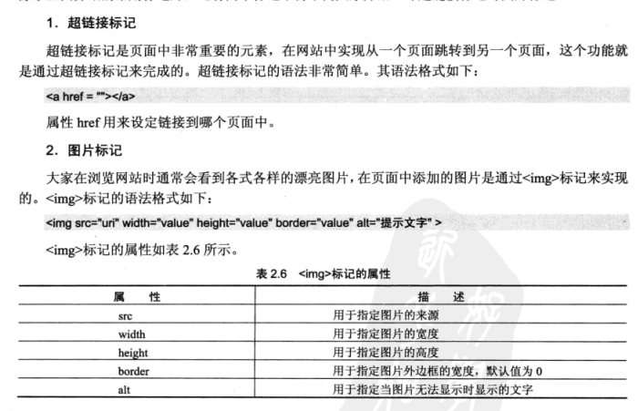

常用标记
--------

```html
<html></html>

<title></title>

<body></body>

<p></p>:换行，文档体上下各加一行

<br>:换行标志，只有一个

<h1> ~<h6>:标题等级

<center></center>:居中
```

##### 文字列表

\<ul\>\</ul\>:无序列表

\<ol\>\</ol\>:有序列表

\<li\>

##### 表格

```html
<table></table>

<caption></caption>：标题

<th></th>:表头，比<tr>后退一格

<tr></tr>：表行

<td></td>
```

对应属性: width宽度 border边框 align：对齐方式 bgcolor：背景颜色

表单标记
--------

### \<form\>标记(整个表达的大标记)

\<form id=”” name=”” action=”url” method=”get\|post” onSubmit=”” target=””\>

\</form\>

Target属性：”_blank” “_self” “_parent” ”_top”

“_blank” 新窗口打开目标文件 “_self”同一个窗口打开文件 “_parent”上一级打开

### \<input\>标记

<br>





