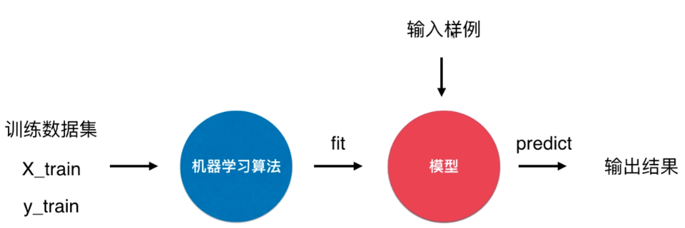
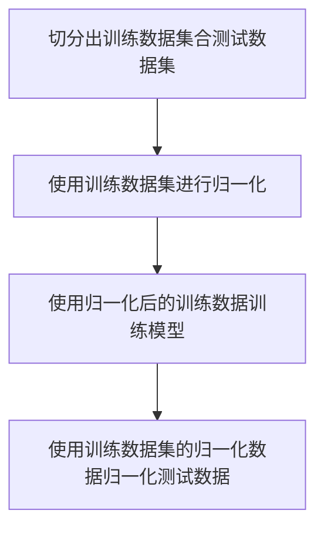

#### scikit-learn 框架的总体流程

scikit-learn框架的总体流程如下：

1. 先创建一个分类器或者回归器的实例

2. 然后调用fit方法提供训练参数构建模型

3. 然后调用predict 方法预测结果



在 scikit-learn 中的分类器的接口也是按照这样的形式进行设计，对于一个分类算法的大致流程如下:

```python
clf = <一个分类器类>(<超参数>) # 构造一个分类器实例
clf.fit(X_train, y_train) # 拟合训练数据集
result = clf.predict(X_predict) # 输入预测样例得到预测结果
```

#### 验证模型准确性

在机器学习中，在给定的测试数据下验证数据准确性的步骤如下：

1. 对测试数据进行随机化

2. 抽取部分测试数据用于训练模型，剩下的数据用于验证训练后模型的准确性

##### 使用scikit-learn 中的类库实现准确性评价的功能

```python
from sklearn.model_selection import train_test_split
X_train, X_test, y_train, y_test = train_test_split(X, y, test_size=0.33, random_state=666)
# X 表示训练的特征集, y 表示训练的标签
# test_size 表示测试集占全体测试数据的比例，random_state 用于指定随机种子，用于复现测试结果。
# X_train, X_test, y_train, y_test 分别表示分割后的训练集和测试集

clf.score(X_test,y_test) # 每个分类器的实例都会有 score 方法用于评级该分类器实例的准确性
```

#### 超参数调优

在机器学习中构建模型实例时输入的参数叫做超参数，这些参数会直接影响模型的预测准确性，所以需要对这些参数进行调优。调优方法如下：

- 根据经验值

- 专业领域知识

- 试验探索

scikit-learn中提供了试验探索的工具 sklearn.model_selection.GridSearchCV，向该工具提供所有可能的超参数组合，返回最优的超参数组合。用法如下：

```python
# 以优化KNN 算法为例
from sklearn.model_selection import GridSearchCV
from sklearn.neighbors import KNeighborsClassifier

clf = KNeighborsClassifier()
grid_search= GridSearchCV(clf,[
    {'n_neighbors':range(1,11),'weights':'uniform'},
    {'n_neighbors':range(1,11),'weights':'distance','p':range(1,6)}
])
# 第一个参数是需要评估的算法的一个实例
# 第二个参数是所有需要测试的参数组合

grid_search.fit(X,y) # 此处提供的是全部的测试数据集，在grid_search的fit方法中会自动对测试数据集进行切分

# 获取超参数网格搜索结果
grid_search.best_estimator_ # 效果最佳的实例
grid_search.best_score_ # 效果最佳的准确度
```

#### 数据归一化

在一些基于距离的机器学习算法，由于数据的单位不同会导致不同维度对距离的影响不同，进而影响模型的准确性，所以需要对数据进行归一化处理。常见的归一化处理方法如下：

- 绝对值归一化

- 均值方差标准化

在机器学习中数据归一化的流程如下：



**需要注意的是，归一化只是用训练数据进行归一化，然后再用归一化数据如均值和方差去归一化预测数据。**

这两种方法在scikit-learn中对应的类是在 sklearn.preprocessing 中的 MinMaxScaler,StandardScaler 。Scaler的结构设计如下：


使用实例：

```python
scaler = StandardScaler()
scaler.fit(X_train)
clf.fit(scaler.transform(X_train),y_train)
result = clf.predict(scaler.transform(X_test))
```
