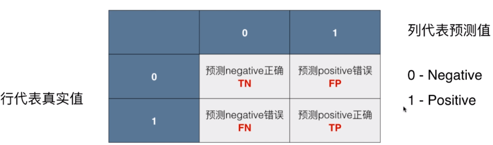
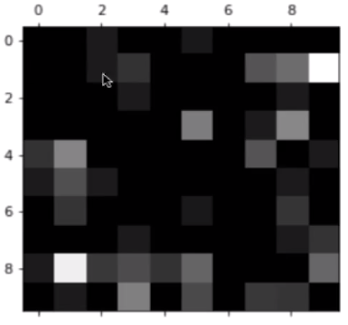
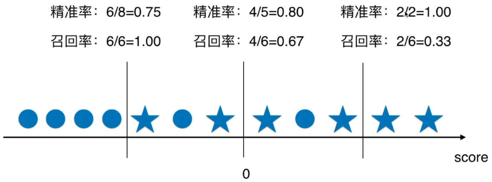
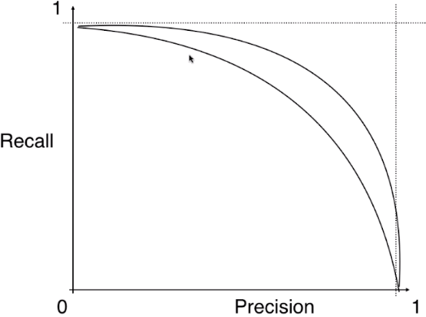

#### 分类算法评价标准

使用直接使用分类准确性会存在以下的问题：

- 当面对的问题有极度的倾斜时，比如预测癌症病人，如果真实的癌症患病率是99.9%时，当模型不需要进行任何预测就会有99.9%的预测准确度。

##### 混淆矩阵



混淆矩阵的一个变体“错误矩阵”，可以用于检查模型是在哪些分类问题上出现了错误，并且查看分类错误的概率。

```python
cfm # an instance of confusion matrix
row_sums = np.sum(cfm,axis=1)
err_matrix = cfm / row_sums # 代表计算出模型在各个真实值中，每个预测值得概率
np.fill_diagonal(err_matrix,0) # 去掉对角线上正确的概率

plt.matshow(err_matrix, cmap=plt.cm.gray) # 使用灰度图可视化错误矩阵
plt.show()
```



##### 精确率(precision score) 和 召回率(recall score)

- 精确率：预测为真时，该预测值的准确率
  
  - $precision \space score=\frac{TP}{TP + FP}$

- 找回率：实际值为真时，模型预测的准确性
  
  - $recall \space score = \frac{TP}{TP + FN}$

精准率和召回率时两个矛盾地评价标准，修改模型超参数不可能一直使得两个标准都在增加，存在一个边界，使得精准率增加会导致召回率下降。这其实可以用一个例子解释，如下图：<bt>

该图中，是以一个逻辑回归为例，通过调节逻辑回归的阈值即“score”，阈值左边即为预测是0，右侧为1。而图中图形“○”代表实际为0，“☆”代表实际为1。可以看出随着阈值的移动，精确率和召回率变换趋势相反。<br>



Precision - Recall curve能够比较好地反映Precision和recall之间的关系。



##### 精确率和召回率平衡的实际意义

精准率的实际意义是：**当模型作出判断为真这个决定时，这个决定的准确率。**以趋势预测为例，当模型作出一个上升趋势预测时，该决定的准确性就可以用准确率来衡量。（**注意，这里准确率默认值预测为1时的正确率。**）<br>

召回率的实际意义是：对于一个集合中，对于分类为真的所有样本，我们能够通过模型找出这些样本中的百分之几。<br>

精确率和召回率平衡的实际意义：当一个预测算法的目的是尽可能地找出所有的正样本，比如癌症预测，这时则希望召回率更大。当我们希望模型在每一次做预测时，尽量准确地判断当前是否是上升的趋势，则此时需要提高模型的精确率。

##### F1 Score

该指标通过调和平均数的方式，同时考虑了模型的精确率和召回率，其公式如下:

$$
\frac{1}{F1 \space Score} = \frac{1}{2}(\frac{1}{precision \space score} + \frac{1}{recall \space score})
→
F1 \space Score = \frac{2 \cdot precision \space score \cdot recall \space score}{precision \space score + recall \space score}
$$

##### Roc曲线

- TPR：对于实际值为1，模型的预测准确度，和召回率相同
  
  - $TPR=\frac{TP}{TP+FN}$

- FPR：对于实际值为0，模型的预测准确度
  
  - $NPR=\frac{TN}{TN+FP}$
