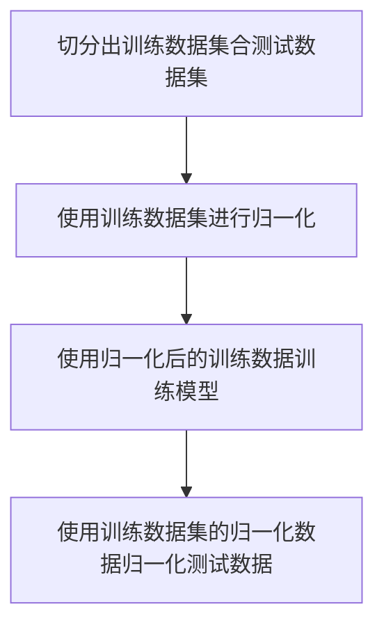
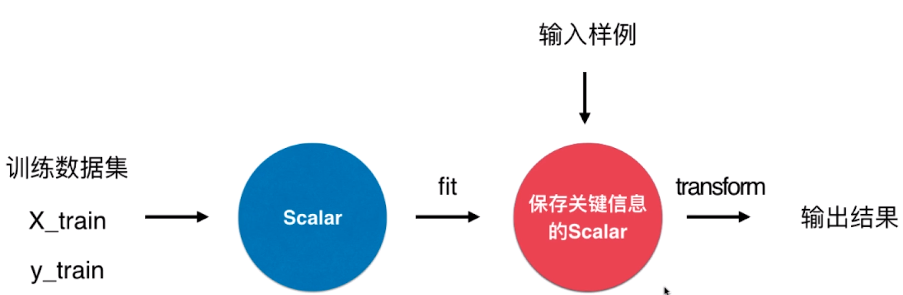

数据前处理

##### 数据归一化

在一些基于距离的机器学习算法，由于数据的单位不同会导致不同维度对距离的影响不同，进而影响模型的准确性，所以需要对数据进行归一化处理。常见的归一化处理方法如下：

- 绝对值归一化

- 均值方差标准化

在机器学习中数据归一化的流程如下：



**需要注意的是，归一化只是用训练数据进行归一化，然后再用归一化数据如均值和方差去归一化预测数据。**

这两种方法在scikit-learn中对应的类是在 sklearn.preprocessing 中的 MinMaxScaler,StandardScaler 。Scaler的结构设计如下：



使用实例：

```python
scaler = StandardScaler()
scaler.fit(X_train)
clf.fit(scaler.transform(X_train),y_train)
result = clf.predict(scaler.transform(X_test))
```

##### 线性模型处理非线性数据

使用线性模型处理非线性数据的基本思路是通过添加多项式特征，把数据映射到更高维的空间，使其变得线性可分。比如 $x → x,x^2,x^3 ...,x^n$。需要注意的是，当有多个特征时，就需要同时考虑多个特征之间的多项式组合。比如有a，b两个特征，当使用2阶非线性时，有$1,a,b,a^2,b^2,ab$共6个特征。<br>

在scikit-learn中在模块 sklearn.preprocessing 中提供了 PolynomialFeatures 类来实现特征多项式化。

```python
from sklearn.preprocessing import PolynomialFeatures
poly = PolynomialFeatures(degree=2)
poly.fit(X)
poly_X = ploy.transform(X)
clf.fit(poly_X,y)
```

#### Pipeline

当一个模型需要多个步骤进行前处理时，使用pipeline就可以简化调用。scikit-learn中把Pipeline封装在了 sklearn.pipeline模块中。其调用方法如下:

```python
from sklearn.pipeline import Pipeline

pipe = Pipeline([
    ('std',StandardScalar()),
    ('poly',PolynomialFeatures(degree=2)),
    ('clf',LogisticsRegresson())
])
pipe.fit(X_train,y_train)
pipe.predict(y_test)
```

使用GridSearchCV同样也可以对Pipeline进行网格优化。但是需要通过“__”连接estimator的参数(**注意这里是两个"\_"**)。比如多项式特征这个步骤叫做ploy，需要对degree调参就对应的key为 “poly\_\_degree"。

```python
pipe = Pipeline([
 ('std',StandardScalar()),
 ('poly',PolynomialFeatures(degree=2)),
 ('clf',LogisticsRegresson())
])
param_grid=[
    {'poly__degree':range(1,10)}
]
grid_search = GridSearchCV(pipe,param_grid)
grid_search.fit(X_train,y_train)
```


