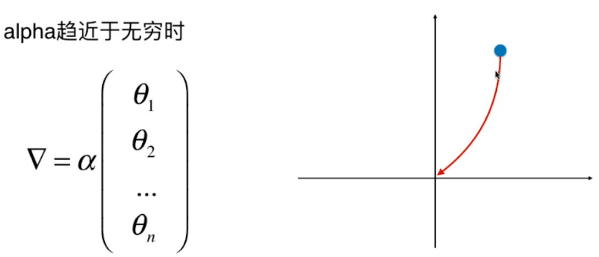
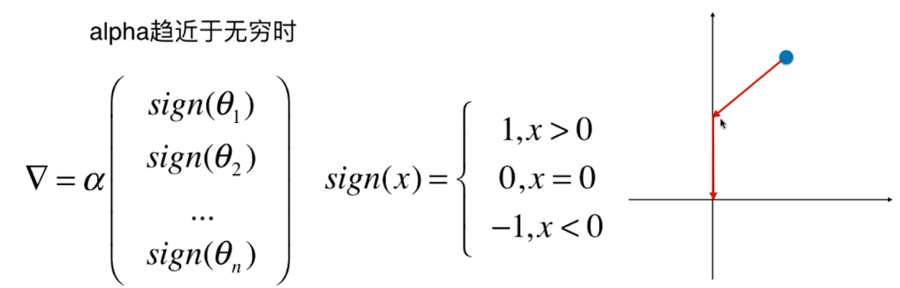

#### 模型正则化

以非线性回归模型为例，在非线性回归模型中，其过拟合导致泛化能力低是以为系数矩阵θ中，有大量的θ都非常大。高阶数的回归模型的系数大的原因其实很简单，因为对高价模型求导之后可以化整为$a(x_1-b_1)(x_2-b_2)...(x_n-b_n)$，高阶非线性模型为了尽可以能地拟合训练数据，就会使得每个极值点之间的距离尽量大来涵盖住所有的训练样本点，所以只有系数矩阵中的每个系数足够大才能够足够地斜率去连接各个极值点。 

而模型正则化就是为了控制模型的参数大小而引入的方法。其思路如下:
原损失函数: $J(θ)=MSE(y,\hat y;θ)$ 

训练目标是： $J(θ)=MSE(y,\hat y;θ)$ 尽可能小 

模型正则化就是通过加入和θ相关的元素到损失函数，从而达到考虑控制θ大小的目的。 

- 岭回归：$J(θ)=MSE(y,\hat y;θ) + \alpha \frac{1}{2}\sum_{i=1}^nθ_i^2$
  
  - 优点：能够更加真实地得到函数平滑后地结果
  
  - 缺点：计算量教LASSO回归更大

- LASSO回归 ：$J(θ)=MSE(y,\hat y;θ) + \alpha \sum_{i=1}^n|θ_i|$
  
  - 优点：具有参数筛选的功能，因为在计算过程中会使得某些参数的系数为0
  
  - 缺点：过早地筛选参数，导致有可能筛选掉正确地参数

- 弹性网：$J(θ)=MSE(y,\hat y;θ) + r\alpha \sum_{i=1}^n|θ_i| + (1-r)\alpha \frac{1}{2}\sum_{i=1}^nθ_i^2$
  
  - 引入了超参数r用于控制岭回归和LASSO回归的比例

##### LASSO回归能够筛选参数的原因

岭回归的导数如下，当θ从非0→0移动时，其图像大致如下：

 

LASSO回归的导数如下，当θ从非0→0移动时，其图像大致如下,由于LASSO(X)这个函数在X=0时时不可导的，所以存在部分X的取值可以使得某些θ为0：

#### Lp范数

数学表达：$Lp=\sum_{i=1}^m(|θ|^p)^{\frac{1}{p}}$，其中p=1相当于LASSO回归，p=2相当于岭回归。p=0相当于目标函数是需要添加一项，使得有尽量少的θ不为0。 

