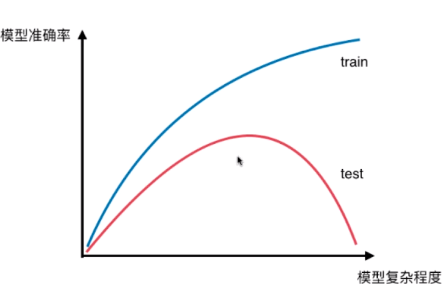
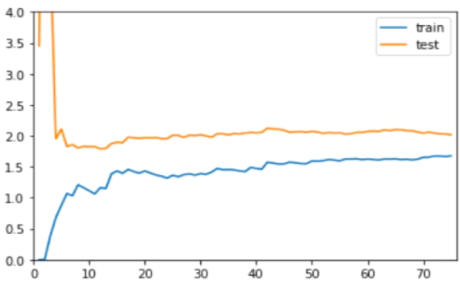
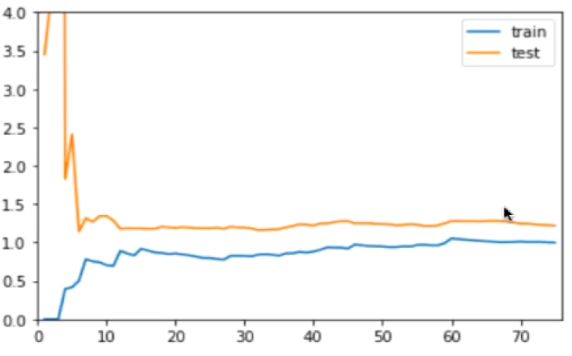
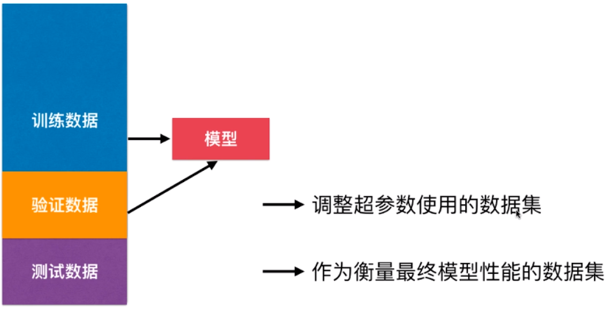
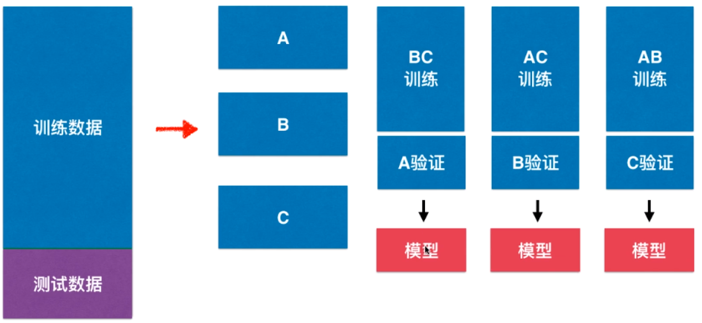
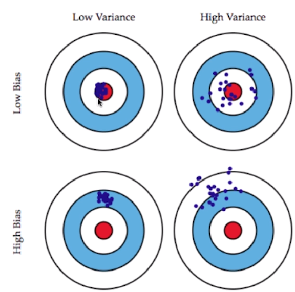

#### 过拟合&欠拟合

- 过拟合：模型对某个训练数据集拟合程度过高，导致模型的泛化能力弱，无法有效地预测新的未知数据

- 欠拟合：模型无法有效地解析出训练数据集的特征。

拟合程度越高，算法本身的复杂度也会越高，但是模型本身的泛化能力就降低。以非线性回归模型为例，阶数越高，算法本身更复杂，但是数据本身有一个客观存在的阶数，当模型的阶数过高就会过度解析训练数据中的噪音，而阶数过低就会无法正确解析数据本身的变化。算法复杂度和对训练模型和测试模型的预测准确度有如下关系：<br>

<br>

**分离训练数据集合测试数据集的作用是，通过测试数据集来校验模型的泛化能力，从而评价训练出的模型的性能。**<br>

##### 可以通过学习曲线来直观的判断欠拟合和过拟合

学习曲线图包含两条曲线，一条是随训练样本数增加，对训练样本预测的准确度曲线，另一条是对测试数据集预测准确度的曲线。<br>

欠拟合的学习曲线相比于刚好拟合的学习曲线，训练和测试数据的均方误差都会更高。<br>

过拟合的学习曲线相比于刚好拟合的学习曲线，训练和测试数据的均方误差在训练完成时的距离更大，并且训练数据的均方误差更低。

<center>
<br>
  <b>欠拟合学习曲线</b>
<br>
 <b>刚好拟合的学习曲线</b>
<br>
 <b>过拟合学习曲线</b>
</center>

##### 调整超参数可以调节模型的拟合程度

比如：KNN中的k，k=1的拟合程度最高，k=训练数据量拟合程度最低。非线性回归中的阶数，阶数越高拟合程度越高。

可以通过调节超参数使得模型更加接近数据本身实际的复杂度。

##### 使用只分离训练数据和测试数据进行调参存在的问题

只采用train test split 进行调参，会存在对测试数据集过拟合的风险。<font color='red'>因为训练数据集的意义是作为一个在训练过程中没有出现的数据来验证最终模型的准确度或者可泛化程度。</font>所以测试数据不应该参与到调参过程中。所以在调参过程中需要再对源测试数据切分出一块数据用于调参时计算模型性能。<br>

**所以，在进行网格搜索时调优参数时，依旧要切分训练数据和测试数据，在调优完成后，使用测试数据集计算出的模型准确度才是模型的最终准确度。**




#### 交叉验证

超参数调参过程中，采用多组数据计算当前模型的准确度，并取均值作为当前模型的准确度。采用这种方式进行超参数调优搜索，可以提高搜索输出模型的准确度，因为去多个训练集和验证集，就可以降低模型对某一个训练集和验证集的过拟合的可能。



##### scikit-learn中的交叉验证工具

scikit-learn 中把计算交叉验证封装在了 sklearn.model_selection 模块中的 cross\_val\_score。

```python
# cross_val_score(estimator, X, y, cv='warm')
# cv 参数可以输入个数表示控制分组数量
cross_val_score(knn_clf, X_train, y_train) 
```


#### 偏差&方差

- 偏差：是由于模型本身的假设不正确导致的误差
  
  - 解决方法：
    
    - 增加模型假设

- 方差：模型太过复杂，导致模型的泛化能力弱
  
  - 解决方法：
    
    - 降低模型复杂度
    
    - 减少数据，降维
    
    - 增加样本数
    
    - 使用验证集
    
    - 模型正则化

偏差和方差的直观理解：<br>


