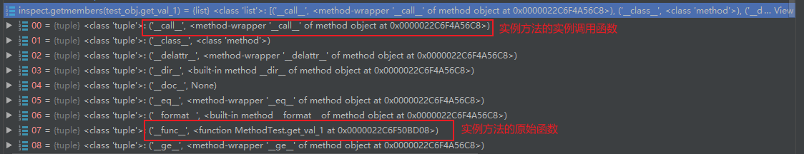
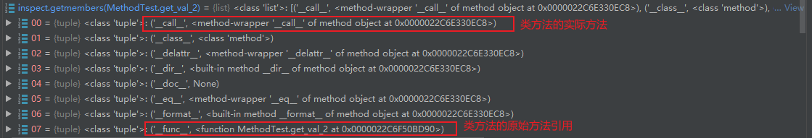

#### Python 面向对象相关

- 函数，实例方法，类方法和静态方法区别
  
  - 原理
  
  - 例子

- 属性访问顺序

- 继承关系
  
  - 继承顺序

##### 函数，实例方法，类方法和静态方法区别

###### 原理

所有实例方法、类方法和静态方法都是函数，它们的区别只是调用时，实例方法会自动在第一个参数添加实例引用，类方法会自动添加类的引用，静态方法和函数的行为一样。<br>

python实现实例方法的原理是在创建对象时，把类之中没有被标注为 classmethod和staticmethod 的函数都创建一个新的函数实例，加上自动添加实例引用的逻辑。Classmethod method则是在 classmethod 这个装饰器中直接把类的引用放入了增强的函数当中。其中实例方法和类方法的类型都是method。

下面是实例方法的一些属性




下面是类方法的一些属性




###### 例子

其他package 函数的定义

```python
def normal_func(self):
    pass
@classmethod
def class_func(cls):
    pass
@staticmethod
def static_func():
    pass
```

```python
class TestMethod:

    def instance_method(self):
        pass
    @classmethod
    def class_method(cls):
        pass
    @staticmethod
    def static_method():
        pass

    from other_pkg import normal_func,class_func,static_func

obj = TestMethod()

obj.instance_method  # call as instance method
obj.class_method     # call as class method
obj.static_method    # call as static method
obj.normal_func      # call as instance method
obj.class_func       # call as class method
obj.static_func      # call as static method

TestMethod.instance_method    # call as static method
TestMethod.class_method       # call as class method
TestMethod.static_method      # call as static method
TestMethod.normal_func      # call as static method
TestMethod.class_func       # call as class method
TestMethod.static_func      # call as static method
```

##### 继承关系

###### 继承顺序

- 在python2中的多继承采用**深度优先顺序**

- 在python3中的多继承采用**广度优先顺序**

###### super的用法

- `super().<method name>`

- `super(<class>,<object instance>).<method name>`

- `super(<class>,<class instance>).<method name>`

当在实例方法中，写法1和写法2等价，其中 `<object instance>` 就是 self。当在类方法时，写法1和写法3等价，其中`<class instance>`就是 cls。<br>

super方法的意义可以理解为，以第一个变量开始**但不包含本身**，在第二个变量中获取到的 MRO中搜寻指定的方法。

实例代码：[Python super 详解 | 菜鸟教程](https://www.runoob.com/w3cnote/python-super-detail-intro.html)

##### 属性访问顺序

顺序：

1. `__getattribute__()`， 无条件调用

2. 数据描述符：由 ① 触发调用 （若人为的重载了该 `__getattribute__()` 方法，可能会调职无法调用描述符）

3. 实例对象的字典（若与描述符对象同名，会被覆盖哦）

4. 类的字典

5. 非数据描述符

6. 父类的字典

7. `__getattr__()` 方法

注意：

- 其中的`数据描述符`是指同时定义了`__get__`和`__set__`的类的实例

- `非数据描述符`是指只定义了`__get__`方法的类的实例

参考博客：[Python描述符 (descriptor) 详解 - Jimmy_Nie - 博客园](https://www.cnblogs.com/Jimmy1988/p/6808237.html)
