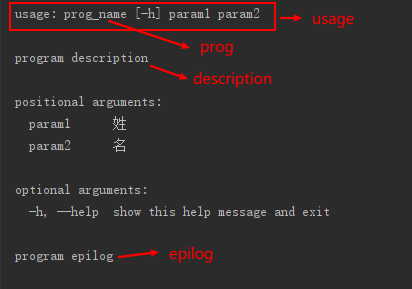
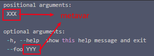
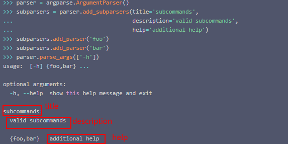

#### argparse

- 解释器选项

- 参数选项

- 解析结果使用

- 多层命令

##### 解释器选项

###### 构造器定义

```python
def __init__(self,
             prog: Optional[str] = ...,
             usage: Optional[str] = ...,
             description: Optional[str] = ...,
             epilog: Optional[str] = ...,
             parents: Sequence[ArgumentParser] = ...,
             formatter_class: Type[HelpFormatter] = ...,
             prefix_chars: Union[str, unicode] = ...,
             fromfile_prefix_chars: Optional[str] = ...,
             argument_default: Optional[str] = ...,
             conflict_handler: Union[str, unicode] = ...,
             add_help: bool = ...,
             allow_abbrev: bool = ...) -> None
```

- prog -（默认：`sys.argv[0]`）

- usage - 描述程序使用情况的字符串（默认值：从添加到解析器的参数生成）

- description - 在参数帮助之前显示的文本（默认值：无）

- epilog - 在参数帮助后显示的文本（默认值：无）

- parents - 表示子`ArgumentParser`也应包含其parent的参数的对象列表

- formatter_class - 用于自定义帮助输出的类

- prefix_chars - 前缀可选参数的字符集（默认值：' - '）

- fromfile_prefix_chars - 当参数包含该前缀时，代表对应的参数的值是个列表，此时给的参数是对应列表的路径（默认值：`None`）
  
  - 例子（当`fromfile_prefix_chars`是`@`时）<br>
    
    当输入参数是`a b @args.txt`，并且args.txt 文件中包含`foo`和`bar`两行，则参数实际会被替换成 `a b foo bar`。
  
  - 参数默认为`None`，这意味着争论就永远不会文件引用处理。

- argument_default -为参数的全局默认值（默认值：`None`）

- conflict_handler - 解决冲突选项的策略（通常不需要）

- add_help -添加`-h/--help`选项解析器（默认值：`True`）。
  
  - **当为True时，命令行如果输入 -h，程序会直接答应帮助内容，并且退出**

parser 的显示布局大概如下：



###### 解释器的父子关系

有时，几个解析器共享一组通用参数。可以使用具有所有共享参数并传递给`parents=`参数的单个解析器，而不是重复这些参数的定义`ArgumentParser`。`parents=`参数获取`ArgumentParser`对象列表，收集所有位置和可选操作，并将这些操作添加到`ArgumentParser`正在构建的对象中：

```python
>>> parent_parser = argparse.ArgumentParser(add_help=False)
>>> parent_parser.add_argument('--parent', type=int)

>>> foo_parser = argparse.ArgumentParser(parents=[parent_parser])
>>> foo_parser.add_argument('foo')
>>> foo_parser.parse_args(['--parent', '2', 'XXX'])
>>> Namespace(foo='XXX', parent=2)

>>> bar_parser = argparse.ArgumentParser(parents=[parent_parser])
>>> bar_parser.add_argument('--bar')
>>> bar_parser.parse_args(['--bar', 'YYY'])
>>> Namespace(bar='YYY', parent=None)
```

请注意，大多数父解析器将指定`add_help=False`。否则，`ArgumentParser`将会看到两个`-h/--help`选项（一个在父项中，一个在子项中）并引发错误。

注意

**在传递`parents=`它们之前，您必须完全初始化解析器。如果在子解析器之后更改父解析器，那些更改将不会反映到子解析器中。**

更多选项细节参考[argparse (Operating System) - Python 中文开发手册 - 开发者手册 - 云+社区 - 腾讯云](https://cloud.tencent.com/developer/section/1370514)

##### 参数选项

###### add_argument方法

对每个参数的定义都需要调用parser 的 add_argument 方法，以下是方法参数说明：

方法定义：

```python
def add_argument(self,
                 *name_or_flags: Union[str, unicode],
                 action: Union[str, unicode, Type[Action]] = ...,
                 nargs: Union[int, str, unicode] = ...,
                 const: Any = ...,
                 default: Any = ...,
                 type: Union[(str) -> _T, FileType] = ...,
                 choices: Iterable[_T] = ...,
                 required: bool = ...,
                 help: Union[str, unicode, None] = ...,
                 metavar: Union[str, unicode, Tuple[Union[str, unicode], ...]] = ...,
                 dest: Union[str, unicode, None] = ...,
                 version: Union[str, unicode] = ...,
                 **kwargs: Any) -> Action
```

- *name_or_flag - 名称或选项字符串列表，例如`foo`或`-f, --foo`。
  
  - 当没有`-`作为前缀时，这个参数会被当做位置参数，有前缀时会被当做可选参数。
  
  - 当是位置参数时，添加的顺序就是对应在命令行中的位置顺序

- action - 在命令行中遇到此参数时要采取的基本操作类型。
  
  - `'store'` - 默认值，存储参数的值
  
  - `'store_const'` - 这存储由 const 关键字参数指定的值
  
  - `'store_true'`和`'store_false'`-这些都是特殊情况下`'store_const'`使用，当结合 default选项同时使用时，该参数相当于一个选项。
    
    - 例子
  
  - `'append'` - 这存储一个列表，并将每个参数值附加到列表中。这对于允许多次指定选项很有用。用法示例：
    
    ```python
    >>> parser = argparse.ArgumentParser() 
    >>> parser.add_argument('--foo', action='append') 
    >>> parser.parse_args('--foo 1 --foo 2'.split()) 
    Namespace(foo='1', '2') 
    ```
  
  - `'count'` - 这会计算关键字参数发生的次数。例如，这对增加冗长级别很有用：
  
  - `'help'` - 这将显示当前解析器中所有选项的完整帮助消息，然后退出。默认情况下，帮助操作会自动添加到解析器中。请参阅`ArgumentParser`有关如何创建输出的详细信息。
  
  - `'version'`- 这需要调用`add_argument()`中的`version=`关键字参数，并打印版本信息并在调用时退出：

- nargs - 应该使用的命令行参数的数量。
  
  - `N`（一个整数）。`N`命令行中的参数将汇集到一个列表中。其中`N`必须大于0
  
  - `'?'`。如有可能，将从命令行中消耗一个参数，即消耗一个或0个参数
  
  - `'*'`和`'+'`。所有存在的命令行参数都被收集到一个列表中。
  
  - `argparse.REMAINDER`。所有其余的命令行参数都被收集到一个列表中。

- const - 一些动作和 nargs 选择所需的常量值。常用于选项
  
  - **当使用const时，nargs必须为 `'?'`**

- default - 如果参数在命令行中不存在，则生成的值。

- type - 命令行参数应该转换的类型。

- choices（选项） - 一个允许参数值的容器。

- required（必需） - 是否可以省略命令行选项（仅限可选项）。

- help（帮助） - 对参数做了什么的简要描述。

- metavar - usage中参数的名称。
  
  例子：
  
  

- dest - 要添加到返回对象的属性的名称`parse_args()`。即存储到namespace中的属性的名称
  
  ```python
  >>> parser = argparse.ArgumentParser()
  >>> parser.add_argument('bar',dest='abc')
  >>> args = parser.parse_args(['XXX'])
  Namespace(abc='XXX')
  ```
  
  - 默认情况下，从选项字符串推断值。通过取第一个长选项字符串并剥离初始字符串来`ArgumentParser`生成`dest`值。如果没有提供长选项`--`字符串，则`dest`将通过剥离初始字符从第一个短选项`-`字符串派生。任何内部`-`字符都将转换为`_`字符以确保该字符串是有效的属性名称。下面的例子说明了这种行为

##### 多层命令

###### 总体步骤

1. 先`parent parser`调用`add_subparsers`方法，创建`Subparsers`对象。

2. 再在`Subparsers` 对象上调用`add_parser`方法添加parser，这些添加的parser就是各个子命令的参数解析器。其中`add_parser` 的方法的参数和 `ArgumentParser` 的构造器方法参数相同

###### add_subparsers方法

**需要注意的是，这个方法是parent parse调用来创建subparser的，并只能调用一次。**

```python
def add_subparsers(self,
                   title: Union[str, unicode] = ...,
                   description: Union[str, unicode, None] = ...,
                   prog: Union[str, unicode] = ...,
                   parser_class: Type[ArgumentParser] = ...,
                   action: Type[Action] = ...,
                   option_string: Union[str, unicode] = ...,
                   dest: Union[str, unicode, None] = ...,
                   required: bool = ...,
                   help: Union[str, unicode, None] = ...,
                   metavar: Union[str, unicode, None] = ...) -> _SubParsersAction
```

参数描述：

- title - 帮助输出中的子分析器组的标题; 如果提供了描述，则默认为“子命令”，否则使用标题作为位置参数

- 描述（description） - 默认情况下帮助输出中的子分析器组的说明 `None`

- prog - 将使用子命令帮助显示的使用信息，默认情况下程序的名称和子分析器参数前的任何位置参数

- parser_class - 将用于创建子分析器实例的类，默认情况下是当前分析器的类（例如，ArgumentParser）

- 操作（action） - 在命令行中遇到此参数时要采取的基本操作类型

- dest - 存储子命令名称的属性名称; 默认情况下`None`不存储任何值

- 帮助（help） - 默认帮助帮助输出中的子分析器组 `None`

- metavar - 字符串在帮助中显示可用的子命令; 默认情况下它是`None`和呈现形式为{cmd1，cmd2，..}的子命令

subparsers 选项对应的help string 的布局



**`add_parser`方法中的`prog`参数，就是parent 判断调用哪个子命令的依据**

###### 子命令调用函数

处理子命令的一种特别有效的方式是将该`add_subparsers()`方法的使用与调用`set_defaults()`结合起来，以便每个子分析器知道应该执行哪个 Python 函数。例如：

```python
>>> # sub-command functions
>>> 
>>> def foo(args):
>>> ...     print args.x * args.y
>>> ...
>>> def bar(args):
>>> ...     print '((%s))' % args.z
>>> ...
>>> 
>>> # create the top-level parser
>>> 
>>> parser = argparse.ArgumentParser()
>>> subparsers = parser.add_subparsers()
>>> 
>>> # create the parser for the "foo" command
>>> 
>>> parser_foo = subparsers.add_parser('foo')
>>> parser_foo.add_argument('-x', type=int, default=1)
>>> parser_foo.add_argument('y', type=float)
>>> parser_foo.set_defaults(func=foo)
>>> 
>>> # create the parser for the "bar" command
>>> 
>>> parser_bar = subparsers.add_parser('bar')
>>> parser_bar.add_argument('z')
>>> parser_bar.set_defaults(func=bar)
>>> 
>>> # parse the args and call whatever function was selected
>>> 
>>> args = parser.parse_args('foo 1 -x 2'.split())
>>> args.func(args)
>>> 2.0
>>> 
>>> # parse the args and call whatever function was selected
>>> 
>>> args = parser.parse_args('bar XYZYX'.split())
>>> args.func(args)
>>> ((XYZYX))
```
