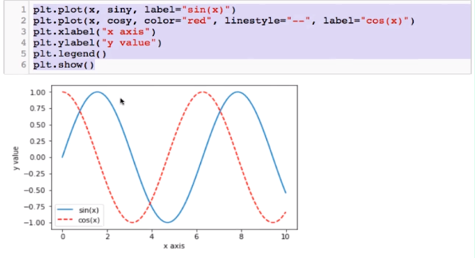

#### 使用Matplotlib绘图

[官方文档]([https://matplotlib.org/](https://matplotlib.org/)

在matplotlib中的绘制步骤是如下：

常见绘制二维图主要使用的是 matplotlib.pyplot 的子模块，常见别名为  import matplotlib as plt


例子:

```python
x = np.linspace(0,10,10001)
sin_y = np.sin(x) 
cos_y = np.cos(x)
plt.plot(x,sin_y)
plt.plot(x,cos_y)
plt.show()
```

需要注意的是调用show方法会显示出，所有绘制的图案，并且清空图案缓存，如果想重新显示之前绘制的图案就必须重新调用对应的绘图命令。


##### matplotlib绘图方法

- plit.plot ：该方法绘制的是折线图
  
  - 常用调用方式：plot(x, y, color='green', label='sin(x)', marker='o', linestyle='dashed', linewidth=2, markersize=12)
  
  - 参数含义：
    
    - label: 折现对应的标签
    
    - marker：折现的点对应的标记符
    
    - linestyle：这线段的样式

- plt.scatter : 该方法主要用于绘制散点图
  
  - 常用调用方式：scatter(x, y, color='red', alpha=0.1)
  
  - 参数含义：
    
    - alpha： 散点的透明度

- plt.xlabel, plt.ylabel : 该方法主要用于添加横纵坐标的标题

- plt.title : 该方法主要用于绘制图的标题

- plt.legend : 该方法主要用于绘制图例。

例子：




