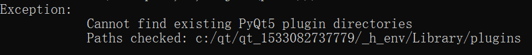

### Pyinstaller

#### 常见错误处理

###### Cannot find existing PyQt5 plugin directories

解决方法： 

1. 先确定是否安装了 PyQt

2. 在python2 中，使用命令 pip install python-qt5 安装PyQt5

3. 把 PyQt5 模块目录下的plugins 复制到错误提示对应的路径中

