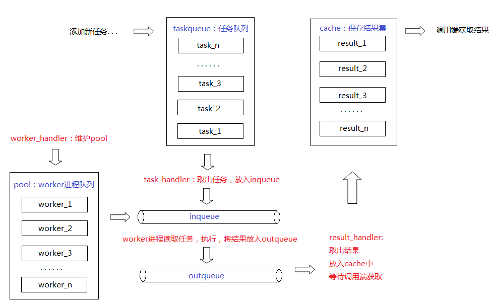

### 

### 要点

- 在python中（主要是因为在cpython（最常用的python解析器）中存在GIL）因为存在GIL，所以在同一个python解析器进程中只会有一个python的指令被执行，所以在 cpython 中，所有对象都是线程安全的。

- 由于在python中的多线程实际上属于多线程异步处理处理，而不是真正的多线程并行处理，所以python只能在IO占比较大的程序中才能从多线程获益。对于cpu是瓶颈的程序，使用多线程编程会使得性能更差，因为涉及到GIL释放和线程调度的消耗。

### python多线程

#### 使用threading

```python
import threading

t = threading.Thread(target=,args=(function arguments))
t.start()
t.join() # 在父子线程中主要是通过 join 方法实现同步
```

#### 使用threadpool

该模块可以直接通过pip安装。pip install threadpool

```python
from threadpool import ThreadPool,makeRequests
pool = ThreadPool(4) # create a pool size
requests = makeRequests(<some callable>, <list of args>, <callback func>)
for request in requests:
    pool.putRequest(request)
```

### python 多进程

python多进程主要使用的是 multiprocessing 模块，该模块在python3中已经内置，但是在python2中需要通过pip 安装

#### 进程中的对象传递

在python多进程中，每个子进程之间的对象是不能通过全局对象进行共享。如果需要把父进程的变量传递给子进程只能通过输入参数进行传递。

#### Process对象创建进程

```python
from multiprocessing import Process

with Process(targer=<func name>,args=(<args>)) as p:
    p.start()
    p.join()
```

注意点：

- 需要注意的是，当输入参数是一个的时候，args的格式为 (,)，即必须在参数后面加上“，”来表示这是一个tuple。

- 在创建新的进程时，传递args是通过对象序列化把对象传递到新的子进程中，所以在考虑使用多进程的时候需要考虑传递大型对象的开销。

- 创建的进程要关闭

#### 进程池

在python中可以采用如下的方式创建进程池。

```python
from multiprocessing import Pool
with Pool(<worker num>,initializer=<init func>,initargs=<args of init func>) as pool:
    result=pool.apply(func,args,kwds) # 同步调用函数并且获得结果
    result=pool.apply_async(func,args,kwds) # 异步调用函数并且获得结果    
    result=pool.map(func,arg_list) # 同步调用多次函数，并且获取结果
    result=pool.map_async(func,arg_list) # 异步调用多次函数，并且获取结果    
```

注意点：

- map 和 map_async 方法中的 arg_list 是指调用多次所传递的所有参数。需要注意的是这两个方法 的 func 参数都只能接收一个输入参数，即方法签名应该是 (<any type>) -> <result type>。当需要多个参数的时候可以采用下面的方式进行传递。

```python
def map_func(args):
    arg1,arg2,arg3 = args
    # something
```

##### 进程池的底层源码

###### Pool的数据结构:

```python
self._inqueue # 接收任务队列（SimpleQueue），用于主进程将任务发送给worker进程

self._outqueue # 发送结果队列（SimpleQueue），用于worker进程将结果发送给主进程

self._taskqueue # 同步的任务队列，保存线程池分配给主进程的任务

self._cache = {} # 任务缓存

self._processes # worker进程个数

self._pool = [] # woker进程队列
```

###### Worker 子进程的源码：

_work_handler线程：

```python
self._worker_handler = threading.Thread(
            target=Pool._handle_workers,
            args=(self, )
)

Pool._handle_workers方法在_worker_handler线程状态为运行时(status==RUN)，循环调用_maintain_pool方法：
def _maintain_pool(self):
    if self._join_exited_workers():
        self._repopulate_pool()

_join_exited_workers()监控pools队列中的进程是否有结束的，有则等待其结束，并从pools中删除，当有进程结束时，调用_repopulate_pool()，创建新的进程：
w = self.Process(target=worker,
            　　  args=(self._inqueue, self._outqueue,
                    　 self._initializer, self._initargs,      　　　　　　　　　　 
                       self._maxtasksperchild)
                 )
self._pool.append(w)

# w是新创建的进程，它是用来处理实际任务的进程，worker是它的回调函数：

def worker(inqueue, outqueue, initializer=None, initargs=(), maxtasks=None):
    assert maxtasks is None or (type(maxtasks) == int and maxtasks > 0)
    put = outqueue.put
    get = inqueue.get
    if hasattr(inqueue, '_writer'):
        inqueue._writer.close()
        outqueue._reader.close()

    # 初始化 worker 进行的运行环境

    if initializer is not None:
        initializer(*initargs)

    completed = 0
    while maxtasks is None or (maxtasks and completed < maxtasks):
        try:
            task = get()
        except (EOFError, IOError):
            debug('worker got EOFError or IOError -- exiting')
            break

        if task is None:
            debug('worker got sentinel -- exiting')
            break

        job, i, func, args, kwds = task
        try:
            result = (True, func(*args, **kwds))
        except Exception, e:
            result = (False, e)
        try:
            put((job, i, result))
        except Exception as e:
            wrapped = MaybeEncodingError(e, result[1])
            debug("Possible encoding error while sending result: %s" % (
                wrapped))
            put((job, i, (False, wrapped)))
        completed += 1
    debug('worker exiting after %d tasks' % completed)

# 所有worker进程都使用worker回调函数对任务进行统一的处理，从源码中可以看出：

# 它的功能是从接入任务队列中（inqueue）读取出task任务，然后根据任务的函数、参数进行调用（result = (True, func(*args, **kwds)，

# 再将结果放入结果队列中（outqueue)，如果有最大处理上限的限制maxtasks，那么当进程处理到任务数上限时退出。
```

_task_handler线程：负责从进程池中的task_queue中，将任务取出，放入接收任务队列（Pipe）

```python
self._task_handler = threading.Thread(
            target=Pool._handle_tasks,
            args=(self._taskqueue, self._quick_put, self._outqueue, self._pool)
)
```

_handle_results线程，负责将处理完的任务结果，从outqueue（Pipe）中读取出来，放在任务缓存cache中，

```python
self._result_handler = threading.Thread(
        target=Pool._handle_results,
        args=(self._outqueue, self._quick_get, self._cache)
)
```

_terminate，这里的_terminate并不是一个线程，而是一个Finalize对象。并且terminate 的方式是父进程传递None 确定不再添加task，Pool进程返回None表示所有task完成。

```python
self._terminate = Finalize(
            self, self._terminate_pool,
            args=(self._taskqueue, self._inqueue, self._outqueue, self._pool,
                  self._worker_handler, self._task_handler,
                  self._result_handler, self._cache),
            exitpriority=15
)
Finalize类的构造函数与线程构造函数类似，_terminate_pool是它的回调函数，args回调函数的参数。
_terminate_pool函数负责终止进程池的工作：终止上述的三个线程，终止进程池中的worker进程，清除队列中的数据。
_terminate是个对象而非线程，那么它如何像线程调用start()方法一样，来执行回调函数_terminate_pool呢？查看Pool源码，发现进程池的终止函数：
def terminate(self):
    debug('terminating pool')
    self._state = TERMINATE
    self._worker_handler._state = TERMINATE
    self._terminate()
函数中最后将_terminate对象当做一个方法来执行，而_terminate本身是一个Finalize对象，我们看一下Finalize类的定义，发现它实现了__call__方法：
def __call__(self, wr=None):
    try:
        del _finalizer_registry[self._key]
    except KeyError:
        sub_debug('finalizer no longer registered')
    else:
        if self._pid != os.getpid():
            res = None
        else:
            res = self._callback(*self._args, **self._kwargs)
        self._weakref = self._callback = self._args = \
                        self._kwargs = self._key = None
        return res
而方法中 self._callback(*self._args, **self._kwargs) 这条语句，就执行了_terminate_pool函数，进而将进程池终止。
```

Pool中每个worker进行的线程合作关系如下：


