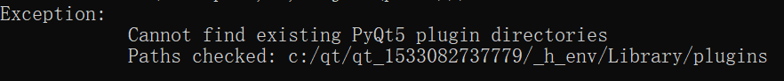

### Virtualenv

virtualenv可以通过 pip 进行安装。pip安装之后，可以通过"python -m virtualenv \<option\>"进行调用。

#### 创建虚拟环境

```python
python -m virtualenv --always-copy --unzip-setuptools <venv path>
```

上面的命令的含义是在 \<venv path\> 中创建一个新的虚拟环境，并且总是复制环境依赖文件而不是创建超链接到依赖文件。

常用参数含义：

- --always-copy：在创建的新的虚拟环境中，把python所有的依赖文件都复制到虚拟环境中。但是还是会有部分的依赖文件没有被复制到。比如说有部分在 \<python installation path\>\Lib 中的文件。当出现文件缺少时就直接从\<python installation path\>\Lib 拷贝缺少文件。

- --unzip-setuptools：解压setuptools 的文件。

- –no-site-packages：隔离环境不能访问系统全局的site-packages目录。

- –distribute ：使用Distribute代替Setuptools。

[一些virtualenv参数的含义](https://blog.csdn.net/u012734441/article/details/55044025/)

### Pyinstaller

再python3中可以通关pip 安装pyinstaller。

下面是一个打包的例子：

```batch
pyinstaller -F -w -n "SG IM py3.exe" ^
--add-data "..\SG IM Mapping File;SG IM Mapping File" ^
-p "%PROJECT_ROOT%\venv3\Lib;%PROJECT_ROOT%\venv3\Lib\site-packages;%PROJECT_ROOT%\venv3\DLLs" ^
--hidden-import distutils ^
--distpath "%PROJECT_ROOT%\bin" --workpath "%PROJECT_ROOT%\tmp" --clean ^
main.py
```

上面的命令就是使用pyinstaller 打包出一个 exe 并且不带命令行窗口的文件

各个参数的含义：

- -F：打包生成一个单一的文件

- -w：打包出的exe在执行的时候没有命令行窗口

- -n：输出的exe 的文件名

- -p：额外添加搜索依赖包的路径。

- --add-data：添加一些依赖的文件。
  
  - 在运行是可以通过 sys._MEIPASS 参数获取到exe解压出的文件的路径。
  
  - 可以多次调用来添加多个路径
  
  - 路径的格式为 \<path of source dir or source file\>;\<path of target dir or file\>。pyinstaller 会把对应的文件打包到 exe 里面，接着在运行时解压到用户的临时目录内。接着在程序中通过 sys._MEIPASS + \<path of target dir or file\> 去获取依赖路径。

- --hidden-import：隐式引入一些依赖包。可以多次使用该参数添加需要隐式引入的依赖包。

- --distpath：生成的exe 的输出路径

- --workpath：生成exe 过程中生成临时文件的文件夹路径

- --clean：执行命令之前先清除tmp目录下的文件。

[Pyinstaller 各个参数详细介绍](https://blog.csdn.net/weixin_39000819/article/details/80942423)

#### 常见错误处理

###### Cannot find existing PyQt5 plugin directories



解决方法：<br>

1. 先确定是否安装了 PyQt

2. 在python2 中，使用命令 pip install python-qt5 安装PyQt5

3. 把 PyQt5 模块目录下的plugins 复制到错误提示对应的路径中
