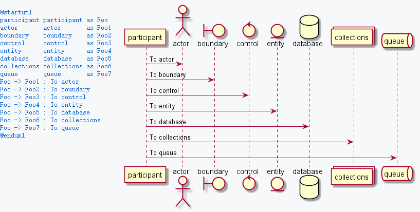
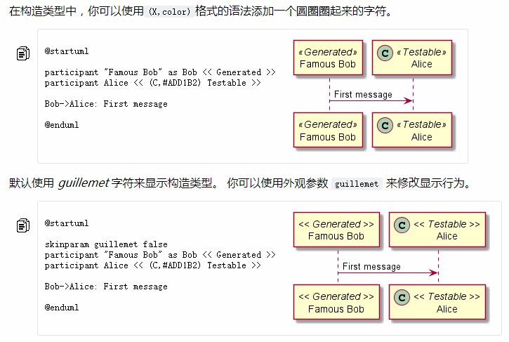
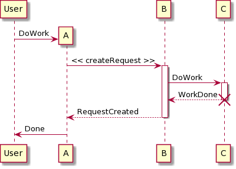
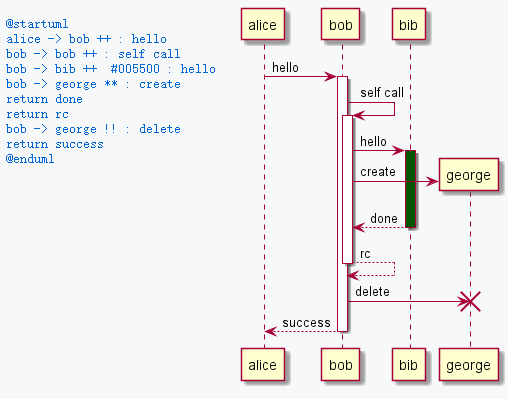

#### 时序图

- 使用场景

- 组成元素

- plantUML语法

- 例子
  
  -  

- 参考文档

##### 使用场景

要点：

1. 时序图是一种动态图，表明对象（lifelines）之间的**消息**交换顺序，它关注的是消息交换的方式，消息交换的时机、顺序以及执行的时间。

2. 通常配合组件图、类图一起使用，表明对象之间的通讯流程。

3. 活动图也是一种动态图，也描述的是流程，但是他们之间关注点会有所区别。活动图粒度比较粗，它只关注 activity 之间是怎么流传的，**因此比较适合在需求分析的阶段来表达需求场景**。而时序图更注重细节，**适合设计阶段**。


##### 组成元素

- 类和对象及其生命线：表示类或者实例需要何时产生何时销毁。

- 控制焦点：代表对象调用某个方法然后等待结果的过程。**即类或对象方法存在于栈帧内的时间范围。**

- 消息调用以返回值：代表一次通信，但通信类型不确定，只关注通信内容。

- 组合片段：复杂的消息组合逻辑，如分支，循环，并发等。

- 引用：简化当前时序图，

- 其他的备注信息：如注释，锚定秩序时间


##### plantUML语法

###### 类和对象生命线

声明对象

```text
participant Alice as a
participant Bob as b
```

plantUml支持一下类型：



或者直接声明对象的类型：




###### 生命线控制：

通过关键字控制对象的创建，激活，撤销激活，删除。

- create：创建，**注意，create和其他控制不同，必须在创建对象的消息之前。**

- activate：激活生命线（激活控制焦点）

- deactivate：撤销激活

- destroy：销毁

```text
@startuml
participant User

create A
User -> A: DoWork

A -> B: << createRequest >>
activate B

B -> C: DoWork
activate C
C --> B: WorkDone
destroy C

B --> A: RequestCreated
deactivate B

A -> User: Done
deactivate A
@enduml
```



控制生命线的快捷语法：

在指定目标参与者后，可以立即使用以下语法：

- `++` 激活目标（可选择在后面加上[#color](https://plantuml.com/zh/color)）
- `--` 撤销激活源
- `**` 创建目标实例
- `!!` 摧毁目标实例



###### 消息调用以返回值

- 创建`-->>`

- 同步调用`->`

- 异步调用`->>`

- 返回`return`：**返回的点是导致最近一次激活生命线的点**

- 销毁`-> !!`：代表同步调用后实例被销毁


##### 参考文档

- https://zhuanlan.zhihu.com/p/78245388

- [UML Message defines specific kind of communication between lifelines of an interaction.](https://www.uml-diagrams.org/interaction-message.html#create)
