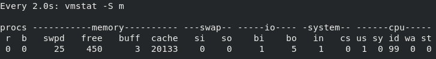
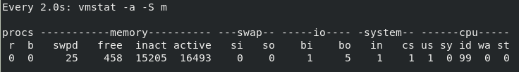
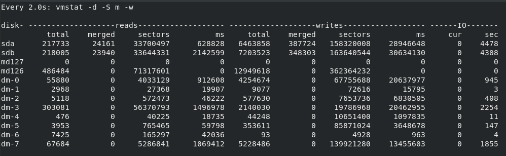

#### vmstat

- 参数解析

- vmstat [-a] [-n] [-S unit] [delay [ count]]

- vmstat [-s] [-n] [-S unit]

- vmstat [-m] [-n] [delay [ count]]

- vmstat [-d] [-n] [delay [ count]]

- vmstat [-p disk partition] [-n] [delay [ count]]

- vmstat [-f]

- vmstat [-V]

##### 参数解析

**控制内容选项**

- 默认视图：显示内存的 cache 和 buffer

- -a：显示活跃和非活跃内存

- -s：显示内存相关统计信息及多种系统活动数量。

- -m：显示slabinfo

- -d：显示磁盘相关统计信息。

- -p：显示指定磁盘分区统计信息

- -f：显示从系统启动至今的fork数量 。

- -V：显示vmstat版本信息。

**控制显示格式选项**

- -n：只在开始时显示一次各字段名称。

- -S：使用指定单位显示。参数有 k 、K 、m 、M ，分别代表1000、1024、1000000、1048576字节（byte）。默认单位为K（1024 bytes）

- -t：显示时间戳

- -w：加宽显示

- delay：刷新时间间隔。如果不指定，只显示一条结果。  

- count：刷新次数。如果不指定刷新次数，但指定了刷新时间间隔，这时刷新次数为无穷。

##### 默认视图 / -a

**默认视图：**

**-a视图**：

###### 字段说明：

proc：进程信息

- r: 运行队列中进程数量，这个值也可以判断是否需要增加CPU。（长期大于1）  

- b: 被阻塞的进程的数量（通常是等待IO的进程数量）

memory：内存信息（默认单位是 kb）

- swpd：虚拟内存使用

- free：空闲内存

- buff：buffer 内存使用

- cache：cache 内存使用

- inact：非活跃内存（-a视图）

- active：活跃内存 （-a视图）

swap：虚拟使用量（kb/s）

- si：从swap 读取的数据量

- so：交换到swap 的数据量

io：磁盘io（块/s）

- bi：磁盘读取块数

- bo：磁盘写入块数

system：（次/s）

- in：系统中断次数

- cs：上下文切换次数

cpu：cpu使用比例（%）

- us：cpu运行非内核程序的时间

- sy：cpu运行内核的时间

- id：空闲时间

- wa：io等待时间

- st：被虚拟机偷掉的时间（虚拟机损耗）

##### -d视图

###### 字段说明

每一行表示不同的磁盘设备 

**read/write**

- total：累计总共成功的读取或写入的次数

- merged：合并字后发起的成功的读取或写入次数

- sectors：扇区读取或写入次数

- ms：读取或写入消耗的总时长

IO:

- cur：当前正在进行的IO

- sec：IO消耗的总时间
